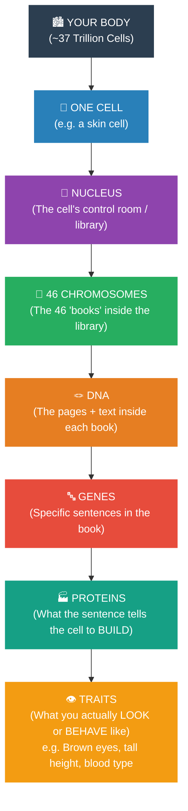
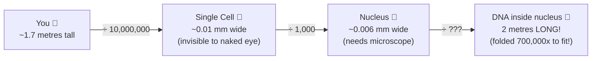

# Chapter 2: The Big Picture — Start Here Before Anything Else

> *"Before you memorize a single term, I want you to understand one thing: every concept in this chapter answers one question. That question is: How does ONE cell become YOU?"*

---

## 🎬 The Story of YOU (Start Here)

About 9 months before you were born, something extraordinary happened.

A single microscopic cell — smaller than a grain of sand — was created. This was your very first cell, the fertilized egg.

That cell had one job: **divide**. 

It divided into 2. Then 2 into 4. Then 4 into 8. Then 16, 32, 64... Today, your body contains roughly **37 trillion cells**. Each one of those cells came from that single original cell. And — this is the mind-blowing part — **every single one of those 37 trillion cells carries the complete instructions to build a whole human being.**

Those instructions? That's the DNA inside chromosomes.

This chapter explains:
- What those instructions look like physically (Chromosomes & DNA)
- How cells make perfect copies before dividing (DNA Replication)
- How cells divide while keeping all instructions intact (Mitosis)
- How reproductive cells break the rules to protect the species (Meiosis)

---

## 🗺️ Your Map — The Hierarchy (Read This Once, Remember Forever)

**This is the most important diagram in the chapter.**

**Read this top to bottom like a zoom-in:**
- Your body is made of cells
- Each cell has a nucleus (control room)
- The nucleus holds 46 chromosomes (like 46 instruction manuals)
- Each chromosome is one very long DNA molecule (the text of that manual)
- Specific sections of that text are called genes (specific instructions)
- Each gene tells the cell to make a specific protein (a molecular machine)
- Those proteins create your physical and biological traits

> 🔑 **Burn this into memory:** The flow is always **Cell → Nucleus → Chromosome → DNA → Gene → Protein → Trait**. Every concept in this chapter lives somewhere on this ladder.

---

## 📐 The Scale Problem (Why This Chapter Is Mind-Bending)

Before you start, let's be honest about why this topic confuses people: **the scale is insane**.

The DNA inside *every cell* is **2 metres long** — stretched out, it could wrap around your finger. But it is folded so incredibly tightly that it fits inside a nucleus that is less than a hundredth of a millimetre across.

Understanding HOW it packs so tightly, and HOW it stays readable — that is what Section 2.3 is all about.

---

## 📚 Chapter Sections — What Each One Answers

| Section | The Question It Answers |
|:---|:---|
| **2.1 What Are Chromosomes?** | What does the packed DNA look like, and how does it change states? |
| **2.2 Discovery** | Who figured all this out, and how? |
| **2.3 Structure of Chromosomes** | How does DNA physically pack itself? What is it made of? |
| **2.4 What Are Genes?** | What is the "instruction" inside the DNA? How does it create traits? |
| **2.5 Why Cells Divide** | Why does the body need to keep making new cells? |
| **2.6 Mitosis** | How does a cell divide while keeping ALL instructions intact? |
| **2.7 Cell Cycle** | What is the full life-cycle of a cell between divisions? |
| **2.8 Meiosis** | Why do reproductive cells need a DIFFERENT kind of division? |

---

## 🎯 Exam Strategy — Read This Before You Start

### What ICSE Board Asks Most Often:
| Topic | Expected Marks | Question Type |
|:---|:---|:---|
| Difference: Chromatin vs Chromosome | 🔴 2 marks | Short answer |
| Structure of DNA / Nucleotide parts | 🔵 3-5 marks | Diagram / label |
| Phases of Mitosis (with events) | 🔵 5 marks | Long answer |
| Mitosis vs Meiosis differences | 🔵 5 marks | Table |
| Significance of Mitosis & Meiosis | 🔴 2 marks | List |
| What is a nucleosome? | 🔴 2 marks | Definition |
| Cell Cycle phases | 🔴 2 marks | Diagram label |
| Why meiosis is called reduction division | 🔴 2 marks | Short answer |

### What IIT Foundation Asks:
- *"What would happen if the cell cycle checkpoint failed?"* (cancer)
- *"Why must A pair with T and not G?"* (molecular geometry)
- *"Why is replication called semi-conservative?"* (mechanism)
- *"If meiosis gave 2n gametes, what would happen over generations?"* (math)

---

## 🧠 Master Mnemonics (Learn These First)

| What to Remember | Mnemonic |
|:---|:---|
| Mitosis phases: Prophase, Metaphase, Anaphase, Telophase | **P**lease **M**ake **A**nother **T**aco (PMAT) |
| DNA bases: A pairs T, G pairs C | **A**pples fall from **T**rees, **C**ars park in **G**arages |
| Purines (large): Adenine, Guanine | **PuRine** = **A**nd **G**uanine → **PAG** → Pure **AG**ents |
| Chromatin composition: 40% DNA, 60% Histone | "DNA is the **minority** partner — 40% only" |
| Nucleosome = 8 histones | "**Octet** rule: 8 histones, like 8 players in a team" |

---

## ✅ Before You Start — Quick Self-Check

Ask yourself these 5 questions. If you can't answer them after reading the chapter, go back and re-read that section.

1. What is the difference between chromatin and a chromosome? *(Same material, different physical state!)*
2. What are the 4 packing levels from DNA to chromosome?
3. In which phase of mitosis do the sister chromatids actually separate?
4. Why does a human body cell need 46 chromosomes, but a sperm only needs 23?
5. What is one consequence if the cell cycle ran without stopping?

---

*→ Now open **Section 2.1: What Are Chromosomes?** and begin your journey.*
