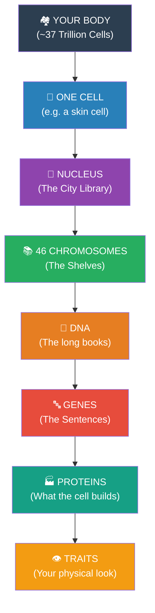

# Chapter 2: The Big Picture — The "Library of Life"

> *"Before you memorize a single term, I want you to understand one thing: every concept in this chapter answers one question. That question is: How does ONE cell become YOU?"*

---

## 🏙️ 1. The "City Library" Analogy (The Hierarchy)

To understand this chapter, you must understand **Scale**. Imagine your body is a massive city:
- **The Library** = The **Nucleus** (where all information is kept).
- **The Shelves** = The **Chromosomes** (46 shelves in humans).
- **The Books** = The **DNA** (one long, 2-metre book per shelf).
- **The Pages/Sentences** = The **Genes** (the actual instructions for your eyes, hair, skin).

**The Zoom-In Rule:** Every concept in this chapter lives somewhere on this ladder. If you get lost, come back to this map.

---

## 🎬 2. The Story of YOU

About 9 months before you were born, you were one single cell—a fertilized egg. That cell had one job: **Divide**.
- At 4 days: 16 cells.
- At birth: 37 Trillion cells.
- **The Secret:** Every single cell carries the *complete* instruction manual to build a whole human. This chapter explains how that manual is packed (DNA), read (Genes), and copied (Mitosis/Meiosis).

---

## 📐 3. The Scale Problem (The "2-Metre" Mystery)

The DNA inside *every single cell* is **2 metres long** if stretched out. 
- **The Problem:** It has to fit into a nucleus that is **invisible** to the naked eye.
- **The Solution:** It super-coils like a telephone wire until it’s a million times smaller.

---

## 🎯 4. Exam Strategy (What to focus on)

| Topic | Importance | Question Type |
|:---|:---|:---|
| **Structure of DNA** | ⭐⭐⭐⭐⭐ | 5-mark Labelled Diagrams |
| **Phases of Mitosis** | ⭐⭐⭐⭐⭐ | "Identify the stage" pictures |
| **Mitosis vs Meiosis** | ⭐⭐⭐⭐⭐ | Difference tables |
| **Cell Cycle (G1, S, G2)** | ⭐⭐⭐⭐☆ | MCQ / 1-mark "What happens in S?" |
| **Chromatin vs Chromosome** | ⭐⭐⭐☆☆ | 2-mark definitions |

---

## 🧠 Master Mnemonics

- **Mitosis Phases:** **P**lease **M**ake **A**nother **T**aco (**P**rophase, **M**etaphase, **A**naphase, **T**elophase).
- **DNA Bases:** **A**pples on **T**rees (**A-T**), **C**ars in **G**arages (**C-G**).

---

*→ Now start with **Section 2.1: What Are Chromosomes?** and keep your 'City Library' map handy.*
