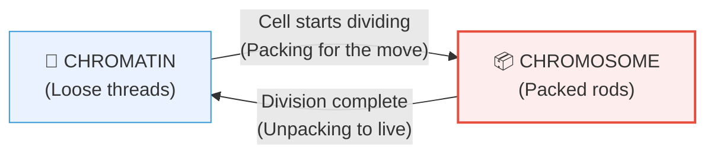

# Section 2.1: What Are Chromosomes? — The Basic Idea

📍 **Big Picture Scale:**
Cell ⮕ Nucleus ⮕ **Chromatin** ⮕ **Chromosome** ⮕ DNA ⮕ Gene

> *"Sir, I read the definition twice but I still don't get it. Are chromosomes and chromatin different things?"*
> 
> *Here is the secret: They are the **exact same material** (DNA + Protein). They just change their 'outfit' depending on what the cell is doing. It's like you in your pyjamas vs you in a school uniform—same person, different look for a different job.*

---

## 🚪 1. The "Everyday" Cloud vs the "Moving Day" Rods

Think of the DNA in your nucleus like 2 metres of very fine, fragile silk thread.

### The Problem:
If you leave that thread loose, you can read the instructions easily. But if you try to pull that thread to the other side of the room, it will tangle and snap. 

### The Solution:
The cell has two storage modes:
1. **Chromatin (Everyday Mode):** DNA is loose, uncoiled, and tangled like a fuzzy cloud. 
   - **Why?** So the cell can "read" the genes and make proteins.
   - **When?** During **Interphase** (normal life).
2. **Chromosome (Moving Mode):** DNA is tightly coiled into thick, sturdy rods.
   - **Why?** So the DNA can be moved safely to a new daughter cell without breaking.
   - **When?** During **Cell Division**.

---

## 🔬 2. The "Coloured Bodies" (Microscope View)

[⚠️ **EXAM TICKER:** Definition of 'Chromosome' is a classic 2-mark question. Don't just say 'rods'—mention the material! ]

In 1882, scientists found that certain dyes (from the clothing industry!) would stain these thick rods very brightly, while the rest of the cell stayed faint. They named them **Chromosomes**:
- **Chroma** = Colour
- **Soma** = Body
- **Meaning:** "Coloured Bodies"

> 💡 **Student Tip:** If you look at a non-dividing cell, you won't see chromosomes. You'll just see a "fuzzy nucleus." That's because the chromatin is too thin for the microscope to catch.

---

## 📊 3. The Quick-Contrast (Chromatin vs Chromosome)

[⚠️ **2-MARK TICKER:** ICSE loves asking you to differentiate between these two. Use this table.]

| Feature | 🧵 Chromatin Fibre | 📦 Chromosome |
|:---|:---|:---|
| **Appearance** | Long, thin, tangled threads | Short, thick, compact rods |
| **Stage** | Non-dividing (Interphase) | Dividing (Prophase onwards) |
| **Visibility** | Invisible/Fuzzy | Clearly visible |
| **Function** | **READING** genes | **MOVING** DNA safely |

---

## 🔢 4. The Human Count (The "46" Rule)

Every human body cell (except mature RBCs) has exactly **46 chromosomes**. 
After division, these 46 rods "unpack" back into **46 threads** (chromatin). 

> 🔴 **Exam Trick:** If they ask: "A human cell in Interphase has 46 chromatin fibres. How many chromosomes will it have during Mitosis?"
> **Answer:** 46. Same DNA, just better packed.

---

---

> 📝 **3-Line Compression:**
> 1. Chromatin and Chromosomes are made of the same ____ + ____.
> 2. We use Chromatin when the cell is _____ and Chromosomes when it is _____.
> 3. Chromosome literally means "_____  _____" because they soak up dye easily.

> 🎤 **Feynman Challenge:**
> *"Explain to your younger brother why your DNA acts like 'threads' normally but like 'suitcases' when the cell divides."*

---

## 📝 ICSE Practice Questions — Section 2.1

> **Instructions:** Attempt all questions. Check answers only after attempting. Mark each answer ✅ or ❌ in your notebook.

---

### 🔘 A. Multiple Choice (1 mark each)

**1.** Chromosomes are visible under a light microscope:
- (a) During Interphase only
- (b) During cell division (Prophase onwards)
- (c) Only when stained with eosin
- (d) Throughout the cell's life

> **Answer: (b)** Chromosomes only condense into visible structures at the start of cell division.

---

**2.** The term "chromosome" literally means:
- (a) Thread body
- (b) Coloured body
- (c) Condensed body
- (d) Nuclear body

> **Answer: (b)** Chroma = colour, Soma = body.

---

**3.** A human body cell has 46 chromosomes. During Interphase, how many chromatin fibres are present in its nucleus?
- (a) 23
- (b) 46
- (c) 92
- (d) None — they disappear

> **Answer: (b) 46.** Same number, different form.

---

**4.** Chromatin is made of:
- (a) DNA only
- (b) Histone proteins only
- (c) DNA and histone proteins
- (d) RNA and histone proteins

> **Answer: (c)** Approximately 40% DNA + 60% histone proteins.

---

### 📝 B. Very Short Answer (1–2 marks each)

**1.** Define chromatin fibres.

> **Answer:** Chromatin fibres are the long, thin, loosely coiled network of DNA + histone protein found in the nucleus during the non-dividing (Interphase) stage of a cell's life.

---

**2.** Name the dyes that made chromosomes visible, and state the industry that originally produced them.

> **Answer:** Aniline dyes (synthetic dyes), originally produced by the **textile/clothing industry**.

---

**3.** Fill in the blanks:
> (a) Chromosomes are readily visible during ____________ of cell division.
> (b) After cell division, chromosomes de-condense back into ____________.
> (c) A cell with 46 chromosomes during division will have ____________ chromatin fibres during Interphase.

> **Answers:** (a) Prophase / cell division; (b) chromatin fibres; (c) 46

---

**4.** State whether the following is True or False. If false, correct it.
> *"Chromatin and chromosomes are chemically different substances."*

> **Answer: False.** Chromatin and chromosomes are the **same material** (DNA + histone proteins), just in different physical states of coiling.

---

### 📄 C. Short Answer (2–3 marks each)

**1.** Distinguish between chromatin fibre and a chromosome.

| Feature | Chromatin Fibre | Chromosome |
|:---|:---|:---|
| **Stage** | Interphase (non-dividing) | Prophase onwards (dividing) |
| **Appearance** | Long, thin, loosely coiled threads | Short, thick, compact rods |
| **Visibility** | Not visible under light microscope | Clearly visible under light microscope |
| **Function** | Reading DNA to make proteins | Safe movement during cell division |

---

**2.** Why do chromosomes condense just before cell division? What would happen if they didn't?

> **Answer:** Chromosomes condense to protect the 2-metre-long DNA from tangling and breaking during the violent movement of cell division. If they did not condense, the delicate chromatin threads would tangle, snap, and could not be distributed equally into daughter cells — leading to genetic errors or cell death.

---

**3.** A student observes two cells under a microscope. Cell A shows a fuzzy network of threads in the nucleus. Cell B shows 46 distinct rod-shaped structures. Which cell is dividing? Give reasons.

> **Answer:** **Cell B** is dividing. The 46 distinct rod-shaped structures are **chromosomes** — the condensed form of chromatin that appears at the start of cell division (Prophase). Cell A is in Interphase (non-dividing), showing loosely coiled **chromatin fibres**.

---

### 🔬 D. Structured / Application Type (3–5 marks)

**1.** The diagram below represents two states of the same material inside a cell nucleus. Answer the questions:

*(Imagine: State 1 = tangled, thread-like network. State 2 = thick, short, X-shaped rods.)*

- (a) Identify State 1 and State 2.
- (b) Name the material that forms both States 1 and 2.
- (c) In which phase of the cell cycle does State 1 transition to State 2?
- (d) Why is State 2 necessary during cell division?

> **Answers:**
> (a) State 1 = Chromatin fibres; State 2 = Chromosomes
> (b) DNA + Histone proteins
> (c) At the beginning of **Prophase** (when cell division starts)
> (d) State 2 (Chromosomes) is necessary because the highly condensed, compact form allows the long DNA to be safely moved and distributed into daughter cells without tangling or breaking.

