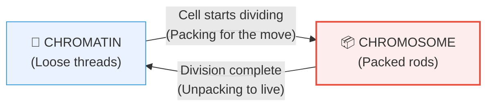

# Section 2.1: What Are Chromosomes? — The Basic Idea

📍 **Big Picture Scale:**
Cell ⮕ Nucleus ⮕ **Chromatin** ⮕ **Chromosome** ⮕ DNA ⮕ Gene

> *"Sir, I read the definition twice but I still don't get it. Are chromosomes and chromatin different things?"*
> 
> *Here is the secret: They are the **exact same material** (DNA + Protein). They just change their 'outfit' depending on what the cell is doing. It's like you in your pyjamas vs you in a school uniform—same person, different look for a different job.*

---

## 🚪 1. The "Everyday" Cloud vs the "Moving Day" Rods

Think of the DNA in your nucleus like 2 metres of very fine, fragile silk thread.

### The Problem:
If you leave that thread loose, you can read the instructions easily. But if you try to pull that thread to the other side of the room, it will tangle and snap. 

### The Solution:
The cell has two storage modes:
1. **Chromatin (Everyday Mode):** DNA is loose, uncoiled, and tangled like a fuzzy cloud. 
   - **Why?** So the cell can "read" the genes and make proteins.
   - **When?** During **Interphase** (normal life).
2. **Chromosome (Moving Mode):** DNA is tightly coiled into thick, sturdy rods.
   - **Why?** So the DNA can be moved safely to a new daughter cell without breaking.
   - **When?** During **Cell Division**.

---

## 🔬 2. The "Coloured Bodies" (Microscope View)

[⚠️ **EXAM TICKER:** Definition of 'Chromosome' is a classic 2-mark question. Don't just say 'rods'—mention the material! ]

In 1882, scientists found that certain dyes (from the clothing industry!) would stain these thick rods very brightly, while the rest of the cell stayed faint. They named them **Chromosomes**:
- **Chroma** = Colour
- **Soma** = Body
- **Meaning:** "Coloured Bodies"

> 💡 **Student Tip:** If you look at a non-dividing cell, you won't see chromosomes. You'll just see a "fuzzy nucleus." That's because the chromatin is too thin for the microscope to catch.

---

## 📊 3. The Quick-Contrast (Chromatin vs Chromosome)

[⚠️ **2-MARK TICKER:** ICSE loves asking you to differentiate between these two. Use this table.]

| Feature | 🧵 Chromatin Fibre | 📦 Chromosome |
|:---|:---|:---|
| **Appearance** | Long, thin, tangled threads | Short, thick, compact rods |
| **Stage** | Non-dividing (Interphase) | Dividing (Prophase onwards) |
| **Visibility** | Invisible/Fuzzy | Clearly visible |
| **Function** | **READING** genes | **MOVING** DNA safely |

---

## 🔢 4. The Human Count (The "46" Rule)

Every human body cell (except mature RBCs) has exactly **46 chromosomes**. 
After division, these 46 rods "unpack" back into **46 threads** (chromatin). 

> 🔴 **Exam Trick:** If they ask: "A human cell in Interphase has 46 chromatin fibres. How many chromosomes will it have during Mitosis?"
> **Answer:** 46. Same DNA, just better packed.

---

---

> 📝 **3-Line Compression:**
> 1. Chromatin and Chromosomes are made of the same ____ + ____.
> 2. We use Chromatin when the cell is _____ and Chromosomes when it is _____.
> 3. Chromosome literally means "_____  _____" because they soak up dye easily.

> 🎤 **Feynman Challenge:**
> *"Explain to your younger brother why your DNA acts like 'threads' normally but like 'suitcases' when the cell divides."*

---

## 📝 ICSE Practice Questions — Section 2.1: What Are Chromosomes?

> **Tutor's Note:** This set is designed to match ICSE board patterns while using the "Life & Intuition" analogies we've learned. Attempt these first without looking at the answers!

---

### A. Multiple Choice Questions (1 mark each)

**1. Chromosomes are visible under a light microscope only when the cell is:**  
(a) in interphase  
(b) during cell division (prophase onwards)  
(c) stained with eosin  
(d) in the G1 phase  

**Answer: (b)**  
Chromosomes condense into thick, compact rods only during cell division (from prophase onwards). In interphase, the material exists as thin, tangled chromatin fibres that appear fuzzy and are not clearly visible under a light microscope.

**2. The term “chromosome” literally means:**  
(a) twisted thread  
(b) coloured body  
(c) inherited body  
(d) condensed fibre  

**Answer: (b)**  
“Chroma” = colour, “Soma” = body. In 1882, scientists noticed that certain aniline dyes (from the textile industry) stained these thick rods brightly, making them appear as “coloured bodies.”

**3. Chromatin and chromosomes are chemically:**  
(a) completely different substances  
(b) the same material (DNA + histone proteins) in different physical states  
(c) DNA only  
(d) histone proteins only  

**Answer: (b)**  
They are the exact same substance—approximately 40% DNA + 60% histone proteins. The only difference is the degree of coiling/condensation (like the same person in pyjamas vs. school uniform for different jobs).

**4. In a normal human somatic cell, the number of chromatin fibres present during interphase is:**  
(a) 23  
(b) 46  
(c) 92  
(d) none (they disappear)  

**Answer: (b)**  
A human cell has 46 chromosomes during division; after division, these unpack into 46 chromatin fibres during the next interphase. The number remains the same—only the form changes.

**5. The main reason chromosomes condense into thick rods just before cell division is:**  
(a) to allow easy reading of genes  
(b) to prevent tangling and breakage of the long DNA threads during movement  
(c) to make them invisible under the microscope  
(d) to increase the number of genes  

**Answer: (b)**  
DNA is like 2 metres of fragile silk thread. Loose chromatin allows easy “reading” of genes in interphase, but during division it would tangle and snap. Condensation packs it safely for equal distribution to daughter cells.

---

### B. Very Short Answer Questions (1–2 marks each)

**1. Define chromatin fibres.**  

**Answer:**  
Chromatin fibres are the long, thin, loosely coiled network of DNA wrapped around histone proteins present in the nucleus during the non-dividing (interphase) stage of the cell. They appear as a fuzzy cloud and allow the cell to read genes for protein synthesis.

**2. What is the etymological meaning of the word “chromosome” and why was this name given?**  

**Answer:**  
“Chromosome” means “coloured body” (Chroma = colour, Soma = body). The name was given because, in 1882, scientists observed that aniline dyes (from the clothing/textile industry) stained these thick rod-shaped structures brightly while the rest of the nucleus remained faint.

**3. Name the two storage forms of the same genetic material in the nucleus and state when each is used.**  

**Answer:**  
The two forms are **chromatin** (loose, everyday “pyjamas” mode) used during interphase for reading genes and making proteins, and **chromosomes** (compact, “school uniform” or “packed suitcases” mode) used during cell division for safe movement of DNA.

**4. Fill in the blanks:**  
Chromosomes are made up of approximately ________ % DNA and ________ % histone proteins.  

**Answer:**  
Approximately **40%** DNA and **60%** histone proteins. (Same composition for chromatin fibres.)

**5. State whether true or false (correct if false):**  
*“A human cell in interphase has 46 chromosomes.”*  

**Answer:**  
False. A human cell in interphase has 46 **chromatin fibres**. It has 46 **chromosomes** only during cell division when the material condenses. The number of genetic units remains 46—only the physical form changes.

---

### C. Short Answer Questions (2–3 marks each)

**1. Distinguish between chromatin fibre and chromosome on the basis of stage, appearance, and function.**

**Answer:**

| Feature | Chromatin Fibre | Chromosome |
|:---|:---|:---|
| **Appearance** | Long, thin, tangled threads (fuzzy cloud) | Short, thick, compact rods |
| **Stage** | Interphase (non-dividing) | During cell division (prophase onwards) |
| **Visibility** | Invisible/fuzzy under light microscope | Clearly visible under light microscope |
| **Main Function** | Reading genes / making proteins | Safe movement of DNA to daughter cells |

**2. Explain with the help of an analogy why the cell needs two different “outfits” (chromatin and chromosome) for the same DNA.**  

**Answer:**  
The DNA in a human nucleus is like 2 metres of very fine, fragile silk thread. In “everyday mode” (interphase), it stays loose like **pyjamas** so the cell can easily read the instructions (genes) to make proteins. During “moving day” (cell division), it packs tightly into sturdy rods like a **school uniform** or **packed suitcases** so the long thread doesn’t tangle or snap while being pulled apart to the two daughter cells. Same material, different form for different jobs.

**3. A student observes two cells under the microscope:**  
- Cell A shows a fuzzy network of threads in the nucleus.  
- Cell B shows 46 distinct rod-shaped structures.  
Which cell is undergoing division? Give reasons.  

**Answer:**  
Cell B is undergoing division. The 46 distinct rod-shaped structures are condensed **chromosomes** visible from prophase onwards. Cell A shows **chromatin** (loose threads), which is the form during interphase when the cell is not dividing.

---

### D. Long Answer / Application / Higher-Order Thinking Questions (3–5 marks)

**1. Why do chromosomes condense?**  
Imagine the DNA in a human nucleus is like 2 metres of very fine silk thread. Explain what problem would arise if this thread remained loose during cell division. What would be the consequences for the daughter cells if condensation did not occur? (Give at least two specific problems.)

**Answer:**  
If the 2-metre silk thread remained loose, it would tangle easily and snap during the violent movements of mitosis/meiosis.  
Consequences:  
- **Unequal distribution:** Daughter cells could receive wrong number or broken pieces of DNA.  
- **Genetic Damage:** Increased risk of mutations or cell death due to damaged genes.  
Condensation protects the DNA and ensures accurate, equal separation.

**2. Case-based question:**  
A researcher is studying a mutant cell line in which chromosomes fail to condense properly before mitosis.  
(i) Predict what would happen to the genetic material during anaphase.  
(ii) How might this affect the daughter cells?  
(iii) Relate this to why the cell normally switches from chromatin to chromosome form.

**Answer:**  
(i) The loose chromatin threads would tangle and likely break during pulling apart in anaphase.  
(ii) Daughter cells could receive unequal or fragmented DNA, leading to abnormal chromosome numbers or loss of genes (non-viable cells).  
(iii) The normal switch to condensed chromosomes prevents these problems by making the genetic material compact and sturdy for safe transport.

**3. Feynman Final Check:**  
Explain to a 10-year-old brother why your DNA sometimes looks like loose tangled threads (chromatin) and sometimes like neat packed suitcases (chromosomes).

**Answer:**  
Imagine your DNA is a 2-metre silk thread with all your body's instructions. When you’re at home living normally (interphase), the thread stays loose like your comfy **pyjamas**—so your body can easily read the instructions. But when the cell wants to move into two new "houses" (cell division), it packs the thread into strong **suitcases** (chromosomes) so nothing gets tangled or broken during the move. After moving, the suitcases unpack back into pyjamas!

