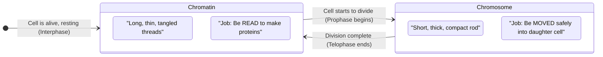

# Section 2.1: What Are Chromosomes?

📍 **Where you are:** Body → Cell → **Nucleus → Chromosomes** (start here)

> *"Open any biology textbook and you'll see the word 'chromosome' in bold. But almost no one stops to ask: what is it, really? Not the definition — but the actual physical thing. What does it look like? Why does it even exist?"*

---

## 🎯 The One Sentence You Must Understand First

**A chromosome and chromatin are the same material — just in two different physical states.**

That's it. No magic. No mystery. Same DNA + proteins. But: 
- In **everyday life** → loose and uncoiled = **Chromatin**
- When **dividing** → tightly packed = **Chromosome**

Why does it change shape? Because the cell has two completely different jobs:
- **Job 1 (Everyday living):** READ the DNA instructions to make proteins. You cannot read a book if its pages are crumpled into a ball.
- **Job 2 (Dividing):** MOVE the DNA safely into a daughter cell. You cannot safely move 2 metres of fragile thread — you must first compact it into a sturdy package.

The cell switches between these two states based on what it needs to do. This is the entire logic of this section.

---

## 🔬 What You'd Actually See Under a Microscope

Sit at a microscope and look at a normal, non-dividing cell. Look at its nucleus. You'll see... almost nothing. Just a faint, fuzzy cloud of threads. That cloud is chromatin. It is so thin and so tangled that it looks like a grey shadow.

Now watch a cell that is actively dividing. Suddenly, thick, distinct, dark-staining rods appear. These are chromosomes — the same material, but compacted hundreds of times tighter until they're visible.

In humans, there are always exactly **46 chromosomes** in every body cell (except for mature red blood cells which have no nucleus at all).

> 🔴 **2-mark exam question:** *"What is the difference between a chromatin fibre and a chromosome?"*
> **Model answer:** Chromatin fibre is the loose, uncoiled form of DNA + histone proteins found during Interphase. Chromosome is the same material but condensed and coiled tightly at the start of cell division.

---

## 🎨 Why the Name "Chromosome"?

The name is literally descriptive. When scientists first started staining cells with dyes in the 1800s, these thick rod-shaped structures inside the nucleus would drink up the coloured dye intensely — while everything else remained faint.

So they named them:
- **Chroma** (Greek) = Colour
- **Soma** (Greek) = Body
- **Chromosome** = **Coloured Body**

> 🔑 **Memory hook:** Think of a dry sponge dropped into coloured water. It soaks up all the colour immediately — that's the chromosome. The rest of the cell's watery contents barely pick up any colour.

---

## 📌 One Important Consequence

After cell division ends, the 46 chromosomes de-condense back into chromatin threads.
- **During division:** 46 chromosomes visible
- **During Interphase (normal life):** 46 chromatin fibres — same number, invisible under normal staining

> 🔴 **Exam trick:** If asked: *"How many chromatin fibres are present in a cell with 46 chromosomes?"*
> Answer: **46**. Same count, different form.

---

### ✅ Before Moving On — Can You Answer These?

1. Are chromatin and chromosomes made of different things? *(No — same DNA + histone material)*
2. When does chromatin condense into chromosomes? *(At the start of cell division, in Prophase)*
3. What does "chromosome" literally mean in Greek? *(Coloured Body)*
