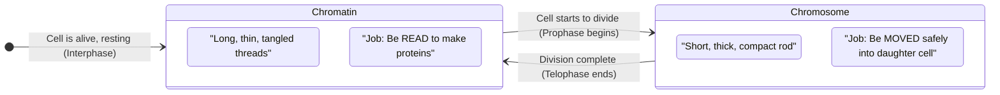

# Section 2.1: What Are Chromosomes?

📍 **Where you are:** Body → Cell → **Nucleus → Chromosomes** (start here)

> *"Open any biology textbook and you'll see the word 'chromosome' in bold. But almost no one stops to ask: what is it, really? Not the definition — but the actual physical thing. What does it look like? Why does it even exist?"*

---

## 🎯 The One Sentence You Must Understand First

**A chromosome and chromatin are the same material — just in two different physical states.**

That's it. No magic. No mystery. Same DNA + proteins. But: 
- In **everyday life** → loose and uncoiled = **Chromatin**
- When **dividing** → tightly packed = **Chromosome**

Why does it change shape? Because the cell has two completely different jobs:
- **Job 1 (Everyday living):** READ the DNA instructions to make proteins. You cannot read a book if its pages are crumpled into a ball.
- **Job 2 (Dividing):** MOVE the DNA safely into a daughter cell. You cannot safely move 2 metres of fragile thread — you must first compact it into a sturdy package.

The cell switches between these two states based on what it needs to do. This is the entire logic of this section.

> 🧠 **Stop & Think — Before you read on:**
> Imagine you are the cell. You have 2 metres of fragile thread that contains your instructions. You need to read some of it right now to make a protein. But in an hour, you also need to copy it and move it to a daughter cell without tangling it.
> *What are the two things your storage system needs to be able to do?*
> *(Think for 10 seconds before scrolling down...)*

---

## 🔬 What You'd Actually See Under a Microscope

Sit at a microscope and look at a normal, non-dividing cell. Look at its nucleus. You'll see... almost nothing. Just a faint, fuzzy cloud of threads. That cloud is chromatin. It is so thin and so tangled that it looks like a grey shadow.

Now watch a cell that is actively dividing. Suddenly, thick, distinct, dark-staining rods appear. These are chromosomes — the same material, but compacted hundreds of times tighter until they're visible.

In humans, there are always exactly **46 chromosomes** in every body cell (except for mature red blood cells which have no nucleus at all).

---

> 📝 **3-Line Compression — Write this in your own notebook right now:**
> 1. Chromatin = __________ (complete without looking)
> 2. Chromosome = __________
> 3. They switch because __________

---

> 🔴 **2-mark exam question:** *"What is the difference between a chromatin fibre and a chromosome?"*
> **Model answer:** Chromatin fibre is the loose, uncoiled form of DNA + histone proteins found during Interphase. Chromosome is the same material but condensed and coiled tightly at the start of cell division.

---

## 🎨 Why the Name "Chromosome"?

The name is literally descriptive. When scientists first started staining cells with dyes in the 1800s, these thick rod-shaped structures inside the nucleus would drink up the coloured dye intensely — while everything else remained faint.

So they named them:
- **Chroma** (Greek) = Colour
- **Soma** (Greek) = Body
- **Chromosome** = **Coloured Body**

> 🔑 **Memory hook:** Think of a dry sponge dropped into coloured water. It soaks up all the colour immediately — that's the chromosome. The rest of the cell's watery contents barely pick up any colour.

---

## 📌 One Important Consequence

After cell division ends, the 46 chromosomes de-condense back into chromatin threads.
- **During division:** 46 chromosomes visible
- **During Interphase (normal life):** 46 chromatin fibres — same number, invisible under normal staining

> 🔴 **Exam trick:** If asked: *"How many chromatin fibres are present in a cell with 46 chromosomes?"*
> Answer: **46**. Same count, different form.

---

---

> 🎤 **Feynman Challenge — Explain it out loud to yourself or a friend:**
> *"Explain to a 10-year-old why chromosomes look like X shapes, and why they don't look like that all the time."*
> If you can say it simply without using notes — you truly understand it.

---

### ✅ Before Moving On — Can You Answer These?

1. Are chromatin and chromosomes made of different things? *(No — same DNA + histone material)*
2. When does chromatin condense into chromosomes? *(At the start of cell division, in Prophase)*
3. What does "chromosome" literally mean in Greek? *(Coloured Body)*

---

## 📝 ICSE Practice Questions — Section 2.1

> **Instructions:** Attempt all questions. Check answers only after attempting. Mark each answer ✅ or ❌ in your notebook.

---

### 🔘 A. Multiple Choice (1 mark each)

**1.** Chromosomes are visible under a light microscope:
- (a) During Interphase only
- (b) During cell division (Prophase onwards)
- (c) Only when stained with eosin
- (d) Throughout the cell's life

> **Answer: (b)** Chromosomes only condense into visible structures at the start of cell division.

---

**2.** The term "chromosome" literally means:
- (a) Thread body
- (b) Coloured body
- (c) Condensed body
- (d) Nuclear body

> **Answer: (b)** Chroma = colour, Soma = body.

---

**3.** A human body cell has 46 chromosomes. During Interphase, how many chromatin fibres are present in its nucleus?
- (a) 23
- (b) 46
- (c) 92
- (d) None — they disappear

> **Answer: (b) 46.** Same number, different form.

---

**4.** Chromatin is made of:
- (a) DNA only
- (b) Histone proteins only
- (c) DNA and histone proteins
- (d) RNA and histone proteins

> **Answer: (c)** Approximately 40% DNA + 60% histone proteins.

---

### 📝 B. Very Short Answer (1–2 marks each)

**1.** Define chromatin fibres.

> **Answer:** Chromatin fibres are the long, thin, loosely coiled network of DNA + histone protein found in the nucleus during the non-dividing (Interphase) stage of a cell's life.

---

**2.** Name the dyes that made chromosomes visible, and state the industry that originally produced them.

> **Answer:** Aniline dyes (synthetic dyes), originally produced by the **textile/clothing industry**.

---

**3.** Fill in the blanks:
> (a) Chromosomes are readily visible during ____________ of cell division.
> (b) After cell division, chromosomes de-condense back into ____________.
> (c) A cell with 46 chromosomes during division will have ____________ chromatin fibres during Interphase.

> **Answers:** (a) Prophase / cell division; (b) chromatin fibres; (c) 46

---

**4.** State whether the following is True or False. If false, correct it.
> *"Chromatin and chromosomes are chemically different substances."*

> **Answer: False.** Chromatin and chromosomes are the **same material** (DNA + histone proteins), just in different physical states of coiling.

---

### 📄 C. Short Answer (2–3 marks each)

**1.** Distinguish between chromatin fibre and a chromosome.

| Feature | Chromatin Fibre | Chromosome |
|:---|:---|:---|
| **Stage** | Interphase (non-dividing) | Prophase onwards (dividing) |
| **Appearance** | Long, thin, loosely coiled threads | Short, thick, compact rods |
| **Visibility** | Not visible under light microscope | Clearly visible under light microscope |
| **Function** | Reading DNA to make proteins | Safe movement during cell division |

---

**2.** Why do chromosomes condense just before cell division? What would happen if they didn't?

> **Answer:** Chromosomes condense to protect the 2-metre-long DNA from tangling and breaking during the violent movement of cell division. If they did not condense, the delicate chromatin threads would tangle, snap, and could not be distributed equally into daughter cells — leading to genetic errors or cell death.

---

**3.** A student observes two cells under a microscope. Cell A shows a fuzzy network of threads in the nucleus. Cell B shows 46 distinct rod-shaped structures. Which cell is dividing? Give reasons.

> **Answer:** **Cell B** is dividing. The 46 distinct rod-shaped structures are **chromosomes** — the condensed form of chromatin that appears at the start of cell division (Prophase). Cell A is in Interphase (non-dividing), showing loosely coiled **chromatin fibres**.

---

### 🔬 D. Structured / Application Type (3–5 marks)

**1.** The diagram below represents two states of the same material inside a cell nucleus. Answer the questions:

*(Imagine: State 1 = tangled, thread-like network. State 2 = thick, short, X-shaped rods.)*

- (a) Identify State 1 and State 2.
- (b) Name the material that forms both States 1 and 2.
- (c) In which phase of the cell cycle does State 1 transition to State 2?
- (d) Why is State 2 necessary during cell division?

> **Answers:**
> (a) State 1 = Chromatin fibres; State 2 = Chromosomes
> (b) DNA + Histone proteins
> (c) At the beginning of **Prophase** (when cell division starts)
> (d) State 2 (Chromosomes) is necessary because the highly condensed, compact form allows the long DNA to be safely moved and distributed into daughter cells without tangling or breaking.

