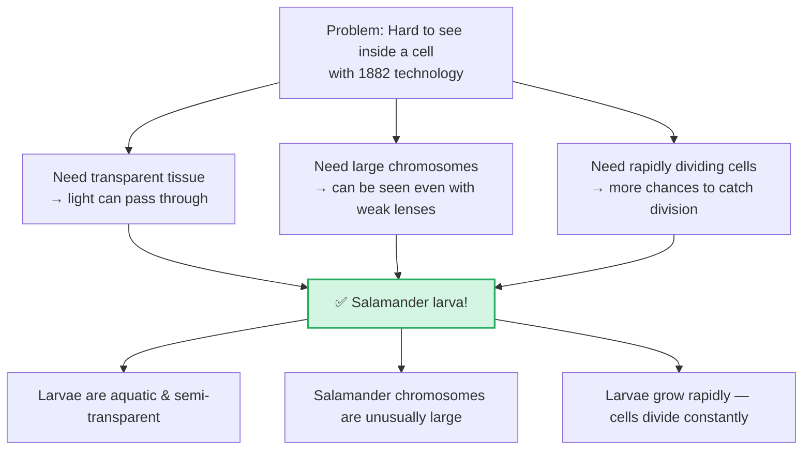
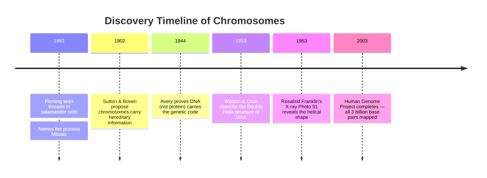

# Section 2.2: Discovery of Chromosomes

📍 **Where you are:** Body → Cell → Nucleus → **Chromosomes** (the discovery story)

> *"Here is something that should humble us: the entire story of chromosomes began not with a plan, not with a theory — but with a German scientist squinting through a low-quality brass microscope at a see-through salamander larva, wondering why some cells had tiny glowing threads inside them..."*

---

## 🕰️ The Scene: Germany, 1882

There is no electron microscope. No PCR machine. No gene sequencer. 

It was in this dark age of biology that a pioneer named **Walther Fleming** made a breathtaking breakthrough. But great science requires the perfect subject, and Fleming chose brilliantly. He decided to observe the larvae of a salamander (an amphibian).

> 🧠 **Stop & Think — Before reading the reason:**
> *If you were Fleming in 1882, what properties would your ideal specimen need? The light in your lab is dim. Your lens is weak. The organism can't be too small. What else?*
> *(List 2–3 properties in your head before scrolling...)*

### 🦎 Why a Salamander Larva? (Brilliant Experimental Choice)

This was not luck — it was sharp thinking. A salamander larva under a weak microscope was the equivalent of choosing a superconductor for an electrical experiment.

---

## 🎨 The Textile Dye Trick

Fleming soaked his salamander cells in aniline dyes — synthetic chemicals originally invented to colour cloth for the fashion industry.

To his astonishment, the dye barely touched the watery cytoplasm. But inside the nucleus, dense structures sucked up the dye intensely, turning bright and visible. Like a spotlight turning on in the dark.

Through his lens, Fleming saw for the first time in history: **tiny threads inside the nucleus, glowing with colour, and appearing to divide lengthwise**.

---

## 🧵 What Fleming Actually Saw and Named

He watched these glowing threads split. He didn't know what they were made of (DNA was completely unknown). He just described what he saw: **threads**.

So he named the process after threads:

> 🏛️ **Etymology:** **Mitos** (Greek) = Thread + **Osis** = Process
> **Mitosis** = *"The process of the threads"*

The word you write in every biology exam was invented because a man in 1882 saw — and could think of no better description than — glowing threads dividing inside a cell.

---

> 📝 **3-Line Compression — Without looking, complete these:**
> 1. Chromosomes were discovered in _____ by _____.
> 2. He chose salamander larvae because _____.
> 3. He named the process Mitosis because _____.

---

> 🔴 **2-mark exam question:** *"Who discovered chromosomes and when?"*
> **Model answer:** Chromosomes were discovered by **Walther Fleming**, a German scientist, in **1882**. He observed them in the rapidly dividing cells of salamander larvae using synthetic dyes.

---

## 🔭 The Journey from Fleming to Today

Fleming's discovery opened a door. Over the next decades, better microscopes and techniques revealed more:

> ⭐ **IIT/HOT question:** *"Fleming named something he could see but couldn't understand. How does this reflect the nature of scientific discovery?"*
> (Science often starts with careful observation — the explanation comes later. Naming something you can observe is the first step to understanding it.)

---

---

> 🎤 **Feynman Challenge:**
> *"Imagine you are Fleming. You've just seen the glowing threads for the first time. How would you describe what you saw to a friend who has never used a microscope?"*
> (Historical empathy = deep memory encoding)

---

### ✅ Before Moving On — Can You Answer These?

1. Why did Fleming choose a salamander larva and not a human skin cell? *(Transparent, rapidly dividing, and with unusually large chromosomes — perfect for primitive microscopes)*
2. What does "mitosis" literally mean and why did Fleming choose that name? *(Thread-process — because under his primitive lens the chromosomes simply looked like dividing threads)*
