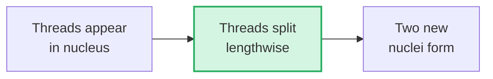

# Section 2.2: Discovery of Chromosomes — The Invisible Made Visible

📍 **Big Picture Scale:**
Cell ⮕ Nucleus ⮕ **Walther Fleming (1882)** ⮕ Chromosomes ⮕ DNA

> *"Sir, how did anyone even find these if DNA is 100,000 times thinner than a human hair?"*
> 
> *The story of chromosomes started with a lucky guess and some very clever animal choices. It wasn't about high-tech lasers—it was about choosing the right animal to peek into.*

---

## 🕰️ 1. The Scene: Germany, 1882

Imagine living in a world where "genes" and "DNA" don't exist yet. No one knows how traits are passed from parents to children. A scientist named **Walther Fleming** is staring through a brass microscope at the larvae of **salamanders**.

### Why the Salamander? (The 'Genius' Choice)
[⚠️ **EXAM TICKER:** Why did Fleming use salamander larvae? This is a common SA question.]

Fleming didn't choose humans or rats. He chose the salamander for three intuitive reasons:
1. **Transparency:** Larvae are semi-transparent. You can literally see *through* them.
2. **Size:** Salamanders have massive chromosomes compared to other animals.
3. **Speed:** Larvae grow fast, meaning their cells are dividing constantly.

> 💡 **Friend-to-Friend Tip:** Think of it like trying to read a tiny book in a dark room. You’d choose the book with the biggest font and the clearest paper. That "big font" book was the salamander.

---

## 🎨 2. The Fashion Industry Secret
*(The Invention of the Name)*

Fleming used **aniline dyes**—chemicals originally invented to dye clothes! When he dropped the dye on the cells:
- The cell body stayed pale.
- But the nucleus soaked up the dye like a sponge, revealing "coloured threads."

[⚠️ **2-MARK TICKER:** What did Fleming name the process and why? **Answer:** He named it **Mitosis** (from Greek *Mitos* = thread). Because to him, the chromosomes just looked like dividing threads.]

---

## 🔬 3. What Fleming Actually Saw
Fleming watched these threads divide lengthwise. He didn't know they were DNA. He just saw a perfectly organized "dance" of threads splitting into two. 

---

---

> 📝 **3-Line Compression:**
> 1. Chromosomes were discovered by _____ in the year _____.
> 2. He used _____ _____ to make the 'threads' visible.
> 3. He chose _____ larvae because their chromosomes are extra _____.

> 🎤 **Feynman Challenge:**
> *"Imagine you are in 1882 with a blurry microscope. Explain why using a transparent salamander makes you a better scientist than using a human cell."*

---

## 📝 ICSE Practice Questions — Section 2.2: Discovery of Chromosomes

> **Tutor's Note:** This set covers everything from Walther Fleming's 1882 "genius" choice to the historical naming of Mitosis. High-yield for board exams!

---

### A. Multiple Choice Questions (1 mark each)

**1. Chromosomes were first discovered by:**  
(a) Watson and Crick  
(b) Walther Fleming  
(c) Rosalind Franklin  
(d) Gregor Mendel  

**Answer: (b)**  
Walther Fleming discovered chromosomes in 1882 while studying dividing cells.

**2. Fleming observed chromosomes in the cells of:**  
(a) Human blood cells  
(b) Onion root tip cells  
(c) Salamander larval cells  
(d) Frog egg cells  

**Answer: (c)**  
He chose salamander larvae because their chromosomes are unusually large, the larvae are semi-transparent, and their cells divide rapidly.

**3. The word “mitosis” is derived from the Greek word meaning:**  
(a) Division  
(b) Thread  
(c) Colour  
(d) Nucleus  

**Answer: (b)**  
“Mitos” = thread. Fleming named the process mitosis because the stained structures looked like dividing threads.

**4. Aniline dyes were originally used for:**  
(a) Staining chromosomes  
(b) Dyeing clothes in the textile industry  
(c) Killing cells  
(d) Making microscopes  

**Answer: (b)**  
These dyes (from the fashion/textile industry) were used by Fleming; they stained the nuclear material intensely while leaving the rest of the cell pale.

**5. Fleming chose salamander larvae mainly because:**  
(a) They have small chromosomes  
(b) Their cells divide very slowly  
(c) They are semi-transparent with large chromosomes and rapid cell division  
(d) They are easy to obtain in Germany only  

**Answer: (c)**  
Large chromosomes + semi-transparency + fast-dividing cells made observation easier (like choosing a **"Big Font Book"** in a dark room).

---

### B. Very Short Answer Questions (1–2 marks each)

**1. When and by whom were chromosomes first discovered?**  

**Answer:**  
In **1882** by the German scientist **Walther Fleming** in the larval cells of salamanders.

**2. Why did Fleming use aniline dyes?**  

**Answer:**  
Aniline dyes (from the clothing industry) stained the nuclear threads intensely, making the chromosomes appear as brightly coloured bodies. This allowed the first clear observation under a light microscope.

**3. What is the meaning of the term “mitosis”? Who coined it and why?**  

**Answer:**  
Mitosis means **“the process of the threads”** (Greek: *mitos* = thread). Walther Fleming coined it because the stained chromosomes looked like dividing threads.

**4. Give any two reasons why Fleming selected salamander larvae for his study.**  

**Answer:**  
1. **Large chromosomes:** Much easier to see with early 1880s microscopes.  
2. **Transparency:** Larvae are semi-transparent, letting light pass through easily.  
3. **Rapid division:** Many cells in division were available at once.

---

### C. Short Answer Questions (2–3 marks each)

**1. Describe the experiment performed by Walther Fleming in 1882. What did he observe?**  

**Answer:**  
Fleming studied dividing cells in salamander larvae using a microscope and aniline dyes. He observed thread-like structures (chromosomes) appearing in the nucleus. These threads split lengthwise in an organised manner, and two new nuclei formed. He named the process **mitosis** (process of the threads). He saw the "dance" but didn't yet know about DNA.

**2. Why was the choice of salamander larvae a “genius” decision by Fleming? Explain with an analogy.**  

**Answer:**  
It was genius because it turned an impossible task (seeing tiny DNA) into a possible one.  
**Analogy:** It is like trying to read a tiny book in a dark room. Choosing the salamander is like selecting the book with the **biggest font** and clearest paper — making the job much easier for his weak 1882 microscope.

**3. Distinguish between the contributions of Walther Fleming (1882) and Watson & Crick (1953).**  

**Answer:**  
- **Fleming (1882):** First observed chromosomes as "coloured threads" and named the division process (Mitosis). He provided the **visible foundation**.  
- **Watson & Crick (1953):** Discovered the **double-helix structure of DNA** (the chemical material inside those threads).  
Fleming saw the "suitcase," while Watson & Crick read the "books" inside.

---

### D. Long Answer / Application / Higher-Order Thinking Questions (3–5 marks)

**1. Explain why Fleming's discovery is the starting point of modern genetics even though he didn't know about DNA.**  

**Answer:**  
Fleming’s observation showed that definite threads appear, divide accurately, and are passed to daughter cells. This proved there was a **physical basis** for inheritance. Science progresses in layers: accurate observation (Fleming) must come before molecular explanation (Watson/Crick).

**2. Assertion-Reason type:**  
- **Assertion (A):** Walther Fleming named the process of cell division “mitosis”.  
- **Reason (R):** He observed thread-like structures that appeared to divide.  
(a) Both A and R are true and R is the correct explanation of A.  
(b) Both true but R is not the correct explanation.  

**Answer: (a)**  
Both are true and R correctly explains A. The Greek word “mitos” means thread.

**3. Feynman Final Check:**  
Explain to a younger student why using salamander larvae was smarter than using human cells for discovering chromosomes in 1882.  

**Answer:**  
In 1882, microscopes were weak and blurry. Human chromosomes are tiny and the cells are hard to see through. It would be like trying to read a secret message written in tiny, faint ink. Fleming was smart: he chose salamander larvae because they have **huge chromosomes** (Big Font) and they are **see-through** (Clear Paper). This made the hidden "threads" of life visible for the first time!

