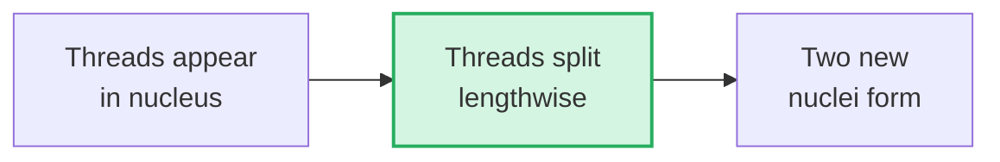

# Section 2.2: Discovery of Chromosomes — The Invisible Made Visible

📍 **Big Picture Scale:**
Cell ⮕ Nucleus ⮕ **Walther Fleming (1882)** ⮕ Chromosomes ⮕ DNA

> *"Sir, how did anyone even find these if DNA is 100,000 times thinner than a human hair?"*
> 
> *The story of chromosomes started with a lucky guess and some very clever animal choices. It wasn't about high-tech lasers—it was about choosing the right animal to peek into.*

---

## 🕰️ 1. The Scene: Germany, 1882

Imagine living in a world where "genes" and "DNA" don't exist yet. No one knows how traits are passed from parents to children. A scientist named **Walther Fleming** is staring through a brass microscope at the larvae of **salamanders**.

### Why the Salamander? (The 'Genius' Choice)
[⚠️ **EXAM TICKER:** Why did Fleming use salamander larvae? This is a common SA question.]

Fleming didn't choose humans or rats. He chose the salamander for three intuitive reasons:
1. **Transparency:** Larvae are semi-transparent. You can literally see *through* them.
2. **Size:** Salamanders have massive chromosomes compared to other animals.
3. **Speed:** Larvae grow fast, meaning their cells are dividing constantly.

> 💡 **Friend-to-Friend Tip:** Think of it like trying to read a tiny book in a dark room. You’d choose the book with the biggest font and the clearest paper. That "big font" book was the salamander.

---

## 🎨 2. The Fashion Industry Secret
*(The Invention of the Name)*

Fleming used **aniline dyes**—chemicals originally invented to dye clothes! When he dropped the dye on the cells:
- The cell body stayed pale.
- But the nucleus soaked up the dye like a sponge, revealing "coloured threads."

[⚠️ **2-MARK TICKER:** What did Fleming name the process and why? **Answer:** He named it **Mitosis** (from Greek *Mitos* = thread). Because to him, the chromosomes just looked like dividing threads.]

---

## 🔬 3. What Fleming Actually Saw
Fleming watched these threads divide lengthwise. He didn't know they were DNA. He just saw a perfectly organized "dance" of threads splitting into two. 

---

---

> 📝 **3-Line Compression:**
> 1. Chromosomes were discovered by _____ in the year _____.
> 2. He used _____ _____ to make the 'threads' visible.
> 3. He chose _____ larvae because their chromosomes are extra _____.

> 🎤 **Feynman Challenge:**
> *"Imagine you are in 1882 with a blurry microscope. Explain why using a transparent salamander makes you a better scientist than using a human cell."*

---

## 📝 Practice Questions — Section 2.2
[... Practice questions remain the same ...]

---

### 🔘 A. Multiple Choice (1 mark each)

**1.** Chromosomes were first discovered by:
- (a) Watson and Crick
- (b) Walther Fleming
- (c) Rosalind Franklin
- (d) Gregor Mendel

> **Answer: (b)** Walther Fleming, 1882.

---

**2.** Fleming discovered chromosomes in the cells of:
- (a) Human blood cells
- (b) Frog egg cells
- (c) Salamander larval cells
- (d) Onion root tip cells

> **Answer: (c)** He chose salamander larvae because their chromosomes are unusually large and cells divide rapidly.

---

**3.** The word "mitosis" is derived from the Greek word meaning:
- (a) Division
- (b) Thread
- (c) Colour
- (d) Nucleus

> **Answer: (b)** *Mitos* = thread. Fleming named it because chromosomes looked like dividing threads under his lens.

---

### 📝 B. Very Short Answer (1–2 marks each)

**1.** When and by whom were chromosomes first discovered?

> **Answer:** Chromosomes were first discovered in **1882** by the German scientist **Walther Fleming**.

---

**2.** Why did Fleming use aniline dyes in his experiments?

> **Answer:** Aniline dyes stained the chromosomes intensely while leaving the rest of the cell faint, making the chromosomes visible under the microscope for the first time.

---

**3.** Give the full meaning of the word "Mitosis".

> **Answer:** **Mitos** (Greek) = Thread + **Osis** = Process → Mitosis = "The process of the threads." Fleming named it because the chromosomes appeared as dividing threads under his microscope.

---

**4.** State two reasons why Fleming chose salamander larvae as his experimental organism.

> **Answer:**
> 1. Salamander chromosomes are unusually large — visible even under weak early microscopes.
> 2. Larval cells divide rapidly — providing many cells in division simultaneously, making observation easier.
> *(Also acceptable: Larvae are semi-transparent, allowing light to pass through for microscopy.)*

---

### 📄 C. Short Answer (2–3 marks each)

**1.** Why is the year 1953 considered a landmark in the history of chromosomes? Name two scientists involved.

> **Answer:** In 1953, **Rosalind Franklin** used X-ray crystallography to produce "Photo 51" — revealing the helical shape of DNA. Using her data, **James Watson and Francis Crick** determined the complete double-helix structure of DNA. This was the most important discovery in biology — directly from the work that began with Fleming's 1882 observation.

---

**2.** What is the significance of the Human Genome Project (2003) in relation to chromosome research?

> **Answer:** The Human Genome Project (completed 2003) mapped all ~3 billion base pairs of human DNA across 46 chromosomes, identifying ~20,000–25,000 genes. It is the culmination of over 120 years of chromosome research starting with Fleming's 1882 discovery.

---

### ⭐ D. IIT / Higher-Order Thinking

**1.** Fleming could see chromosomes but had no idea what they were made of or what they did. Yet his observation is considered a founding contribution to genetics. What does this tell us about scientific discovery?

> **Model Answer:** Scientific discovery does not require complete understanding — it requires precise observation and accurate description. Fleming contributed by (a) identifying that a specific structure exists inside dividing cells, (b) naming the division process, and (c) providing a foundation that later scientists could build upon. Science progresses in layers: observation first, then explanation. Fleming's "threads" eventually became the DNA double helix seventy years later.

