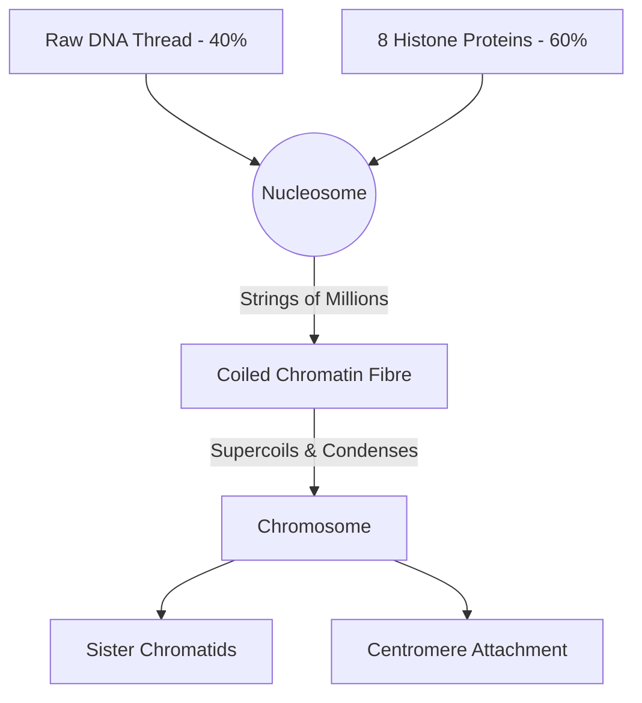

# Section 2.3: Structure of Chromosomes

> *"Here, we witness one of nature's greatest feats of microscopic engineering. How, one might ask, does a cell manage to pack two solid meters of genetic code into a vault so small it cannot be seen by the naked eye? The answer lies in an exquisite masterpiece of folding..."*

## 🩻 1. The Anatomy of the "X"
When observing a cell prepare for division, the chromosome reveals its magnificent, condensed form—resembling a thick "X". 
- **Chromatids:** These are the two identical "arms" or "legs" of the chromosome. Because they are exact photocopies of each other, they are forever destined to be pulled apart.
- **Centromere:** The vital, pinched region (constriction) that binds the identical twins together. 

During the chaos of cell division, **spindle fibres** behave like microscopic grappling hooks. They attach directly to this centromere and violently tear the sister chromatids apart, reeling them toward opposite poles of the cell.

## 🧬 2. The Grand Recipe of Chromatin
What exactly is this magical chromatin material made of? It is a harmonious marriage of two distinct elements:
1. **DNA (Deoxyribonucleic acid)** — Making up about **40%** of the structure.
2. **Histones** — Specialized, structural proteins making up the remaining **60%**.

### 🧶 The Packing Game: Introducing the Nucleosome
If you simply threw two meters of thread into a tennis ball, it would become an irrecoverable tangle. Nature, however, is exceptionally tidy.

The DNA thread wraps elegantly around a core cluster of exactly **8 histone molecules**—much like winding a garden hose around a wooden spool. 
👉 **Exam Term:** This breathtaking complex of 8 histones wrapped with DNA is called a **Nucleosome**. 

When one million of these nucleosomes string together, they coil, and then they *supercoil*, much like an old-fashioned telephone cord spiraling into a dense, unbreakable package.

## 🪜 3. Structure of DNA (The Double Helix)
In 1953, peering into the very fabric of life, Rosalind Franklin studied its shape, while Watson and Crick unlocked its ultimate structure: the **Double Helix**.

DNA is a macromolecule consisting of two complementary strands winding beautifully around each other. Each strand is a chain of repeating building blocks called **Nucleotides**. Every nucleotide is an alliance of three components:
1. A **Phosphate**
2. A **Sugar** (Pentose)
3. A **Nitrogenous Base**

### 🔥 The Rungs of the Ladder
It is the bases that form the "rungs" connecting the two sides of the ladder. There are four bases, and they follow strict rules of loyalty:
- **Adenine (A)** pairs exclusively with **Thymine (T)** (using exactly **2 hydrogen bonds**).
- **Guanine (G)** pairs exclusively with **Cytosine (C)** (using exactly **3 hydrogen bonds**).
*(Memory Trick: **A**pples in the **T**ree, **C**ars in the **G**arage!)*

## 🖨️ 4. Formation of New DNA (Replication)
During the interphase of the cell cycle, a quiet miracle occurs. The great double helix slowly unwinds, unzipping down the middle. Against each of the original, exposed strands, a brand new complementary strand is built simultaneously. From one original code, two identical helixes are born—ready to be bestowed upon the next generation of cells.

---
### 🏆 Active Recall Check
1. **What is a nucleosome?** *(Answer: A core of 8 histone proteins with DNA wrapped around it).*
2. **What are the 3 parts of a nucleotide?** *(Answer: Phosphate, Sugar, Nitrogenous Base).*
3. **How many hydrogen bonds are between G and C?** *(Answer: Three).*
