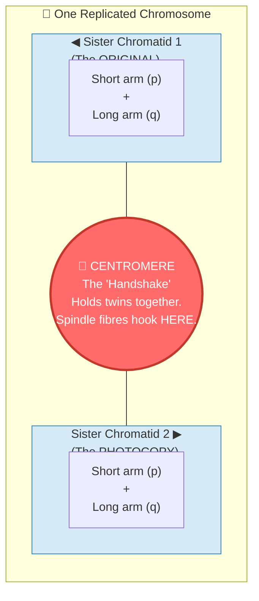

# Section 2.3: Structure of Chromosomes — The Master Logic

📍 **Big Picture Scale:**
Cell ⮕ Nucleus ⮕ **Chromatin** ⮕ **Chromosome** ⮕ **DNA** ⮕ **Gene**

> *"Sir, if I have 2 metres of DNA in every tiny cell, why doesn't it just get tangled like my headphones in my pocket?"*
> 
> *The answer is the 'Master Logic' of packing. Your cell is a genius architect. It knows when to keep its blueprints loose (to read them) and when to pack them into iron-clad suitcases (to move them).*

---

## 🚪 1. The "Loose Thread" vs the "Suitcase"

Before we dive into the chemicals, we need to solve the biggest confusion in Biology: **What is the difference between Chromatin and Chromosomes?**

Think of it like a **move to a new house**:
- **Chromatin** is like all your clothes scattered around your room while you are living there (Interphase). You can find your favourite shirt easily (the cell can read the DNA).
- **Chromosome** is when you pack those same clothes into a tight suitcase to move them (Cell Division). You can't wear the clothes anymore, but you can move them without losing a single sock.

| Feature | 🧵 Chromatin Fibre | 📦 Chromosome |
|:---|:---|:---|
| **Form** | Long, thin, uncoiled threads | Short, thick, condensed "X" shapes |
| **When?** | During everyday life (**Interphase**) | Only during **Cell Division** |
| **Visibility** | Invisible under light microscope | Clearly visible! |
| **Purpose** | **Reading:** To make proteins/run the cell | **Moving:** To ensure DNA doesn't snap during division |

---

## 🩻 2. Anatomy of the Armored "X"

[⚠️ **EXAM TICKER:** Identifying parts of a chromosome is the #1 most common diagram question. Study this carefully.]

When you see a chromosome under a microscope, it looks like an **X**. But remember: it only looks like an X because it has *already* photocopied itself. It’s actually twins holding hands!

### The Parts You Must Label:
- **Sister Chromatids:** The two identical "arms" of the X. They are exact clones of each other.
- **Centromere:** The pinched "waist" that holds them together. 
  - *Why does it exist?* To give the cell a single handle to grab onto during the "tug-of-war" of division.
- **p-arm & q-arm:** (p = petite/short, q = long).

---

## 🧶 3. How to Pack 2 Metres into a Microscopic Dot
*(The 4-Step Packing Logic)*

[⚠️ **EXAM TICKER:** You must know the 4 levels of packing in order. They love asking for this sequence.]

How do you fit a 2-metre thread inside a nucleus that is 100,000 times smaller? **You use Histone Spools.**

> 💡 **The Analogy:** 
> Imagine you have a single, long hair. It’s thin and easily tangles. Now imagine you braid that hair tightly. It becomes shorter, thicker, and much stronger. 
> **Chromatin** = Loose hair.
> **Chromosome** = The tight braid.

### Step 1: The "Beads on a String" (Nucleosomes)
DNA is negatively charged (magnetic physics!). **Histones** are proteins that are positively charged. Because opposites attract, DNA naturally wraps itself twice around a core of **8 Histone proteins**.
- This bundle is called a **Nucleosome**.
- **Mental Image:** Think of a football (Histones) with a rope (DNA) wound around it.

### Step 2: The Coil (30nm Fibre)
The string of nucleosomes coils up like a spring. This is the **Chromatin Fibre**.

### Step 3: The Supercoil
The spring then coils *again* on itself. Think of an old telephone cord that starts looping into knots. 

### Step 4: The Chromosome 
Finally, it folds into the thick, visible **Chromosome**.

---

## 🪜 4. The DNA "Rope Ladder" (Double Helix)

If you unraveled everything, you'd find the DNA molecule.
In **1953**, **Watson and Crick** (using data from **Rosalind Franklin**) discovered its shape: the **Double Helix**. It looks like a twisted rope ladder.

### The Building Block: The Nucleotide
Every rung and rail of that ladder is made of **Nucleotides**. One nucleotide has:
1. **Phosphate** (The Rail)
2. **Sugar** (The Rail)
3. **Nitrogenous Base** (The Rung/Step)

### ⚖️ The Pairing Rule (The "Apples & Trees" Logic)
There are 4 types of bases: **A, T, G, C**. They aren't allowed to pair with whoever they want.

[⚠️ **2-MARK TICKER:** Why does A always pair with T and G with C? **Answer:** To keep the width of the DNA ladder perfectly constant. If two large bases (Purines) paired, the ladder would bulge and break!]

- **A pairs with T** (2 Hydrogen bonds) 🍎 **A**pples in **T**rees
- **G pairs with C** (3 Hydrogen bonds) 🚙 **G**arage for **C**ars

---

## 🖨️ 5. DNA Replication (Making the Photocopy)

Before a cell divides, it must copy its DNA. It uses a **Semi-Conservative** method.
1. **The Unzip:** An enzyme (Helicase) breaks the weak hydrogen bonds, zipping open the ladder.
2. **The Template:** Each half-ladder acts as a mould.
3. **The New Partner:** New building blocks (nucleotides) float in and pair up (A with T, G with C).
4. **Result:** Two identical DNA ladders! Each has **one old** strand and **one new** strand. (This is why it's called "Semi-Conservative").

---

---

> 📝 **3-Line Compression:**
> 1. Chromatin is for _____; Chromosomes are for _____.
> 2. DNA wraps around histones because DNA is _____ and Histones are _____.
> 3. _____ and _____ discovered the Double Helix in the year _____.

> 🎤 **Feynman Challenge:**
> *"Explain to your friend why a chromosome looks like an 'X'. Use the 'photocopy' analogy."*

---

## 📝 ICSE Practice Questions — Section 2.3: Structure of Chromosomes

> **Tutor's Note:** This is the most "technical" section of the chapter. Master the analogies (Suitcase, Football, Handshake) and the base-pairing rules (Apples & Trees) to score 100%.

---

### A. Multiple Choice Questions (1 mark each)

**1. A replicated chromosome appears X-shaped because:**  
(a) It has two different chromatids  
(b) It consists of two identical sister chromatids joined at the centromere  
(c) The arms are of unequal length  
(d) Telomeres join the ends  

**Answer: (b)**  
After DNA replication, the chromosome has two identical copies (sister chromatids) holding hands at the centromere, giving the classic X-shape.

**2. The “waist” or pinched region of a chromosome that holds the two sister chromatids together and serves as the attachment point for spindle fibres is called:**  
(a) Telomere  
(b) Centromere  
(c) Nucleosome  
(d) Satellite  

**Answer: (b)**  
The centromere acts like a **“handshake”** or handle that the cell uses during division.

**3. The basic unit of DNA packing, described as “beads on a string”, is:**  
(a) Nucleosome  
(b) Chromatin fibre  
(c) Double helix  
(d) Supercoil  

**Answer: (a)**  
A nucleosome consists of DNA wrapped twice around a core of 8 histone proteins (like a **football with rope** wound around it).

**4. In DNA base pairing, Guanine (G) always pairs with Cytosine (C) because:**  
(a) It forms 2 hydrogen bonds  
(b) It forms 3 hydrogen bonds and maintains constant ladder width  
(c) It is a purine like Adenine  
(d) It prevents unzipping  

**Answer: (b)**  
G-C pairing (3 bonds) and A-T pairing (2 bonds) keep the width of the DNA ladder constant. Purines (big) must pair with Pyrimidines (small) to prevent the ladder from bulging.

**5. The method of DNA replication in which each new DNA molecule has one old (parental) strand and one new strand is called:**  
(a) Conservative  
(b) Dispersive  
(c) Semi-conservative  
(d) Random  

**Answer: (c)**  
This is the **semi-conservative** method. The original ladder unzips, and each half acts as a template for a new complementary strand.

---

### B. Very Short Answer Questions (1–2 marks each)

**1. Define a nucleosome.**  

**Answer:**  
A nucleosome is the basic packaging unit of DNA in which a negatively charged DNA molecule wraps twice around a positively charged core of 8 histone proteins. It looks like **“beads on a string.”**

**2. What is the difference between the p-arm and q-arm of a chromosome?**  

**Answer:**  
The **p-arm** is the short (petite) arm, and the **q-arm** is the long arm of a chromosome. They are separated by the centromere.

**3. Name the enzyme that unzips the DNA double helix during replication and state its function.**  

**Answer:**  
**Helicase.** It breaks the weak hydrogen bonds between base pairs, allowing the two strands to separate (unzip) so each can act as a template.

**4. Why does DNA replication occur in the S-phase of interphase?**  

**Answer:**  
DNA replication occurs in the S-phase so that each daughter cell receives an exact copy of the genetic material when the cell divides later in mitosis.

**5. State the analogy used to explain why chromosomes condense during cell division.**  

**Answer:**  
Chromatin is like **clothes scattered** around the room (easy to read but messy), while a chromosome is like the same clothes packed tightly in a **suitcase** (easy to move without losing anything).

---

### C. Short Answer Questions (2–3 marks each)

**1. Distinguish between chromatin and chromosome (tabular form).**

**Answer:**

| Feature | Chromatin | Chromosome |
|:---|:---|:---|
| **Form** | Long, thin, uncoiled threads | Short, thick, condensed X-shape |
| **Stage** | Interphase (non-dividing) | During cell division |
| **Visibility** | Not clearly visible | Clearly visible under microscope |
| **Purpose** | Reading genes / protein synthesis | Safe movement of DNA during division |

**2. Describe the four levels of DNA packing in a chromosome in correct sequence.**  

**Answer:**  
1. **Nucleosomes** (“Beads on a string”): DNA wraps around histone octamers.  
2. **30 nm Chromatin fibre**: Nucleosomes coil into a spring-like fibre.  
3. **Supercoil**: The fibre coils further on itself (like a telephone cord).  
4. **Chromosome**: Final highly condensed, visible structure.

**3. With the help of an analogy, explain the role of the centromere in a replicated chromosome.**  

**Answer:**  
The centromere is the **“handshake”** or **“handle”** that holds the two identical sister chromatids together. It gives the cell a single point to attach spindle fibres during the tug-of-war of cell division, ensuring accurate separation.

**4. Name the building blocks of DNA and state their three components.**  

**Answer:**  
The building blocks are **Nucleotides**. Each nucleotide contains:  
1. A Phosphate group (The Rail)  
2. A Deoxyribose Sugar (The Rail)  
3. A Nitrogenous Base (The Rung)

---

### D. Long Answer / Application / Higher-Order Thinking Questions (3–5 marks)

**1. Explain the “Master Logic” of chromosome packaging. Why two forms?**  

**Answer:**  
The cell is a genius architect. It keeps DNA loose as chromatin during interphase (like **clothes scattered** in the room) so genes can be easily read for protein synthesis. During cell division, it packs the same DNA into tight chromosomes (like **packing clothes into a suitcase**) so the 2-metre-long fragile thread does not tangle or break while being moved. Same material — different packaging for “reading mode” vs. “moving mode.”

**2. Assertion-Reason type:**  
- **Assertion (A):** DNA replication is called semi-conservative.  
- **Reason (R):** Each new DNA molecule consists of one parental strand and one newly synthesised strand.  
(a) Both A and R true, R explains A  

**Answer: (a)**  
Both are true and R correctly explains A. After unzipping, each old strand serves as a template, conserving half of the original molecule.

**3. Case-based question:**  
*“If histones were not present, the 2 metres of DNA could never fit inside the nucleus.”* Do you agree? Explain using the **hair-braiding analogy**.  

**Answer:**  
Yes, I agree. Without histones, DNA would remain tangled like loose hair.  
**Analogy:** Braiding loose hair makes it shorter, thicker, and stronger — exactly what happens when DNA wraps around histones to form nucleosomes and then supercoils into a chromosome. Without the histone core, the first step of "braiding" would fail.

**4. Feynman Final Check:**  
Explain to a younger sibling why DNA bases pair specifically (A-T and G-C). Use the mnemonics and the ladder-width reason.  

**Answer:**  
DNA is a rope ladder. To keep the ladder straight, a big person (Purine) must always pair with a small person (Pyrimidine).  
- **A pairs with T:** “**A**pples in **T**rees” (2 bonds).  
- **G pairs with C:** “**G**arage for **C**ars” (3 bonds).  
If two big people paired, the ladder would bulge and break! If two small people paired, it would narrow. This perfect matching keeps the ladder of life strong.

