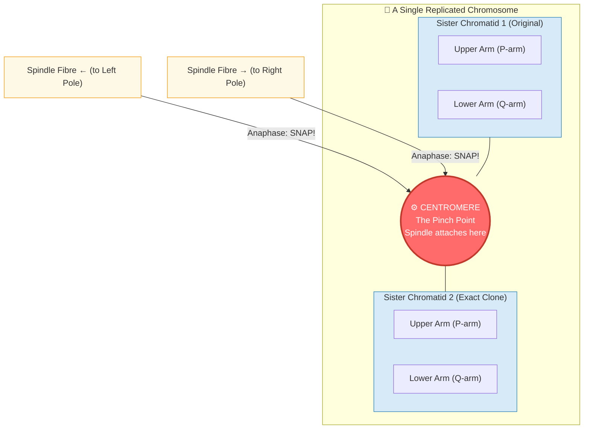
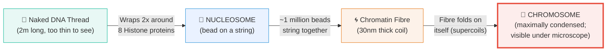
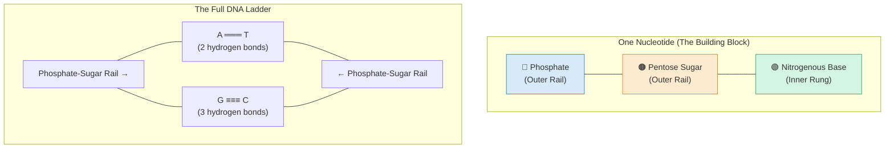
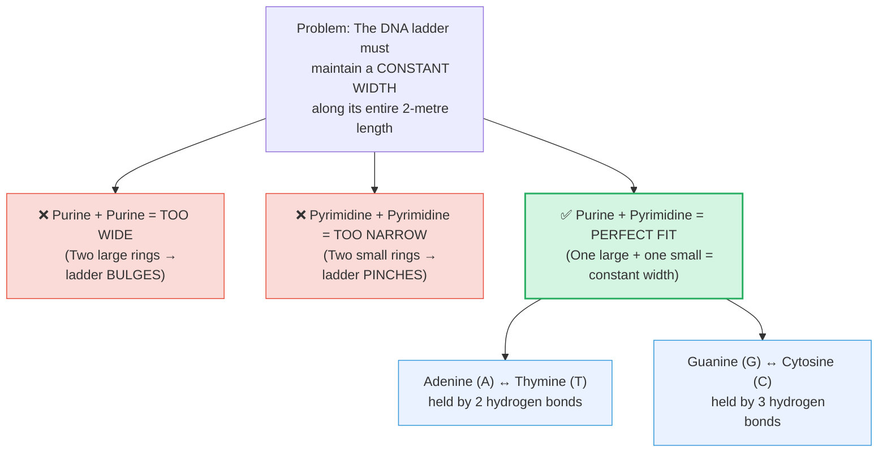
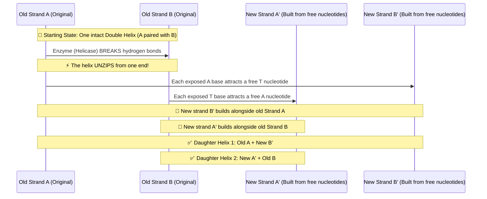

# Section 2.3: Structure of Chromosomes

> *"Here, we witness one of nature's greatest feats of microscopic engineering. How does a cell manage to pack two solid meters of fragile genetic code into a vault so small it cannot be seen by the naked eye, and without a single tangle? The answer lies in an exquisite, mathematically perfect masterpiece of folding..."*

*(Note: This is the most heavily-tested section in your syllabus. Pay deep attention to every structural level.)*

---

## 🩻 1. The Anatomy of a Replicated Chromosome

When a cell is preparing to divide, the chromatin fibre condenses into a compact, visible shape — the classic **"X"**. But this X is not just one thing; it is two.

**Read this diagram**: The two blue boxes (Sister Chromatids) are identical twins born from DNA copying. They are glued together at the **red circle (Centromere)**. During Anaphase, spindle fibres from opposite poles hook onto this centromere and snap them apart.

- **Chromatids (The Twins):** The two identical arms of the X. The left arm is a 100% perfect clone of the right arm — born from the S-Phase copying event.
- **Centromere (The Belt):** The constricted pinch-point holding the twins together. It is not always central; it can be closer to one end, making arms unequal.

> 📌 **Key fact:** After cell division completes, the chromatids (now separated) de-condense back into chromatin fibres. If there are 46 chromosomes, there will be 46 chromatin fibres in the nucleus during Interphase.

---

## 🧬 2. The Packing Hierarchy: DNA → Chromosome

The most visually confusing concept in this chapter is *how* DNA becomes a chromosome. It happens in a beautiful zoom-out sequence of 4 levels.

### 🧲 Why Does DNA Wrap Around Histones? (The Magnetic Secret)
This is pure electrostatics — the exact same physics as a magnet attracting a fridge door.

- **DNA** is negatively charged (due to its phosphate groups).
- **Histones** are positively charged proteins.
- Opposite charges attract, so DNA *magnetically* winds itself around the histone core.

> 📌 **Exam Definition — Nucleosome:** A nucleosome is the complex formed by a core of **8 histone proteins** with a DNA strand wound around it **twice**. Think of a football (histone core) wrapped tightly by a rope (DNA). One human chromosome contains approximately **one million nucleosomes**!

The chromatin fibre then coils and **supercoils** upon itself — just like a telephone cord that has been twisted until it folds back onto itself. This is what creates the thick, fat chromosome.

---

## 🪜 3. The Architecture of DNA (The Double Helix)

In **1953**, two parallel stories collided. **Rosalind Franklin** produced a breathtaking X-ray photograph of DNA (called "Photo 51"), revealing its helical shape. Using her data, **James Watson and Francis Crick** published the definitive architecture of the Double Helix.

DNA is a **macromolecule** of two complementary strands wound around each other — an infinitely long spiral staircase. Every step of the staircase is made of the same 3-part building block: the **nucleotide**.

### ⚖️ The Base Pairing Rule: A Physics Constraint

There are exactly **4 nitrogenous bases**, divided by physical size:

| Type | Name | Size | Rings |
|:---|:---|:---|:---|
| **Purines** | **A**denine, **G**uanine | Large | 2 rings |
| **Pyrimidines** | **T**hymine, **C**ytosine | Small | 1 ring |

Now here is the critical insight Watson and Crick had:

> 🔑 **Memory trick:** **A**pples fall from **T**rees. **C**ars park in a **G**arage.

---

## 🖨️ 4. Formation of New DNA (Replication)

Before a cell can divide, it must first **copy its entire DNA** perfectly. This happens silently during the S-Phase of Interphase.

The mechanism is elegant: the helix *unzips* down the middle, and each exposed half becomes a template for a brand-new complementary strand.

**The result:** From one parent double helix, **two identical daughter helices** are produced. Each new helix contains **one original old strand** and **one new strand** — this is called **Semi-Conservative Replication**.

---
### 🏆 Active Recall & IIT Foundation Check

1. **What is the exact chemical composition of Chromatin?**
   *(Answer: 40% DNA and 60% Histone proteins.)*

2. **Define a nucleosome and explain WHY DNA wraps around histones.**
   *(Answer: A nucleosome is a core of 8 histone proteins with DNA wound around it twice. DNA is negatively charged and histones are positively charged — opposite charges attract!)*

3. **Name the 4 packing levels that convert naked DNA into a chromosome.**
   *(Answer: Naked DNA Thread → Nucleosome → Chromatin Fibre → Chromosome.)*

4. **Why CAN'T Adenine pair with Guanine?**
   *(Answer: Both Adenine and Guanine are large double-ringed Purines. Two Purines together would make the DNA ladder wildly bulge outward, destroying its structural integrity!)*

5. **What does "semi-conservative replication" mean?**
   *(Answer: Each new DNA double helix keeps one old original strand and built one brand-new strand against it. The genetic information is "conserved" in one original strand per copy.)*
