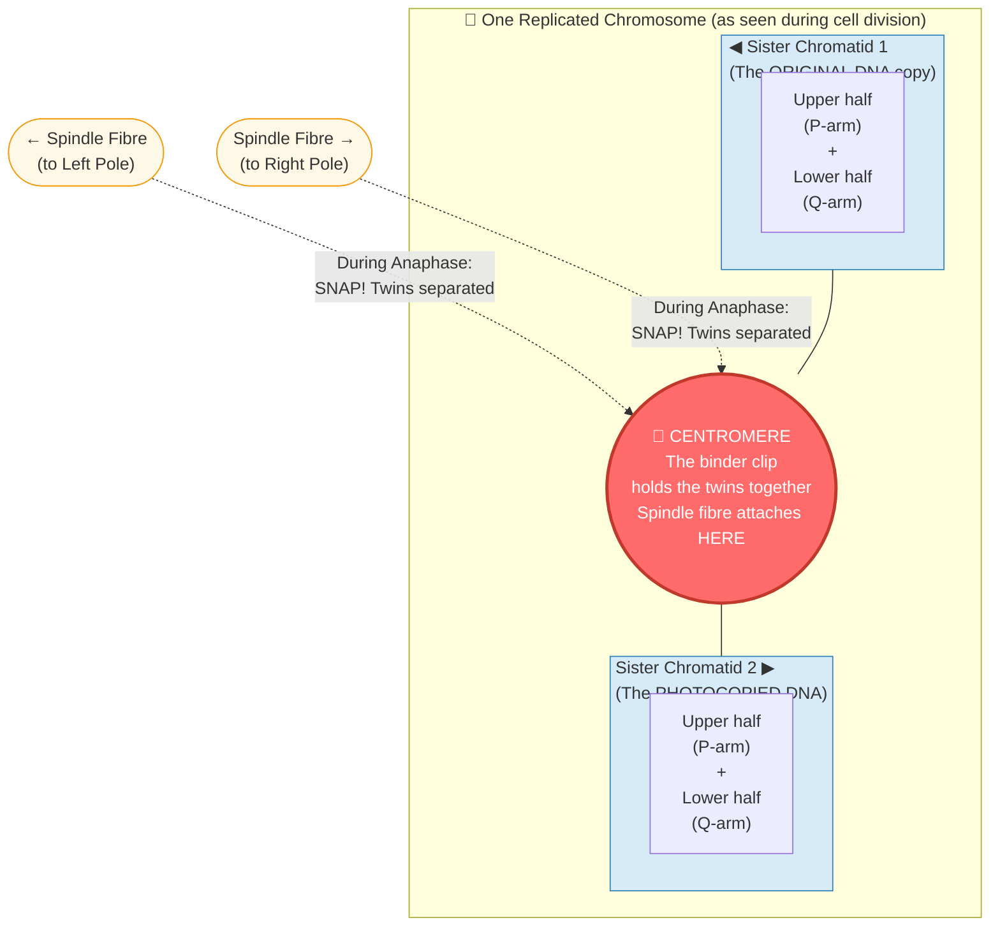
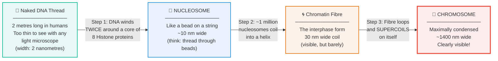
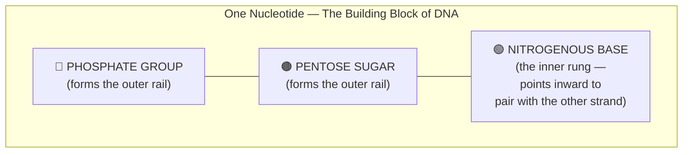
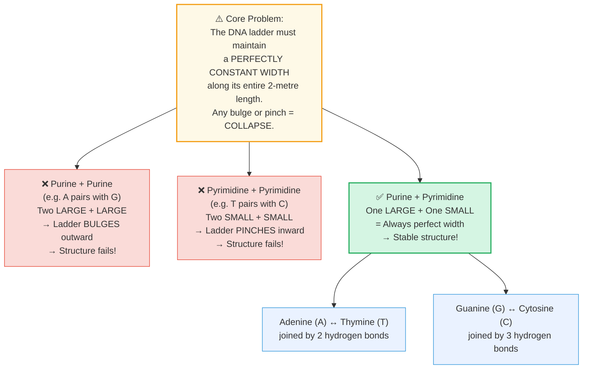
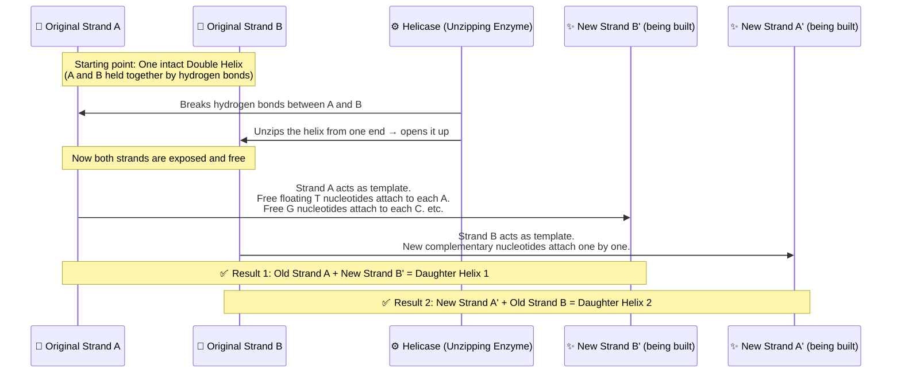

# Section 2.3: Structure of Chromosomes

> *"Before we can understand how life divides, we must first understand what life is actually dividing. Inside every cell is a vault. Inside that vault is a blueprint. And that blueprint is stored in the most cleverly packed object in the known universe..."*

*(Note: This is the most heavily-tested section in your entire syllabus. Read slowly. Every word matters.)*

---

## 🚪 First — Let's Orient Ourselves

You already know from Section 2.1 that chromosomes are the "packaged" form of DNA — the thick, compact structures that appear inside the nucleus when a cell is preparing to divide. In their loose, everyday form, they are called **chromatin fibres** — impossibly thin threads you cannot see. They only become the thick, visible "X" shapes when the cell is about to divide.

So the first question a curious student should ask is:

> **"Why do chromosomes look like an X? Why not a line, or a circle?"**

The answer is timing. By the time a chromosome becomes visible (during a phase called Prophase), it has *already been duplicated*. The cell has already quietly made a photocopy of its DNA during the S-Phase. So what you are looking at is **not one chromosome — it is two identical copies still stuck together**. That joined pair is what makes the X shape.

This is called a **Replicated Chromosome**, and understanding this distinction is the key to understanding everything that follows.

---

## 🩻 1. The Anatomy of a Replicated Chromosome

Think of it like this: imagine a book that has been photocopied. You have the original and the copy, held together at their spines by a binder clip. That binder clip is the **centromere**. The original is one **chromatid**. The copy is the other **chromatid**. Together, they make one replicated chromosome.

> 🧠 **Stop & Think — Before reading the Centromere explanation:**
> *You have 2 identical books. You need to split them later and give one to each of two rooms. How do you safely hold them together in the meantime without mixing up the pages?*
> *(Your answer IS the centromere.)*

Let's name the parts properly now:

- **Chromatid** — One of the two identical arms of the X. The left arm is called **Sister Chromatid 1** (the original), and the right arm is **Sister Chromatid 2** (the exact photocopy). They are "sisters" because they are genetically identical.
- **Centromere** — The pinched, constricted region that holds the two sisters together. It is not always exactly in the middle — sometimes it is closer to one end, making the arms unequal.
- **P-arm and Q-arm** — Just the formal names for the two arms on either side of the centromere. "P" (from French *petite*) = the shorter arm. "Q" = the longer arm.

**What happens next?** During Anaphase (the "pulling apart" phase of cell division), long protein ropes called **spindle fibres** grow from opposite ends of the cell. They hook onto the centromere from *both sides* and pull the sisters apart. The centromere snaps, and each sister travels to a different daughter cell. This is how one cell's genetic material becomes two identical sets.

> 📌 **After division is complete:** The chromatids de-condense back into chromatin fibres. A cell with 46 chromosomes will have 46 chromatin fibres inside the nucleus during everyday life (Interphase).

---

## 🧬 2. What is Chromatin Actually Made Of?

We know chromosomes condense from chromatin fibres. But what *is* chromatin? What is it made of at the chemical level?

Chromatin is not just raw DNA. It is a partnership between two things:
1. **DNA (Deoxyribonucleic acid)** — Makes up about **40%** of the mass.
2. **Histones** — Special structural proteins that make up the remaining **60%**.

The DNA cannot just float freely — it would tangle into an unreadable mess (imagine 40 miles of fishing line in a tennis ball). Histones are the *spools*. DNA winds around them to stay organized.

### The 4 Levels of Packing (From Thread to Chromosome)

This is the most important zoom-out in all of biology. DNA becomes a chromosome through four progressive levels of folding. Think of it like folding a huge map into your pocket:

### 🧲 Why Does DNA Wind Around Histones? (The Magnetic Secret)

This is pure physics — the same reason a magnet sticks to a fridge.

- **DNA is negatively charged** (it has phosphate groups all along its backbone).
- **Histone proteins are positively charged** (they contain many positively charged amino acids).
- Opposite charges *attract*. So DNA wraps itself naturally and magnetically around the histone core — no force required.

> 📌 **Exam Term — Nucleosome:** A **nucleosome** is a core of **8 histone proteins** with a strand of DNA wound **twice** around it. Like a football (histone core) with a rope (DNA) wound tightly around it. One human chromosome contains approximately **one million nucleosomes**.

The huge chromatin fibre that results then coils, then *supercoils* upon itself — exactly like a telephone cord that has been twisted so many times it folds back on itself. This is what ultimately creates the dense, compact chromosome you see during cell division.

---

## 🪜 3. The Architecture of DNA (The Double Helix)

Now we zoom in — past the chromosome, past the chromatin fibre, past the nucleosome — all the way down to the DNA molecule itself.

First, let's visualize what we're looking at. DNA is not straight. It is not a simple line. It is a **Double Helix** — imagine a rope ladder, but the two rails are twisted into a gentle spiral. That spiral staircase, extended infinitely, is the shape of DNA.

Here is how it arrived at this structure: In **1953**, a scientist named **Rosalind Franklin** produced a legendary X-ray photograph of DNA called *"Photo 51"*. This grainy image revealed DNA's helical shape with precision. Using her data, **James Watson and Francis Crick** worked out the full architecture.

### Building Up the Ladder from Scratch

The rails of the ladder are built from repeating units called **nucleotides**. Before we describe DNA, we need to understand this building block. Every single nucleotide everywhere in all of life has three parts:

- **Phosphate + Sugar** chain together to form the **two outer rails** of the ladder (the backbone).
- The **Nitrogenous Base** points **inward**, sticking out like a half-rung, reaching across to grab its partner on the other strand.

### ⚖️ The Four Bases and the Pairing Rule

This is where most students get confused. There are **4 nitrogenous bases**, and they do NOT pair randomly.

First, understand their sizes:

| Group | Bases | Physical Size | Ring Count |
|:---|:---|:---|:---|
| **Purines** | **A**denine (A) and **G**uanine (G) | Large | 2 rings |
| **Pyrimidines** | **T**hymine (T) and **C**ytosine (C) | Small | 1 ring |

Now the key insight — *why* can't bases just pair with anyone?

> 🔑 **Memory trick:** **A**pples fall from **T**rees. **C**ars park in a **G**arage. (A↔T and C↔G)

---

## 🖨️ 4. How Does DNA Copy Itself? (Replication)

Here is a problem every dividing cell must solve: before it can split into two daughter cells, it must give each daughter a **complete, perfect copy** of its entire DNA. You cannot tear the original in half — each daughter needs the full instructions.

So how does the cell copy 2 metres of DNA perfectly, without a single typo?

The process is called **DNA Replication** (replication = making a copy) and it happens during the **S-Phase** (Synthesis Phase) of Interphase. Here's the story of how it works:

> 💡 **The key insight:** DNA is double-stranded. The two strands are held together by weak hydrogen bonds (the rungs of the ladder). Because these bonds are *weak*, they can be gently broken open without destroying either strand. Each freed strand then acts as a **template** — a mould — for building a brand-new partner strand.

**What you get:** From one original double helix → **two identical daughter helices**. Crucially, each daughter keeps *one original strand* and builds *one new strand* against it.

> 📌 **Exam Term — Semi-conservative Replication:** The copying strategy where each new DNA molecule retains one *original* strand and one *new* strand. The genetic information is "semi-conserved" — half old, half new.

---

---

> 📝 **3-Line Compression — Without looking, complete:**
> 1. Chromatin = ___% DNA + ___% _____.
> 2. A nucleosome = _____ histone proteins + DNA wound _____ times.
> 3. DNA base rule: A pairs with ___, using ___ bonds. G pairs with ___, using ___ bonds.

---

> 🎤 **Feynman Challenge:**
> *"Explain to a friend how 2 metres of DNA fits in a cell nucleus. Use ONE analogy. No technical terms."*

---

### 🏆 Active Recall & IIT Foundation Check

1. **Why does a chromosome look like an "X" shape?**
   *(Answer: By the time a chromosome becomes visible, it has already been duplicated. The X shape is actually TWO identical chromatids — the original and the clone — held together at the centromere!)*

2. **Name the 4 packing levels from raw DNA to visible chromosome.**
   *(Answer: Naked DNA Thread → Nucleosome → Chromatin Fibre → Chromosome.)*

3. **What is a nucleosome, and what causes DNA to wrap around histones?**
   *(Answer: A nucleosome = 8 histone proteins + DNA wound twice around them. DNA is negatively charged and histones are positively charged — opposites attract!)*

4. **Why MUST Adenine pair with Thymine, and CANNOT pair with Guanine?**
   *(Answer: Both A and G are large Purines. Pairing two large bases would make the DNA ladder bulge and collapse. A must pair with T (a small Pyrimidine) to maintain a constant width.)*

5. **What does "semi-conservative replication" mean? Why does it matter?**
   *(Answer: Each new DNA double helix keeps one old original strand and builds one new strand. It matters because it guarantees both daughter cells get a perfect, error-checked copy of the DNA.)*

---

## 📝 ICSE Practice Questions — Section 2.3

---

### 🔘 A. Multiple Choice (1 mark each)

**1.** The chromatin material is formed of:
- (a) DNA only
- (b) Histones only
- (c) DNA and histones
- (d) RNA and histones

> **Answer: (c)** ~40% DNA + ~60% histone proteins.

---

**2.** What is a nucleosome?
- (a) A cluster of 8 DNA molecules wrapped around one histone
- (b) A core of 8 histone proteins with DNA wound around it
- (c) A chromosome plus its centromere
- (d) One complete strand of the DNA double helix

> **Answer: (b)** A nucleosome = 8 histone proteins + DNA wound twice around them.

---

**3.** Adenine pairs with Thymine using:
- (a) 1 hydrogen bond
- (b) 2 hydrogen bonds
- (c) 3 hydrogen bonds
- (d) Covalent bonds

> **Answer: (b)** A-T = 2 hydrogen bonds. G-C = 3 hydrogen bonds.

---

**4.** DNA replication takes place during which phase of the cell cycle?
- (a) G₁ Phase
- (b) S Phase
- (c) G₂ Phase
- (d) M Phase

> **Answer: (b) S Phase** (Synthesis Phase).

---

**5.** Why does DNA wrap around histone proteins?
- (a) DNA is positively charged; histones are negative
- (b) DNA is negatively charged; histones are positively charged
- (c) Both are neutral; they are held by covalent bonds
- (d) Histones provide energy for DNA coiling

> **Answer: (b)** Electrostatic attraction — negative DNA is drawn to positive histones.

---

### 📝 B. Very Short Answer (1–2 marks each)

**1.** Name the three components of a nucleotide.

> **Answer:** 1. Phosphate group, 2. Pentose (deoxyribose) sugar, 3. Nitrogenous base.

---

**2.** What are the "rungs" of the DNA ladder made of?

> **Answer:** The rungs of the DNA ladder are made of **paired nitrogenous bases** (A-T and G-C pairs), connected by hydrogen bonds.

---

**3.** Fill in the blanks:
> (a) A single human chromosome may contain approximately _____ nucleosomes.
> (b) _____ pairs with Cytosine using _____ hydrogen bonds.
> (c) The DNA structure was determined by _____ and _____ in the year _____.

> **Answers:** (a) one million; (b) Guanine, 3; (c) Watson and Crick, 1953.

---

**4.** Correct the following statements if incorrect:
> (a) "The four nitrogenous bases of DNA are Guanine, Thiamine, Adrenaline and Cytosine."
> (b) "A nucleosome is composed of 6 histones surrounded by a DNA strand."
> (c) "If a cell has 46 chromosomes, it will have 92 chromatin fibres during Interphase."

> **Answers:**
> (a) **Incorrect.** Correct bases: Guanine, **Thymine**, **Adenine**, and Cytosine.
> (b) **Incorrect.** A nucleosome contains **8** histone proteins (not 6), with DNA wound around them.
> (c) **Incorrect.** A cell with 46 chromosomes will have **46** chromatin fibres during Interphase.

---

### 📄 C. Short Answer (2–3 marks each)

**1.** What are nucleosomes? How are they formed?

> **Answer:** A **nucleosome** is the basic structural unit of chromatin. It consists of a core of **8 histone protein molecules** around which a segment of **DNA is wound approximately twice**. Histones are positively charged proteins; DNA is negatively charged. The electrostatic attraction causes DNA to wrap tightly around the histone core. Millions of nucleosomes strung together form the chromatin fibre, which further coils and supercoils to form a chromosome.

---

**2.** Describe the structure of DNA. Draw a labelled diagram.

> **Answer:** DNA (Deoxyribonucleic acid) is a **macromolecule** consisting of two complementary strands wound around each other in a **double helix**. Each strand is composed of repeating **nucleotides**, each containing:
> 1. A phosphate group
> 2. A deoxyribose sugar
> 3. A nitrogenous base (A, T, G, or C)
> The two strands are held together by **hydrogen bonds** between complementary bases: **A pairs with T** (2 bonds) and **G pairs with C** (3 bonds). The phosphate-sugar chains form the outer "rails" and the paired bases form the "rungs" of the molecular ladder.

---

**3.** Explain the process of DNA replication.

> **Answer:** DNA replication occurs during the **S-Phase** of Interphase. The process:
> 1. The enzyme **Helicase** breaks the hydrogen bonds between complementary bases, unzipping the double helix from one end.
> 2. Each exposed single strand acts as a **template** for a new complementary strand.
> 3. Free nucleotides from the nucleus attach to each template strand following base-pairing rules (A-T, G-C).
> 4. Result: **Two identical double helices**, each containing one original strand and one new strand → called **semi-conservative replication**.

---

### 🔬 D. Structured / Application Type

**1.** A student is shown a schematic of a part of DNA with labels 1-5 pointing to different parts. Answer:

*(Labels: 1→Phosphate, 2→Sugar, 3→Adenine, 4→Thymine, 5→Cytosine)*

- (a) How many strands are shown?
- (b) What type of bond connects the bases across the two strands?
- (c) Parts 1, 2, and 3 together form what unit?
- (d) Which labelled base would pair with label 5 (Cytosine)?

> **Answers:**
> (a) **2 strands**
> (b) **Hydrogen bonds**
> (c) Together they form a **Nucleotide**
> (d) Label 5 (Cytosine) pairs with **Guanine** (G).

---

**2.** Three sketches (A, B, C) show stages of DNA replication. A = fully bound double helix. C = helix splitting at one end. B = two fully separate strands. What is the correct sequence?

> **Answer:** **A → C → B.** First the helix is intact (A), then it begins opening at one end (C), and finally both strands are fully separated and each is building a new partner strand (B).

