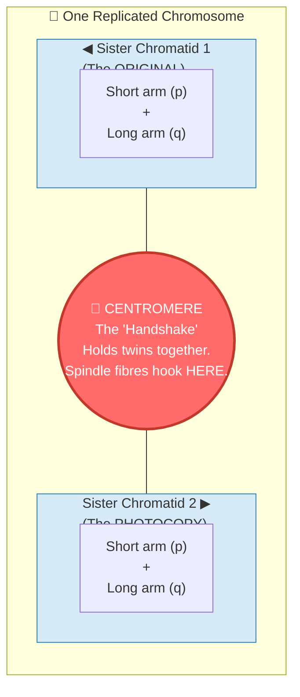

# Section 2.3: Structure of Chromosomes — The Master Logic

📍 **Big Picture Scale:**
Cell ⮕ Nucleus ⮕ **Chromatin** ⮕ **Chromosome** ⮕ **DNA** ⮕ **Gene**

> *"Sir, if I have 2 metres of DNA in every tiny cell, why doesn't it just get tangled like my headphones in my pocket?"*
> 
> *The answer is the 'Master Logic' of packing. Your cell is a genius architect. It knows when to keep its blueprints loose (to read them) and when to pack them into iron-clad suitcases (to move them).*

---

## 🚪 1. The "Loose Thread" vs the "Suitcase"

Before we dive into the chemicals, we need to solve the biggest confusion in Biology: **What is the difference between Chromatin and Chromosomes?**

Think of it like a **move to a new house**:
- **Chromatin** is like all your clothes scattered around your room while you are living there (Interphase). You can find your favourite shirt easily (the cell can read the DNA).
- **Chromosome** is when you pack those same clothes into a tight suitcase to move them (Cell Division). You can't wear the clothes anymore, but you can move them without losing a single sock.

| Feature | 🧵 Chromatin Fibre | 📦 Chromosome |
|:---|:---|:---|
| **Form** | Long, thin, uncoiled threads | Short, thick, condensed "X" shapes |
| **When?** | During everyday life (**Interphase**) | Only during **Cell Division** |
| **Visibility** | Invisible under light microscope | Clearly visible! |
| **Purpose** | **Reading:** To make proteins/run the cell | **Moving:** To ensure DNA doesn't snap during division |

---

## 🩻 2. Anatomy of the Armored "X"

[⚠️ **EXAM TICKER:** Identifying parts of a chromosome is the #1 most common diagram question. Study this carefully.]

When you see a chromosome under a microscope, it looks like an **X**. But remember: it only looks like an X because it has *already* photocopied itself. It’s actually twins holding hands!

### The Parts You Must Label:
- **Sister Chromatids:** The two identical "arms" of the X. They are exact clones of each other.
- **Centromere:** The pinched "waist" that holds them together. 
  - *Why does it exist?* To give the cell a single handle to grab onto during the "tug-of-war" of division.
- **p-arm & q-arm:** (p = petite/short, q = long).

---

## 🧶 3. How to Pack 2 Metres into a Microscopic Dot
*(The 4-Step Packing Logic)*

[⚠️ **EXAM TICKER:** You must know the 4 levels of packing in order. They love asking for this sequence.]

How do you fit a 2-metre thread inside a nucleus that is 100,000 times smaller? **You use Histone Spools.**

> 💡 **The Analogy:** 
> Imagine you have a single, long hair. It’s thin and easily tangles. Now imagine you braid that hair tightly. It becomes shorter, thicker, and much stronger. 
> **Chromatin** = Loose hair.
> **Chromosome** = The tight braid.

### Step 1: The "Beads on a String" (Nucleosomes)
DNA is negatively charged (magnetic physics!). **Histones** are proteins that are positively charged. Because opposites attract, DNA naturally wraps itself twice around a core of **8 Histone proteins**.
- This bundle is called a **Nucleosome**.
- **Mental Image:** Think of a football (Histones) with a rope (DNA) wound around it.

### Step 2: The Coil (30nm Fibre)
The string of nucleosomes coils up like a spring. This is the **Chromatin Fibre**.

### Step 3: The Supercoil
The spring then coils *again* on itself. Think of an old telephone cord that starts looping into knots. 

### Step 4: The Chromosome 
Finally, it folds into the thick, visible **Chromosome**.

---

## 🪜 4. The DNA "Rope Ladder" (Double Helix)

If you unraveled everything, you'd find the DNA molecule.
In **1953**, **Watson and Crick** (using data from **Rosalind Franklin**) discovered its shape: the **Double Helix**. It looks like a twisted rope ladder.

### The Building Block: The Nucleotide
Every rung and rail of that ladder is made of **Nucleotides**. One nucleotide has:
1. **Phosphate** (The Rail)
2. **Sugar** (The Rail)
3. **Nitrogenous Base** (The Rung/Step)

### ⚖️ The Pairing Rule (The "Apples & Trees" Logic)
There are 4 types of bases: **A, T, G, C**. They aren't allowed to pair with whoever they want.

[⚠️ **2-MARK TICKER:** Why does A always pair with T and G with C? **Answer:** To keep the width of the DNA ladder perfectly constant. If two large bases (Purines) paired, the ladder would bulge and break!]

- **A pairs with T** (2 Hydrogen bonds) 🍎 **A**pples in **T**rees
- **G pairs with C** (3 Hydrogen bonds) 🚙 **G**arage for **C**ars

---

## 🖨️ 5. DNA Replication (Making the Photocopy)

Before a cell divides, it must copy its DNA. It uses a **Semi-Conservative** method.
1. **The Unzip:** An enzyme (Helicase) breaks the weak hydrogen bonds, zipping open the ladder.
2. **The Template:** Each half-ladder acts as a mould.
3. **The New Partner:** New building blocks (nucleotides) float in and pair up (A with T, G with C).
4. **Result:** Two identical DNA ladders! Each has **one old** strand and **one new** strand. (This is why it's called "Semi-Conservative").

---

---

> 📝 **3-Line Compression:**
> 1. Chromatin is for _____; Chromosomes are for _____.
> 2. DNA wraps around histones because DNA is _____ and Histones are _____.
> 3. _____ and _____ discovered the Double Helix in the year _____.

> 🎤 **Feynman Challenge:**
> *"Explain to your friend why a chromosome looks like an 'X'. Use the 'photocopy' analogy."*

---

## 📝 Practice Questions — Section 2.3

[... Practice questions remain the same as previous version but verify the 'A-T' bond counts are emphasized ...]

---

### 🔘 A. Multiple Choice (1 mark each)

**1.** The chromatin material is formed of:
- (a) DNA only
- (b) Histones only
- (c) DNA and histones
- (d) RNA and histones

> **Answer: (c)** ~40% DNA + ~60% histone proteins.

---

**2.** What is a nucleosome?
- (a) A cluster of 8 DNA molecules wrapped around one histone
- (b) A core of 8 histone proteins with DNA wound around it
- (c) A chromosome plus its centromere
- (d) One complete strand of the DNA double helix

> **Answer: (b)** A nucleosome = 8 histone proteins + DNA wound twice around them.

---

**3.** Adenine pairs with Thymine using:
- (a) 1 hydrogen bond
- (b) 2 hydrogen bonds
- (c) 3 hydrogen bonds
- (d) Covalent bonds

> **Answer: (b)** A-T = 2 hydrogen bonds. G-C = 3 hydrogen bonds.

---

**4.** DNA replication takes place during which phase of the cell cycle?
- (a) G₁ Phase
- (b) S Phase
- (c) G₂ Phase
- (d) M Phase

> **Answer: (b) S Phase** (Synthesis Phase).

---

**5.** Why does DNA wrap around histone proteins?
- (a) DNA is positively charged; histones are negative
- (b) DNA is negatively charged; histones are positively charged
- (c) Both are neutral; they are held by covalent bonds
- (d) Histones provide energy for DNA coiling

> **Answer: (b)** Electrostatic attraction — negative DNA is drawn to positive histones.

---

### 📝 B. Very Short Answer (1–2 marks each)

**1.** Name the three components of a nucleotide.

> **Answer:** 1. Phosphate group, 2. Pentose (deoxyribose) sugar, 3. Nitrogenous base.

---

**2.** What are the "rungs" of the DNA ladder made of?

> **Answer:** The rungs of the DNA ladder are made of **paired nitrogenous bases** (A-T and G-C pairs), connected by hydrogen bonds.

---

**3.** Fill in the blanks:
> (a) A single human chromosome may contain approximately _____ nucleosomes.
> (b) _____ pairs with Cytosine using _____ hydrogen bonds.
> (c) The DNA structure was determined by _____ and _____ in the year _____.

> **Answers:** (a) one million; (b) Guanine, 3; (c) Watson and Crick, 1953.

---

**4.** Correct the following statements if incorrect:
> (a) "The four nitrogenous bases of DNA are Guanine, Thiamine, Adrenaline and Cytosine."
> (b) "A nucleosome is composed of 6 histones surrounded by a DNA strand."
> (c) "If a cell has 46 chromosomes, it will have 92 chromatin fibres during Interphase."

> **Answers:**
> (a) **Incorrect.** Correct bases: Guanine, **Thymine**, **Adenine**, and Cytosine.
> (b) **Incorrect.** A nucleosome contains **8** histone proteins (not 6), with DNA wound around them.
> (c) **Incorrect.** A cell with 46 chromosomes will have **46** chromatin fibres during Interphase.

---

### 📄 C. Short Answer (2–3 marks each)

**1.** What are nucleosomes? How are they formed?

> **Answer:** A **nucleosome** is the basic structural unit of chromatin. It consists of a core of **8 histone protein molecules** around which a segment of **DNA is wound approximately twice**. Histones are positively charged proteins; DNA is negatively charged. The electrostatic attraction causes DNA to wrap tightly around the histone core. Millions of nucleosomes strung together form the chromatin fibre, which further coils and supercoils to form a chromosome.

---

**2.** Describe the structure of DNA. Draw a labelled diagram.

> **Answer:** DNA (Deoxyribonucleic acid) is a **macromolecule** consisting of two complementary strands wound around each other in a **double helix**. Each strand is composed of repeating **nucleotides**, each containing:
> 1. A phosphate group
> 2. A deoxyribose sugar
> 3. A nitrogenous base (A, T, G, or C)
> The two strands are held together by **hydrogen bonds** between complementary bases: **A pairs with T** (2 bonds) and **G pairs with C** (3 bonds). The phosphate-sugar chains form the outer "rails" and the paired bases form the "rungs" of the molecular ladder.

---

**3.** Explain the process of DNA replication.

> **Answer:** DNA replication occurs during the **S-Phase** of Interphase. The process:
> 1. The enzyme **Helicase** breaks the hydrogen bonds between complementary bases, unzipping the double helix from one end.
> 2. Each exposed single strand acts as a **template** for a new complementary strand.
> 3. Free nucleotides from the nucleus attach to each template strand following base-pairing rules (A-T, G-C).
> 4. Result: **Two identical double helices**, each containing one original strand and one new strand → called **semi-conservative replication**.

---

### 🔬 D. Structured / Application Type

**1.** A student is shown a schematic of a part of DNA with labels 1-5 pointing to different parts. Answer:

*(Labels: 1→Phosphate, 2→Sugar, 3→Adenine, 4→Thymine, 5→Cytosine)*

- (a) How many strands are shown?
- (b) What type of bond connects the bases across the two strands?
- (c) Parts 1, 2, and 3 together form what unit?
- (d) Which labelled base would pair with label 5 (Cytosine)?

> **Answers:**
> (a) **2 strands**
> (b) **Hydrogen bonds**
> (c) Together they form a **Nucleotide**
> (d) Label 5 (Cytosine) pairs with **Guanine** (G).

---

**2.** Three sketches (A, B, C) show stages of DNA replication. A = fully bound double helix. C = helix splitting at one end. B = two fully separate strands. What is the correct sequence?

> **Answer:** **A → C → B.** First the helix is intact (A), then it begins opening at one end (C), and finally both strands are fully separated and each is building a new partner strand (B).

