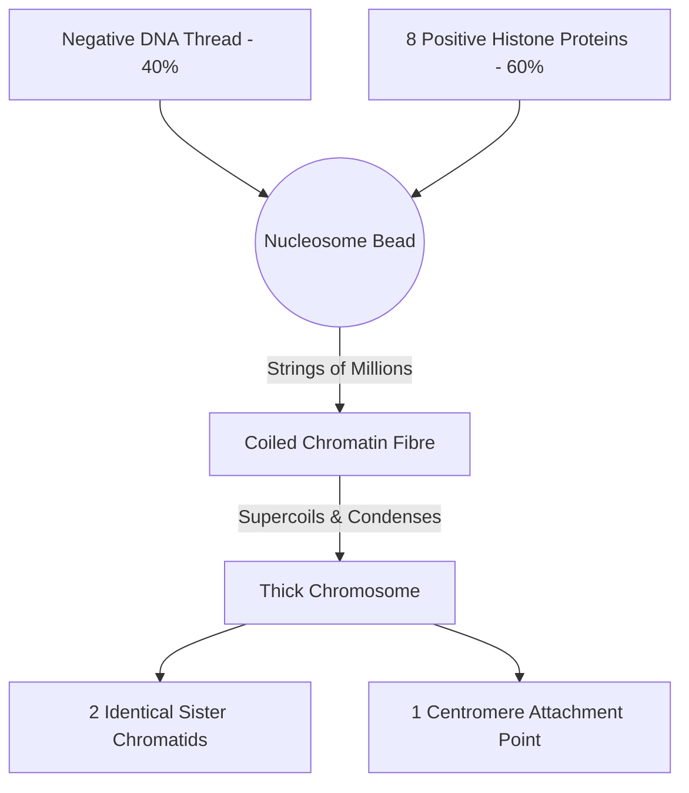

# Section 2.3: Structure of Chromosomes

> *"Here, we witness one of nature's greatest feats of microscopic engineering. How, one might ask, does a cell manage to pack two solid meters of fragile genetic code into a vault so small it cannot be seen by the naked eye, without a single tangle? The answer lies in an exquisite, mathematically perfect masterpiece of folding..."*

*(Note: This is the most heavily-tested section in your syllabus. Pay deep attention to every structural level.)*

## 🩻 1. The Anatomy of the Armored "X"
When observing a cell actively dividing, the chromosome reveals its magnificent, maximally condensed form—resembling a thick, armored "X". But this "X" is not a single structure; it is a temporary, violently forged alliance of two identical clones.

- **Chromatids (The Twins):** These are the two identical "arms" or "legs" of the X. During the synthesis phase of the cell's life, the DNA completely photocopied itself. Therefore, the left arm is a 100% molecular clone of the right arm. Because they are identical twins, they are called **Sister Chromatids**.
- **Centromere (The Belt):** The vital, pinched region (constriction point) that binds the identical twins together. It is not always exactly in the middle; sometimes it is closer to the top, making the arms unequal!

**The Physics of the Tear:**
Why does the centromere exist? During the violent chaos of cell division, **spindle fibres** emerge like microscopic grappling hooks. They shoot out, attach directly to the hard shell of this centromere, and violently rip the sister chromatids apart, reeling one twin to the North pole and the other to the South pole.

---

## 🧬 2. The Chemistry of Chromatin (Proteins Meet DNA)
What exactly is this magical chromatin material made of? It is a harmonious, electro-chemical marriage of two distinct elements:
1. **DNA (Deoxyribonucleic acid)** — Making up about **40%** of the structure.
2. **Histones** — Specialized, structural proteins making up the remaining **60%**.

### 🧲 The Magnetic Masterpiece: Introducing the Nucleosome
How do Histones pack DNA so perfectly? It's pure physics. DNA molecules inherently possess a **negative electrical charge** (thanks to their phosphate groups). Histone proteins are specifically built by the body to carry a **positive electrical charge**. 

Opposites attract! The negative DNA thread happily and magnetically wraps itself aggressively around a core cluster of exactly **8 positively-charged histone molecules**—much like tightly winding a garden hose around a perfectly round wooden spool.

👉 **Exam Term:** This breathtaking, bead-like complex of 8 histones wrapped twice around with DNA is called a **Nucleosome**. 

When roughly **one million** of these nucleosome beads string together in a single human chromosome, they begin to coil. Then, those coils fold onto themselves to *supercoil*, creating a dense, unbreakable package reminiscent of an infinitely tangled, yet perfectly organized, telephone cord.

---

## 🪜 3. The Architecture of DNA (The Double Helix)
The structural climax of biology occurred in **1953**. Peering into the very fabric of life using X-ray crystallography, **Rosalind Franklin** captured the exact shadow of DNA's shape. Her data paved the way for **James Watson and Francis Crick** to unlock its ultimate, glorious architecture: the **Double Helix**.

DNA is a macromolecule consisting of two complementary strands winding beautifully around each other, like a spiraling, endless staircase. Each side of the staircase is a chain of repeating building blocks called **Nucleotides**. 

Every single nucleotide is an alliance of three chemical components:
1. A **Phosphate** (The outer rails)
2. A **Sugar** (Pentose) (The outer rails)
3. A **Nitrogenous Base** (The inner rungs connecting the two sides)

### 🔥 The Rungs of the Ladder (The Genetic Code)
The bases projecting inward from the sugar-phosphate rails form the "rungs" connecting the two sides of the ladder. There are exactly four bases in the universe of DNA, but they are physically divided by size:
- **Purines (Large, Double-Ringed):** Adenine (A) and Guanine (G).
- **Pyrimidines (Small, Single-Ringed):** Thymine (T) and Cytosine (C).

> 🧪 **The Watson & Crick Physics Puzzle:**
> Watson and Crick realized a profound mathematical necessity: the DNA ladder must maintain an absolutely constant, perfect width down its entire 6-foot length. 
> - If two giant Purines bound together, the ladder would wildly bulge outwards.
> - If two tiny Pyrimidines bound together, the ladder would pinch inwards.
> - Therefore, a Large Purine MUST always aggressively pair with a Small Pyrimidine!

This strict chemical architecture leads to the unbreakable rules of loyalty:
- **Adenine (A)** pairs exclusively with **Thymine (T)** (binding together with exactly **2 weak hydrogen bonds**).
- **Guanine (G)** pairs exclusively with **Cytosine (C)** (binding together with exactly **3 weak hydrogen bonds**).

*(Memory Trick: **A**pples always fall from the **T**ree, **C**ars are always parked in the **G**arage!)*

---

## 🖨️ 4. Formation of New DNA (Replication)
To pass life onto the next generation, the code must be copied perfectly. During the quiet interphase of the cell cycle, a true miracle occurs. 

The great double helix slowly unwinds. The weak hydrogen bonds holding the A-T and C-G bases together effortlessly pop open, unzipping the DNA straight down the middle! Against each of the original, now-exposed half-strands, a brand-new complementary strand is synthesized simultaneously from free-floating nucleotides in the nucleus. 

From one original code, two perfectly identical double-helixes are born. Every new chromosome retains one "old" original strand and one beautifully minted "new" strand. 

---
### 🏆 Active Recall & IIT Foundation Check

1. **What is the exact chemical composition of Chromatin?** 
   *(Answer: Approximately 40% DNA and 60% Histone proteins.)*
2. **Define a nucleosome and explain the physical reason DNA violently wraps around histones.** 
   *(Answer: A nucleosome is a core of 8 histone proteins with DNA wrapped around it. They naturally bind because DNA is negatively charged and histones are positively charged!)*
3. **What are the 3 parts of a nucleotide, and which parts make up the "rails" versus the "rungs" of the ladder?** 
   *(Answer: Phosphate and Pentose Sugar make up the outer rails. The Nitrogenous Base makes up the inner rungs).*
4. **Why MUST Adenine pair with Thymine?** 
   *(Answer: For physical stability! Adenine is a massive Purine, and Thymine is a small Pyrimidine. They fit together perfectly, ensuring the DNA ladder never bulges or pinches, maintaining a constant width).*
