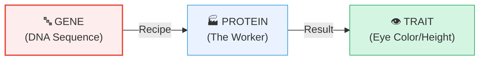

# Section 2.4: What Are Genes? — The Instruction Manual

📍 **Big Picture Scale:**
Cell ⮕ Nucleus ⮕ Chromosome ⮕ DNA ⮕ **Gene** ⮕ Protein ⮕ **Trait**

> *"Sir, why do I have my dad's nose but my mom's hair? If they gave me their DNA, which part of it decided my nose?"*
> 
> *The answer is the **Gene**. If your DNA is a massive instruction manual for building 'YOU', then a gene is a single sentence in that manual that says: 'Instruction for the nose shape'.*

---

## 🚪 1. The "Library of Life" Analogy

To understand how genes relate to DNA and chromosomes, imagine a massive **City Library**:
- **The Library** = The Nucleus (where all info is kept).
- **The Shelves** = The Chromosomes (46 shelves in humans).
- **The Books** = The DNA (one long book per shelf).
- **The Pages/Sentences** = The **Genes** (the actual meaningful instructions).

**The Big Secret:** 
Most of the pages in these books are actually blank or have random gibberish ("Junk DNA"). Only about **1%** of the pages have actual recipes for building proteins. Those functional pages are your **Genes**.

---

## 🏗️ 2. How a Gene Becomes a "Look" (The Flow)

[⚠️ **EXAM TICKER:** You must know the flow from Gene to Trait. It’s the foundation of all biology.]

A gene doesn't just "appear" as a nose. It’s a multi-step process:
1. **The Code:** A specific sequence of ~10,000 DNA letters (A, T, G, C) on a chromosome.
2. **The Product:** The cell reads that code and builds a specific **Protein** (like an enzyme).
3. **The Result:** That protein goes to work and creates a **Trait** (like brown pigment in your eyes).

---

## 📊 3. DNA vs. Gene (Clear Contrast)

[⚠️ **2-MARK TICKER:** Students often say 'DNA and Genes are the same'. In an exam, contrast them like this!]

| Feature | 🧬 DNA | 🔤 Gene |
|:---|:---|:---|
| **What is it?** | The entire chemical molecule | A **specific segment** of that molecule |
| **Size** | Massive (2 metres long) | Smaller (~10,000 to million bases) |
| **Function** | Stores everything (even the 'junk') | Codes for **one specific protein** |
| **Address** | The whole "book" | A specific "page" (**Locus**) |

---

## 🗺️ 4. The "Locus" (The Gene's Home)

Every gene has a fixed, permanent address on a specific chromosome. This address is called its **Locus** (plural: Loci).
- *Example:* The gene for your blood group is always found at the exact same spot on Chromosome 9 in every human being.

---

## 🔍 5. Why "Junk DNA" is Actually Useful
*(DNA Fingerprinting)*

As we mentioned, **99% of your DNA is "non-coding"** (it doesn't make proteins). 
- **The Genius Part:** Because this junk doesn't do anything, it can mutate and change randomly without hurting you. 
- **The Result:** This junk becomes a **unique barcode** for you. Mapping this unique junk is called **DNA Fingerprinting**.

[⚠️ **EXAM TICKER:** Why use junk DNA for fingerprinting? **Answer:** Because the functional genes (1%) are virtually identical in all humans, but the non-coding regions (99%) are unique to every individual.]

---

---

> 📝 **3-Line Compression:**
> 1. A gene is a specific sequence of _____ on a _____.
> 2. The physical 'address' of a gene is called its _____.
> 3. We use _____ DNA for fingerprinting because it is _____ in every person.

> 🎤 **Feynman Challenge:**
> *"Use the 'Instruction Manual' analogy to explain the difference between a Chromosome, DNA, and a Gene to a Class 6 student."*

---

## 📝 Practice Questions — Section 2.4
[... Practice questions remain the same ...]

---

### 🔘 A. Multiple Choice (1 mark each)

**1.** Genes are located on:
- (a) Cell membrane
- (b) Chromosomes
- (c) Ribosomes
- (d) Mitochondria

> **Answer: (b)** Genes are specific sequences of nucleotides located on chromosomes.

---

**2.** What percentage of human DNA actually consists of functional genes?
- (a) ~50%
- (b) ~25%
- (c) ~1%
- (d) ~99%

> **Answer: (c) ~1%.** The remaining ~99% is non-coding ("junk") DNA.

---

**3.** DNA fingerprinting (profiling) makes use of which part of DNA?
- (a) Gene-coding regions
- (b) Non-coding (junk) regions
- (c) Histone proteins
- (d) The nucleosome

> **Answer: (b)** Non-coding regions vary enormously between individuals — making them ideal for identification.

---

### 📝 B. Very Short Answer (1–2 marks each)

**1.** Define a gene.

> **Answer:** A gene is a specific sequence of nucleotides on a chromosome that encodes a particular protein, which expresses as a specific trait of the body (e.g. eye colour, blood group, height).

---

**2.** What is meant by the "locus" of a gene?

> **Answer:** The **locus** (plural: loci) is the fixed, specific physical location of a gene on a particular chromosome. Every gene for a specific trait always occupies the same chromosomal address in all members of a species.

---

**3.** State the function of a gene in human body in terms of protein production.

> **Answer:** A gene provides the coded instruction (sequence of nucleotides) for the production of a specific **protein**. The protein then performs a biological function that results in the expression of a particular **trait** (e.g. eye colour, enzyme activity, blood type).

---

### 📄 C. Short Answer (2–3 marks each)

**1.** What are genes? How does a gene control a trait such as eye colour?

> **Answer:** Genes are specific sequences of nucleotides on chromosomes that encode proteins. They control traits as follows:
> 1. A specific gene (e.g. eye colour gene) contains the coded instructions to produce a specific **enzyme** (protein).
> 2. That enzyme deposits pigment in the iris (e.g. brown pigment).
> 3. The amount of pigment determines the colour of the eyes.
> A variation (allele) of the same gene may instruct a different enzyme → less pigment → blue eyes.

---

**2.** What is DNA fingerprinting? State two practical applications.

> **Answer:** DNA fingerprinting (DNA profiling) is a technique that maps the unique pattern of non-coding (junk) DNA regions of an individual to create a biological barcode unique to that person.
> **Applications:**
> 1. **Forensic science** — identifying suspects from blood, hair, or tissue found at a crime scene.
> 2. **Paternity/maternity testing** — confirming biological parenthood in legal cases.

---

### ⭐ D. IIT / Higher-Order

**1.** A student argues: "Since only 1% of DNA codes for genes, the other 99% is useless and evolution should have eliminated it." Do you agree? Justify with reference to DNA fingerprinting.

> **Model Answer:** **Disagree.** While 99% of DNA is non-coding (does not make proteins), this does not make it "useless" or an evolutionary failure for two reasons:
> 1. **It may have regulatory roles** — some non-coding DNA helps control when and where genes are switched on/off.
> 2. **It creates individual uniqueness** — variations in non-coding regions across generations create the genetic variation exploited in DNA fingerprinting. This variation is also the raw material for natural selection and evolution.
> Its lack of a direct protein product means mutations are harmless — so these regions accumulate variation freely, which itself is biologically valuable.

