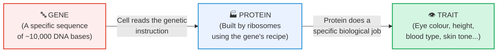
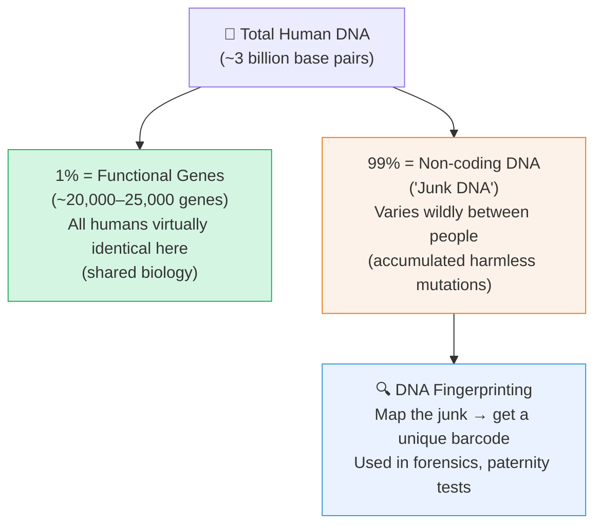

# Section 2.4: What Are Genes?

📍 **Where you are:** Body → Cell → Nucleus → Chromosome → DNA → **🔤 Gene → Protein → YOUR TRAIT**

> *"You have 46 chromosomes. Each holds a long strand of DNA. But most of that DNA is silence — random, repetitive, non-functional text. Scattered through the silence, like islands of meaning in a sea of noise, are the genes. These are the sentences that actually matter."*

---

## 🎯 Start With the Simplest Possible Version

Before we give you the textbook definition, let's build the idea from scratch.

> 🧠 **Stop & Think — Before reading the answer:**
> *You and your sibling have the same parents. You have brown eyes, they have blue eyes. Why? Both of you got the same gene for eye colour — from the same two parents. So what's different?*
> *(Sit with this question for 10 seconds. Your answer will make sense after this section.)*

**Question:** Why do you have the eye colour you have?

Somewhere in your DNA, there is a specific sequence of bases — let's say 10,000 letters long — that contains the instruction: *"Build the enzyme that deposits brown pigment in the iris."*

That 10,000-letter instruction sequence is a **gene**.

The cell reads that gene. It builds the enzyme (a protein). The enzyme deposits the pigment. Your eyes are brown.

Change a few letters in that sequence → different enzyme → less pigment → blue eyes.

**That's all a gene is.** A specific stretch of DNA that codes for a specific protein that creates a specific biological outcome.

---

## 📖 The Textbook Definition (Now You're Ready For It)

> 🔵 **Official definition:** Genes are **specific sequences of nucleotides on a chromosome** that encode particular proteins, which express in the form of some particular feature (trait) of the body.

Break it down:
- **"Specific sequences of nucleotides"** = a particular stretch of A, T, G, C letters
- **"On a chromosome"** = located at a fixed address on a fixed chromosome
- **"Encode particular proteins"** = give the recipe for building a specific molecular machine
- **"Express in the form of a feature"** = that protein manifests as something you can observe (height, colour, blood group)

---

> 📝 **3-Line Compression — Cover the page and write:**
> 1. A gene is a specific _____ of _____ on a _____.
> 2. It encodes a specific _____ which expresses as a specific _____.
> 3. Only about ____% of DNA is made of functional genes. The rest is _____.

---

> 🔴 **2-mark exam question:** *"What is a gene?"*
> **Model answer:** A gene is a specific sequence of nucleotides on a chromosome that encodes a particular protein, which expresses as a specific feature of the body (e.g. eye colour, blood group).

---

## 📍 Where Is a Gene Located?

Every gene has a fixed physical address — a specific location on a specific chromosome. This address is called its **locus** (plural: loci).

For example:
- The gene for eye colour → fixed location on Chromosome 15
- The gene for blood group → fixed location on Chromosome 9

> ⭐ **IIT insight — What is an Allele?**
> Sometimes, the same gene can exist in two slightly different "spellings." For example, one version (allele) of the eye colour gene spells out "Brown eyes" and another version spells out "Blue eyes." Both are the same gene, but different variants. Alleles are the reason siblings from the same parents look slightly different from each other.

---

## 🗑️ The "Junk" That Makes You Unique (DNA Fingerprinting)

Here's a startling fact: **only about 1% of your DNA actually contains genes** (functional instructions). The remaining ~99% codes for nothing — it makes no proteins, does nothing visible. Scientists call it non-coding DNA (less politely: "junk DNA").

**But here's the twist:** This "junk" varies enormously from person to person. Why? Because mutations in non-coding regions are harmless (they build no proteins, so no damage occurs). Over millions of years, these junk regions have accumulated random changes, making them uniquely different in every human on Earth.

By mapping this unique junk-pattern, scientists get a biological barcode that is unique to exactly one person in the world. This is **DNA Fingerprinting** (officially: **DNA Profiling**).

> 📌 **Syllabus note:** DNA Fingerprinting is marked as **EXTRA** in the ICSE textbook — not required for board exam, but it appears in entrance exams and MCQ rounds.

---

---

> 🎤 **Feynman Challenge:**
> *"Explain genes to your younger sibling who is in Class 6. Use eye colour as your example. You cannot use the words 'nucleotide' or 'sequence'."*
> If they understand it — you understand it.

---

### ✅ Before Moving On — Can You Answer These?

1. In your own words (not the textbook's), explain what a gene does. *(A gene is an instruction inside DNA that tells a cell to build a specific protein, which then creates a physical trait in the body.)*
2. Why can scientists use "junk DNA" to identify individuals, but not the gene-containing DNA? *(Gene-containing DNA is nearly identical across all humans — shared biology. Junk DNA has accumulated random, harmless mutations that make it unique to each person.)*

---

## 📝 ICSE Practice Questions — Section 2.4

---

### 🔘 A. Multiple Choice (1 mark each)

**1.** Genes are located on:
- (a) Cell membrane
- (b) Chromosomes
- (c) Ribosomes
- (d) Mitochondria

> **Answer: (b)** Genes are specific sequences of nucleotides located on chromosomes.

---

**2.** What percentage of human DNA actually consists of functional genes?
- (a) ~50%
- (b) ~25%
- (c) ~1%
- (d) ~99%

> **Answer: (c) ~1%.** The remaining ~99% is non-coding ("junk") DNA.

---

**3.** DNA fingerprinting (profiling) makes use of which part of DNA?
- (a) Gene-coding regions
- (b) Non-coding (junk) regions
- (c) Histone proteins
- (d) The nucleosome

> **Answer: (b)** Non-coding regions vary enormously between individuals — making them ideal for identification.

---

### 📝 B. Very Short Answer (1–2 marks each)

**1.** Define a gene.

> **Answer:** A gene is a specific sequence of nucleotides on a chromosome that encodes a particular protein, which expresses as a specific trait of the body (e.g. eye colour, blood group, height).

---

**2.** What is meant by the "locus" of a gene?

> **Answer:** The **locus** (plural: loci) is the fixed, specific physical location of a gene on a particular chromosome. Every gene for a specific trait always occupies the same chromosomal address in all members of a species.

---

**3.** State the function of a gene in human body in terms of protein production.

> **Answer:** A gene provides the coded instruction (sequence of nucleotides) for the production of a specific **protein**. The protein then performs a biological function that results in the expression of a particular **trait** (e.g. eye colour, enzyme activity, blood type).

---

### 📄 C. Short Answer (2–3 marks each)

**1.** What are genes? How does a gene control a trait such as eye colour?

> **Answer:** Genes are specific sequences of nucleotides on chromosomes that encode proteins. They control traits as follows:
> 1. A specific gene (e.g. eye colour gene) contains the coded instructions to produce a specific **enzyme** (protein).
> 2. That enzyme deposits pigment in the iris (e.g. brown pigment).
> 3. The amount of pigment determines the colour of the eyes.
> A variation (allele) of the same gene may instruct a different enzyme → less pigment → blue eyes.

---

**2.** What is DNA fingerprinting? State two practical applications.

> **Answer:** DNA fingerprinting (DNA profiling) is a technique that maps the unique pattern of non-coding (junk) DNA regions of an individual to create a biological barcode unique to that person.
> **Applications:**
> 1. **Forensic science** — identifying suspects from blood, hair, or tissue found at a crime scene.
> 2. **Paternity/maternity testing** — confirming biological parenthood in legal cases.

---

### ⭐ D. IIT / Higher-Order

**1.** A student argues: "Since only 1% of DNA codes for genes, the other 99% is useless and evolution should have eliminated it." Do you agree? Justify with reference to DNA fingerprinting.

> **Model Answer:** **Disagree.** While 99% of DNA is non-coding (does not make proteins), this does not make it "useless" or an evolutionary failure for two reasons:
> 1. **It may have regulatory roles** — some non-coding DNA helps control when and where genes are switched on/off.
> 2. **It creates individual uniqueness** — variations in non-coding regions across generations create the genetic variation exploited in DNA fingerprinting. This variation is also the raw material for natural selection and evolution.
> Its lack of a direct protein product means mutations are harmless — so these regions accumulate variation freely, which itself is biologically valuable.

