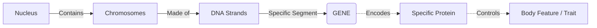

# Section 2.4: What Are Genes?

> *"Imagine, if you will, a vast and ancient library, nestled deep within the nucleus. The thick, leather-bound encyclopedias lining the walls are the Chromosomes. The billions of letters printed on the pages are the DNA. But what of the sentences? What of the stories they tell?"*

## 🧬 Decoding the Master Blueprint

We have seen how DNA folds into breathtaking, spiraling structures. But structure alone does not create life; information does. 

👉 **Textbook Definition:** **Genes** are specific sequences of nucleotides on a chromosome that encode particular proteins, which express themselves in the form of some particular feature of the body.

A gene is a single, coherent sentence written in the language of the cosmos. One sequence of nucleotides codes for the color of your eyes; another codes for the curl of your hair, or the digestive enzymes in your stomach.

### 🧬 The "Junk" That Defines Us (DNA Fingerprinting)
*Note: Your textbook highlights this fascinating concept as an 'Extra' beyond the syllabus.*

Curiously, nearly **99% of your DNA is entirely non-functional**. It codes for absolutely nothing. Yet, it is within this vast wasteland of "junk DNA" that we find tremendous variation from one human to another. 

By mapping these unique, non-functional regions, scientists perform what is called **DNA Profiling** or **DNA Fingerprinting**. This majestic biological barcode is so unique that it is used in criminal investigations to match a single stray hair or drop of blood to a suspect, or to irrefutably establish paternity.

---
### 🏆 Active Recall Check
1. **What precisely is a gene?** 
   *(Answer: A specific sequence of nucleotides on a chromosome that encodes a particular protein to express a body feature).*
