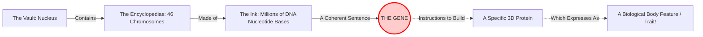

# Section 2.4: What Are Genes?

> *"Imagine, if you will, the greatest library ever constructed, nestled deep within the vault of the nucleus. The thick, leather-bound encyclopedias lining the walls are the Chromosomes. The billions of individual ink letters printed on those pages are the sparse DNA bases (A, T, C, G). But scattered amongst the meaningless pages of repeating letters are brilliant, coherent sentences. What are these sentences? What are the profound stories they tell?"*

## 🧬 Decoding the Master Blueprint

In the previous chapters, we dissected the magnificent architecture of chromosomes and the winding, spiraling staircase of DNA. We marveled at how 40% of chromatin is DNA and 60% is structural histone protein. 

But physical structure alone does not breathe life into an organism. It is the invisible *information* hidden within the structure that commands the biological universe. 

👉 **Textbook Definition:** **Genes** are specific sequences of nucleotides on a chromosome that encode particular proteins, which express themselves in the form of some particular feature of the body.

### 🏭 Translating the Code into Reality (The Central Dogma)
To truly grasp an IIT-level understanding of advanced biology, you must understand the "Central Dogma" of life: **DNA $\to$ RNA $\to$ Protein**.

A gene does not directly stretch out its microscopic hands and make your eyes blue or your skin dark. A gene is simply a sequence of letters (perhaps 10,000 bases long reading A-T-T-G-C-C...). 
1. The cell actively reads this specific sentence (the **Gene**).
2. It uses that recipe to build a specific, complex 3D molecular machine (a **Protein**).
3. If that protein happens to be the enzyme *Melanin*, it deposits dark pigment into your iris, making your eyes brown! If the protein is *Keratin*, it builds the durable, physical structure of your hair.

Therefore, a gene is the ultimate puppet master. By simply altering a few letters in the genetic sentence, the folded shape of the resulting protein changes, and a completely different physical trait is born!

> 🧬 **Advanced Insight: The Concept of Alleles & Mutations**
> Every human has a gene responsible for eye color. It is located at the exact same geographic spot on the exact same chromosome for all 8 billion people on Earth. 
> But if we all have the exact same gene, why are eyes different colors? 
> Sometimes, when DNA copies itself, a tiny typo occurs. A 'C' is accidentally swapped for an 'A'. This new, slightly altered version of the genetic sentence is called an **Allele**. The original allele codes for Brown eyes. The mutated allele codes for Blue eyes! Evolution is driven entirely by these accidental typos in the sentences of genes!

---

## 🕵️‍♂️ The "Junk" That Defines Us (DNA Fingerprinting)
*Note: Your textbook highlights this fascinating concept as an 'Extra' beyond the strict board syllabus, but it is deeply relevant to modern biology and forensic science.*

If genes are beautiful, meaningful sentences, you might naturally assume your entire chromosome is an epic novel. Curiously, this is entirely false. 

Nearly **99% of your DNA is completely non-functional**. It codes for absolutely no proteins; it builds absolutely nothing. Scientists fondly refer to this vast, silent wasteland of repeating nucleotides as "junk DNA." 

However, humanity is infinitely, breathtakingly varied, and we owe this variation entirely to the "junk." While the genes that build a human heart or a human lung are virtually identical in every person on Earth (because any mutation there would lead to immediate death), the silent, non-functional 99% mutated wildly over millions of years without causing harm. 

Through highly advanced techniques, scientists can digitally map these chaotic, unique, non-functional regions. This mapping process creates a majestic biological barcode, entirely unique to you. This is known as **DNA Profiling** or **DNA Fingerprinting**. 
- It is so unimaginably precise that it is used in modern forensic science to match a single microscopic flake of skin, a stray hair follicle, or a drop of blood found at a crime scene back to a suspect with irrefutable certainty. 
- It is also the ultimate tool for establishing definitive biological paternity and maternity!

---
### 🏆 Active Recall & IIT Foundation Check

1. **What precisely is a gene, and how does it somehow manifest as a physical trait?** 
   *(Answer: A gene is a specific sequence of nucleotides on a chromosome. It acts as a recipe to encode a particular protein, and that protein goes on to execute a function that expresses a physical feature in the body).*
2. **Approximately what percentage of human DNA is actually composed of functional, protein-coding genes, and what is the rest of it useful for in modern science?** 
   *(Answer: Only about 1% of DNA forms functional genes. The remaining 99% is completely non-functional "junk". However, because it varies wildly from person to person, it is the primary basis for DNA Fingerprinting and forensics!)*
