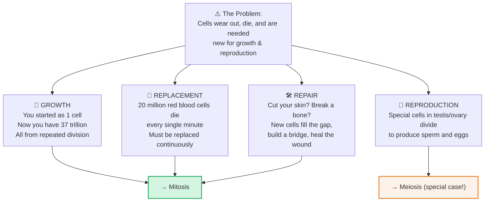
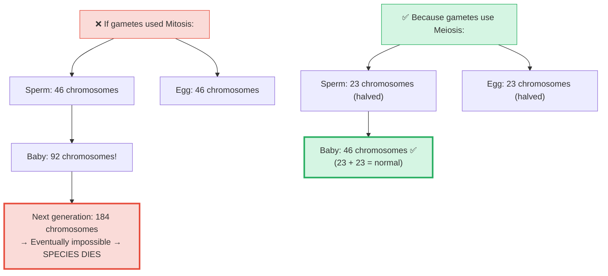

# Section 2.5: Why Do Cells Need to Divide?

📍 **Where you are:** Body → Cell → **Why make more cells?** (the motivation before the mechanism)

> *"Before you learn HOW a cell divides, you need to feel WHY it must. Because without understanding the 'why', the 'how' is just memorization."*

---

## 🎯 The Core Idea in One Sentence

**Your body needs new cells for four and only four reasons: Growth, Replacement, Repair, and Reproduction.**

If there were no wear, no aging, no injury, and no need to reproduce — cells would never need to divide. But life is messy and violent, and the body must constantly rebuild itself.

---

## 🌱 1. Growth — From 1 Cell to 37 Trillion

You began as a single fertilized egg. That cell divided: 1 → 2 → 4 → 8 → 16...

At 4 days old, a human embryo has just 16 cells. By birth (~9 months), that number reaches roughly **37 trillion**. Not by magic — by relentless, structured, controlled cell division.

As cells multiply, they specialize. Some become nerve cells, some become bone, some become skin. Division creates the raw numbers; specialization creates the structure.

> 🔴 **Exam point:** All growth happens through which type of division? **Mitosis** — it preserves the full chromosome number in every new cell.

---

## 🔄 2. Replacement — The Body You Have Today Is Not The Body You Had Last Year

You feel like the same person. But the physical cells making up your body are being constantly swapped out:

| Tissue | Replaced Every |
|:---|:---|
| Skin cells | ~2 weeks |
| Red blood cells | ~120 days |
| Gut lining cells | ~5 days |
| Liver cells | ~300–500 days |
| Bone cells | ~10 years |
| Brain/nerve cells | **Never** (once dead, gone forever) |

> 🧠 **Why don't brain cells replace themselves?** Because neurons are physically wired together to store memories and skills. If a neuron divided, it would create a new cell but destroy the old wiring. You'd lose the skill or memory that wiring encoded. So the brain made a trade-off: no replacement, but no forgetting either.

> 🔴 **Exam fact:** 20 million red blood cells are destroyed every minute. Because mature RBCs have no nucleus, they cannot divide themselves — they are replaced by stem cells in the **bone marrow**.

---

## 🛠️ 3. Repair — Your Body's Emergency Rebuilding Service

When you cut your skin, cells at the wound edge receive chemical distress signals. They wake from their resting state and begin dividing rapidly — building a wall of new cells across the gap. Skin knits closed. Bone fractures fuse.

> ⭐ **IIT insight:** This is why cancer and wound healing look similar under a microscope — both show rapid, uncontrolled-looking cell division. The difference: healing stops when the gap is closed (controlled). Cancer never stops (uncontrolled).

---

## 👶 4. Reproduction — And Why It Needs a Different Kind of Division

For the first three purposes (growth, replacement, repair), **Mitosis** is perfect — it makes exact copies with the full 46 chromosomes.

But reproduction is different. Think about the maths:

> 🧠 **Stop & Think — Before reading the maths:**
> *A sperm has 46 chromosomes (just like a body cell). An egg has 46. What happens when they merge? What would the baby have? And the baby's baby?*
> *(Work out the maths yourself before scrolling...)*

Meiosis halves the chromosome count before fertilization so that the fusion restores the normal count. This is the **only** reason Meiosis exists.

> 🔵 **5-mark exam question:** *"Why is meiosis essential for sexual reproduction?"*
> Answer: Because it halves the chromosome number (from 2n to n) in gametes. When sperm (n=23) and egg (n=23) fuse during fertilization, the normal diploid number (2n=46) is restored. Without meiosis, chromosome numbers would double every generation.

---

---

> 📝 **3-Line Compression:**
> 1. Cells divide for 4 reasons: _____, _____, _____, _____.
> 2. 20 million _____ die every minute. They are replaced by _____ in the _____.
> 3. Gametes need meiosis (not mitosis) because _____.

> 🎤 **Feynman Challenge:**
> *"In one minute, explain to your mum or dad why your body never runs out of blood even though millions of blood cells die every minute."*

---

### ✅ Before Moving On — Can You Answer These?

1. Name 3 situations in your body right now where Mitosis is actively occurring. *(Skin cells replacing dead surface cells, bone marrow producing RBCs, gut lining cells replacing themselves every 5 days)*
2. Why can Mitosis be used for growth and repair but NOT for gamete production? *(Mitosis preserves 46 chromosomes — if gametes had 46, fertilization would create 92, doubling each generation)*
