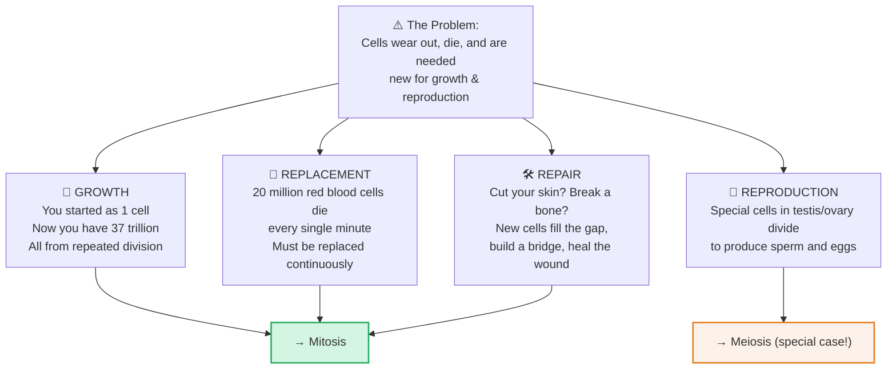
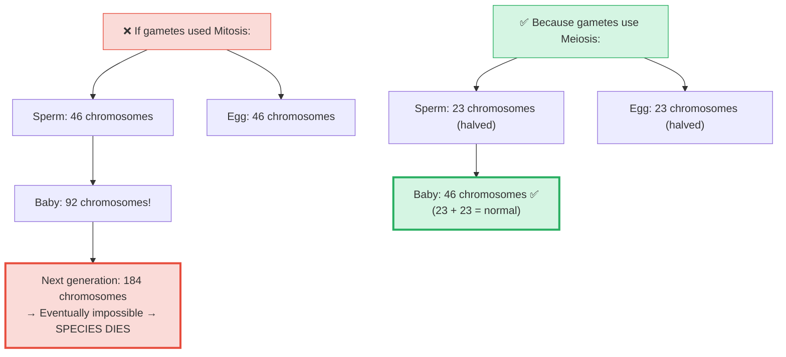

# Section 2.5: Why Do Cells Need to Divide?

📍 **Where you are:** Body → Cell → **Why make more cells?** (the motivation before the mechanism)

> *"Before you learn HOW a cell divides, you need to feel WHY it must. Because without understanding the 'why', the 'how' is just memorization."*

---

## 🎯 The Core Idea in One Sentence

**Your body needs new cells for four and only four reasons: Growth, Replacement, Repair, and Reproduction.**

If there were no wear, no aging, no injury, and no need to reproduce — cells would never need to divide. But life is messy and violent, and the body must constantly rebuild itself.

---

## 🌱 1. Growth — From 1 Cell to 37 Trillion

You began as a single fertilized egg. That cell divided: 1 → 2 → 4 → 8 → 16...

At 4 days old, a human embryo has just 16 cells. By birth (~9 months), that number reaches roughly **37 trillion**. Not by magic — by relentless, structured, controlled cell division.

As cells multiply, they specialize. Some become nerve cells, some become bone, some become skin. Division creates the raw numbers; specialization creates the structure.

> 🔴 **Exam point:** All growth happens through which type of division? **Mitosis** — it preserves the full chromosome number in every new cell.

---

## 🔄 2. Replacement — The Body You Have Today Is Not The Body You Had Last Year

You feel like the same person. But the physical cells making up your body are being constantly swapped out:

| Tissue | Replaced Every |
|:---|:---|
| Skin cells | ~2 weeks |
| Red blood cells | ~120 days |
| Gut lining cells | ~5 days |
| Liver cells | ~300–500 days |
| Bone cells | ~10 years |
| Brain/nerve cells | **Never** (once dead, gone forever) |

> 🧠 **Why don't brain cells replace themselves?** Because neurons are physically wired together to store memories and skills. If a neuron divided, it would create a new cell but destroy the old wiring. You'd lose the skill or memory that wiring encoded. So the brain made a trade-off: no replacement, but no forgetting either.

> 🔴 **Exam fact:** 20 million red blood cells are destroyed every minute. Because mature RBCs have no nucleus, they cannot divide themselves — they are replaced by stem cells in the **bone marrow**.

---

## 🛠️ 3. Repair — Your Body's Emergency Rebuilding Service

When you cut your skin, cells at the wound edge receive chemical distress signals. They wake from their resting state and begin dividing rapidly — building a wall of new cells across the gap. Skin knits closed. Bone fractures fuse.

> ⭐ **IIT insight:** This is why cancer and wound healing look similar under a microscope — both show rapid, uncontrolled-looking cell division. The difference: healing stops when the gap is closed (controlled). Cancer never stops (uncontrolled).

---

## 👶 4. Reproduction — And Why It Needs a Different Kind of Division

For the first three purposes (growth, replacement, repair), **Mitosis** is perfect — it makes exact copies with the full 46 chromosomes.

But reproduction is different. Think about the maths:

> 🧠 **Stop & Think — Before reading the maths:**
> *A sperm has 46 chromosomes (just like a body cell). An egg has 46. What happens when they merge? What would the baby have? And the baby's baby?*
> *(Work out the maths yourself before scrolling...)*

Meiosis halves the chromosome count before fertilization so that the fusion restores the normal count. This is the **only** reason Meiosis exists.

> 🔵 **5-mark exam question:** *"Why is meiosis essential for sexual reproduction?"*
> Answer: Because it halves the chromosome number (from 2n to n) in gametes. When sperm (n=23) and egg (n=23) fuse during fertilization, the normal diploid number (2n=46) is restored. Without meiosis, chromosome numbers would double every generation.

---

---

> 📝 **3-Line Compression:**
> 1. Cells divide for 4 reasons: _____, _____, _____, _____.
> 2. 20 million _____ die every minute. They are replaced by _____ in the _____.
> 3. Gametes need meiosis (not mitosis) because _____.

> 🎤 **Feynman Challenge:**
> *"In one minute, explain to your mum or dad why your body never runs out of blood even though millions of blood cells die every minute."*

---

### ✅ Before Moving On — Can You Answer These?

1. Name 3 situations in your body right now where Mitosis is actively occurring. *(Skin cells replacing dead surface cells, bone marrow producing RBCs, gut lining cells replacing themselves every 5 days)*
2. Why can Mitosis be used for growth and repair but NOT for gamete production? *(Mitosis preserves 46 chromosomes — if gametes had 46, fertilization would create 92, doubling each generation)*

---

## 📝 ICSE Practice Questions — Section 2.5

---

### 🔘 A. Multiple Choice (1 mark each)

**1.** Which type of cell division is responsible for the growth of an organism?
- (a) Meiosis
- (b) Binary fission
- (c) Mitosis
- (d) Budding

> **Answer: (c)** Mitosis maintains the chromosome number and produces genetically identical daughter cells for growth.

---

**2.** Red blood cells in humans are replaced approximately every:
- (a) 5 days
- (b) 2 weeks
- (c) 120 days
- (d) 10 years

> **Answer: (c) 120 days.** Mature RBCs live for ~120 days before being destroyed and replaced.

---

**3.** Which type of cell in the human body undergoes NEITHER Mitosis NOR Meiosis?
- (a) Skin cells
- (b) Bone marrow cells
- (c) Liver cells
- (d) Mature red blood cells

> **Answer: (d)** Mature RBCs have no nucleus — they cannot divide at all.

---

**4.** The number of chromosomes in body cells that undergo Mitosis is expressed as:
- (a) n
- (b) 2n
- (c) 4n
- (d) n/2

> **Answer: (b) 2n** (diploid). Mitosis preserves the full diploid chromosome number.

---

### 📝 B. Very Short Answer (1–2 marks each)

**1.** State four reasons why new cells need to be produced.

> **Answer:** 1. Growth, 2. Replacement of old/dead cells, 3. Repair of damaged tissue, 4. Reproduction.

---

**2.** Why do skin cells need to be replaced every 2 weeks, while nerve cells are never replaced?

> **Answer:** Skin cells are continuously lost to friction and environmental damage and must be replaced. Nerve cells (neurons) are **not replaced** because they are wired to store memories and skills — dividing them would destroy those neural connections permanently.

---

**3.** Where in the body are new red blood cells produced? Why can mature RBCs not produce themselves?

> **Answer:** New RBCs are produced in the **bone marrow** (by stem cells). Mature RBCs cannot produce themselves because they have **no nucleus** — without a nucleus, they have no DNA and therefore cannot divide.

---

**4.** "Reproduction is the only reason that requires Meiosis — Growth, Repair, and Replacement all use Mitosis." Is this correct? Explain why.

> **Answer: Yes, this is correct.** Growth, repair, and replacement require exact copies with full chromosome numbers → Mitosis is perfect. Reproduction requires gametes (sperm/eggs) with HALF the chromosome number so that fertilization restores the correct diploid number. If gametes were produced by Mitosis, the chromosome count would double each generation.

---

### 📄 C. Short Answer (2–3 marks each)

**1.** "Cell division for growth, replacement, and repair uses Mitosis, while reproduction uses Meiosis." Explain why two different types of division are needed.

> **Answer:** Mitosis produces daughter cells with the same chromosome number as the parent (2n=46 in humans). This is perfect for growth, replacement, and repair — where exact genetic copies are needed. However, for reproduction, if gametes also had 46 chromosomes, fertilization (sperm + egg) would produce offspring with 92 chromosomes — doubling every generation and quickly becoming biologically impossible. **Meiosis** solves this by halving the chromosome count to 23 (n) in gametes, so fertilization restores the normal 46 (2n).

---

**2.** An organism begins life as a single fertilized cell with 46 chromosomes. After 4 days it has 16 cells. (a) By what type of division did it grow? (b) How many chromosomes does each of the 16 cells have? (c) How many divisions occurred?

> **Answers:**
> (a) **Mitosis**
> (b) Each of the 16 cells has **46 chromosomes** — Mitosis preserves the chromosome number.
> (c) **4 divisions** (1→2→4→8→16 = 4 rounds of division).

---

### ⭐ D. IIT / Application Type

**1.** Wound healing and cancer both involve rapid cell division. Why is wound healing beneficial but cancer dangerous?

> **Model Answer:** Both processes involve accelerated mitotic cell division. Wound healing is **controlled** — cells divide in response to chemical signals from the wound site and stop once the gap is repaired (the cell cycle is correctly regulated). Cancer involves **uncontrolled** division — the cell cycle checkpoint(s) are broken or mutated, so cells keep dividing indefinitely, forming a tumour that invades surrounding tissue and disrupts organ function. The mechanism (Mitosis) is identical; the regulation is what differs.

