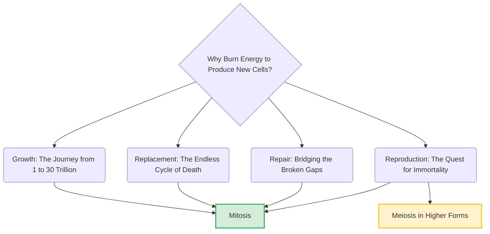

# Section 2.5: New Cells Need to Be Produced

> *"When you look in the mirror, you believe you are a solid, permanent object. This is a profound illusion. The structure you call a human body is not a static painting, but a bustling, chaotic, and unimaginably violent city. Every second, millions of cells perish, falling like leaves in autumn. To survive, the organism must master the art of relentless, endless biological creation..."*

## 2B. CELL DIVISION - NEW CELLS FROM EXISTING ONES

Why does cell division occur? Why must a cell go through the exhausting, energetic marathon of duplicating its chromosomes and violently tearing itself in half? Nature is highly efficient; it never spends energy without a purpose. It divides for exactly **four fundamental, non-negotiable reasons**.

## 🌱 1. For Growth
Every organism on Earth—whether a towering, 100-foot banyan tree or a complex human being—begins its incredible journey as a single solitary cell (the fertilized egg, or Zygote). 
Through the relentless engine of division, this one lonely cell multiplies. 

The mathematics of growth is exponential ($2^n$).
A mere 4-day-old human embryo already contains 16 cells (from $1 \to 2 \to 4 \to 8 \to 16$). Fast forward roughly 9 months, and that single cell has become roughly **30 Trillion cells**. As they multiply, they bend, fold, and specialize to form the complex tissues, bones, and organs that make up conscious life.

## 🏎️ 2. For Replacement (The Illusion of Permanence)
Our bodies endure a staggering, terrifying amount of daily wear and tear.
- *Consider this astonishing fact:* **20 million red blood cells** in our body are destroyed every incredibly brief minute! 
Because red blood cells shed their nucleus to carry more oxygen, they cannot divide themselves. If the body did not replace them, you would asphyxiate within weeks. To prevent collapse, the stem cells hidden deep inside your bone marrow furiously work to replace them through continuous cell division. 
- In the plant kingdom, the exact same engine drives new vibrant green leaves to unfurl in the spring as the old, dried, yellowed ones fall to the earth in autumn. You are constantly replacing yourself.

## 🛠️ 3. For Repair
Beyond everyday wear and tear, accidents fracture the delicate harmony of life. The skin is cut by a knife; a bone is shattered by a fall. The cells surrounding the trauma leap into immediate action. 

They exit their resting phases and divide rapidly, creating a living biological bridge across the wound. They divide, bridging the gaps, and welding the broken tissues and jagged bone ends back together. 

*(Note: In divisions for growth, replacement, and repair, the number of chromosomes remains absolutely identical. The body wants a perfect clone of a skin cell to replace a damaged skin cell. This cloning process is Mitosis!)*

## 👶 4. For Reproduction
To ensure the survival of the species against the march of time, biological organisms must divide to reproduce.
- **The Quest for Immortality:** Simple, single-celled organisms like the Amoeba or bacteria simply divide themselves perfectly in half to conquer the world (*Mitosis*). The parent cell doesn't technically die; it simply becomes its two daughters.
- **The Invention of Sex:** However, in higher, complex forms like humans or flowering plants, specialized reproductive organs (like the testis and ovary) undergo a far more mystical, highly complex type of division called **Meiosis**. 

This division produces sperms and eggs with exactly *half* the normal number of chromosomes. The elegant, unbreakable math of human survival absolutely requires this reduction:
- **Sperm (23 single chromosomes, $n$)** + **Egg (23 single chromosomes, $n$)** = **Fertilised Egg (46 chromosomes in 23 pairs, $2n$)**!

If Meiosis did not exist, a sperm with 46 would meet an egg with 46, creating a baby with 92 chromosomes, which would instantly die.

---
### 🏆 Active Recall & IIT Foundation Check
*Don't just memorize the list; understand the biological "Why" behind it!*

1. **How many red blood cells are destroyed in your body every single minute, and what dividing tissue replaces them?** 
   *(Answer: 20 million are destroyed every minute. Because they lack a nucleus, they are replaced by the actively dividing stem cells in the Bone Marrow).*
2. **What are the 4 main reasons new cells need to be produced in an organism?** 
   *(Answer: Growth of a zygote, Replacement of dead tissue, Repair of injuries, and Gamete production for Reproduction).*
3. **Why must reproduction in humans utilize Meiosis (halving) instead of Mitosis (cloning)?** 
   *(Answer: If human gametes were cloned via Mitosis, they would both have 46 chromosomes. When they fused during fertilization, the resulting zygote would possess 92 chromosomes, leading to immediate biological failure. Halving ensures the new generation returns precisely to 46).*
