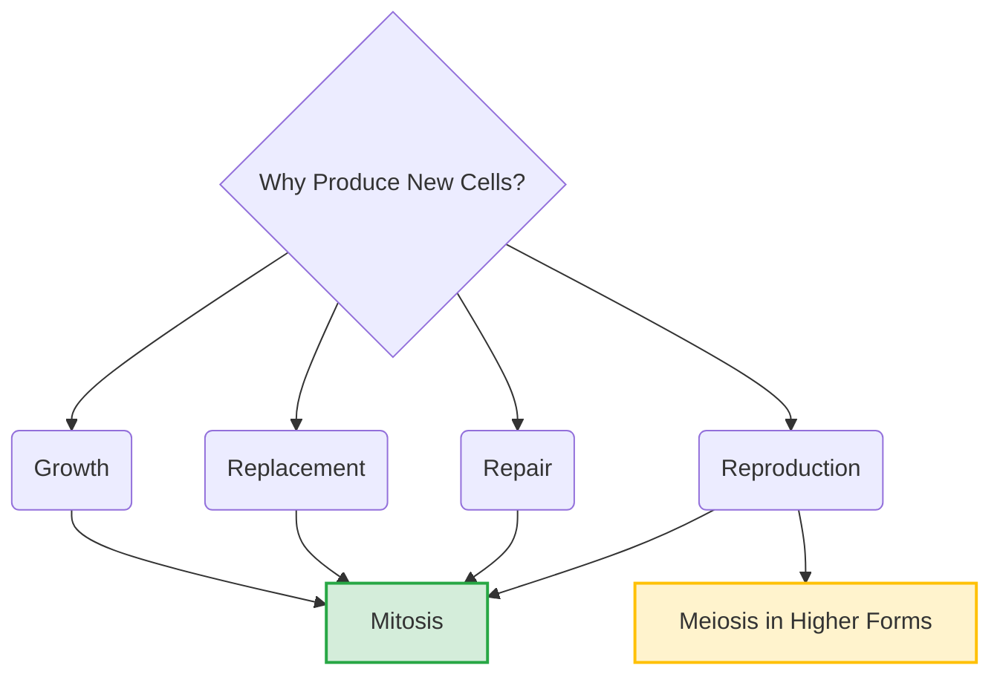

# Section 2.5: New Cells Need to Be Produced

> *"The cycle of life is not a static painting, but a bustling, chaotic, and unimaginably violent city. Every second, millions of cells perish. To survive, the organism must master the art of relentless, endless creation..."*

## 2B. CELL DIVISION - NEW CELLS FROM EXISTING ONES

Why does cell division occur? Why must the cell go through the exhausting, energetic marathon of duplicating its chromosomes? Nature is highly efficient; it divides for exactly **four fundamental reasons**.

## 🌱 1. For Growth
Every organism on Earth—whether a towering banyan tree or a human being—begins its incredible journey as a single solitary cell (the fertilized egg). 
Through the relentless engine of division, this one cell multiplies. A mere 4-day-old human embryo already contains 16 cells (from $1 \to 2 \to 4 \to 8 \to 16$). As they multiply, they bend, fold, and specialize to form the tissues and organs that make up life.

## 🏎️ 2. For Replacement
Our bodies endure a staggering amount of wear and tear.
- *Consider this astonishing fact:* **20 million red blood cells** in our body are destroyed every incredibly brief minute! 
To prevent collapse, the bone marrow frantically works to replace them through continuous cell division. In the plant kingdom, the same engine drives new leaves to unfurl as the old, dried ones fall to the earth.

## 🛠️ 3. For Repair
Beyond everyday wear and tear, accidents happen. The skin is cut; a bone is fractured. The cells surrounding the trauma leap into action. They divide, bridging the gaps and welding the broken tissues back together. 

*(Note: In divisions for growth, replacement, and repair, the number of chromosomes remains identical. This is Mitosis!)*

## 👶 4. For Reproduction
To ensure the survival of the species, the cell must divide to reproduce.
- Simple organisms like Amoeba or bacteria simply divide themselves in half to conquer the world (*Mitosis*).
- However, in higher forms like humans, specialized reproductive organs undergo a far more mystical type of division called **Meiosis**. This division produces sperms and eggs with exactly *half* the normal number of chromosomes.

The elegant math of human survival requires this reduction:
- **Sperm (23 single chromosomes, $n$)** + **Egg (23 single chromosomes, $n$)** = **Fertilised Egg (46 chromosomes in 23 pairs, $2n$)**!

---
### 🏆 Active Recall Check
1. **How many red blood cells are destroyed in your body every minute?** 
   *(Answer: 20 million!).*
2. **What are the 4 main reasons new cells need to be produced?** 
   *(Answer: Growth, Replacement, Repair, and Reproduction).*
