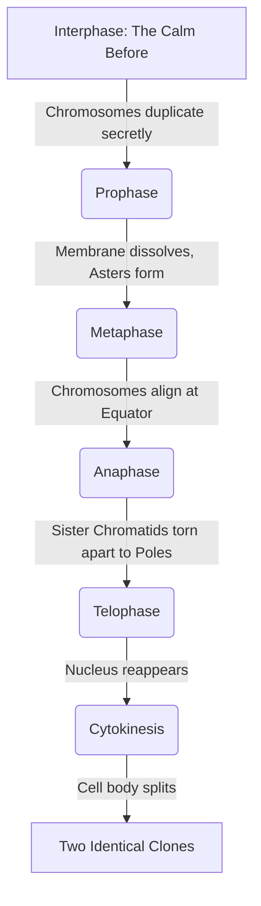

# Section 2.6: Types of Cell Division & Mitosis

> *"We now arrive at the greatest magic trick in the biological universe: the ability to turn one into two, without losing a single drop of information. It is a flawlessly choreographed dance, orchestrated by invisible threads..."*

There are exactly two grand architectures of cell division:
1. **Mitosis:** Division leading to everyday growth, repair, and development.
2. **Meiosis:** Division leading to the creation of reproductive gametes (sex cells).

## 2.6.1 MITOSIS (Mitos: thread)
Mitosis splits one parent cell into **two identical daughter cells**. 
The golden rule of Mitosis is preservation: **The exact same normal chromosome number is maintained at each division.** 

This extraordinary event is split into two major acts: Karyokinesis (the splitting of the nucleus) and Cytokinesis (the splitting of the cell body itself).

### 🎭 Phases of Mitosis — Karyokinesis
It occurs in 4 continuous phases. 
🔥 **Memory Trick:** **P**lease **M**ake **A**nother **T**aco!

**1. Prophase (pro = first)**
- The chromosomes emerge from the dark, becoming short, thick, and brutally visible. 
- They have already duplicated into sister chromatids attached at the centromere.
- In animal cells, the centrosome splits. The **centrioles** migrate to opposite 'poles', glowing with radiating rays called an **aster** (star).
- Spindle fibres stretch out across the void. The **nuclear membrane and nucleolus completely disappear**.

**2. Metaphase (meta = after)**
- The duplicated chromosomes are corralled onto the **equatorial plane** (the exact middle of the cell).
- Each chromosome is snared by a spindle fibre attaching to its centromere.

**3. Anaphase (ana = up, back)**
- The centromere shatters. The two sister chromatids snap apart!
- They are violently reeled toward opposite poles by the contraction of the spindle fibres.

**4. Telophase (telo = end)**
- The exhausted daughter chromosomes reach the poles and thin out back into a messy network of chromatin threads.
- The spindle fibres vanish. 
- **The nuclear membrane and nucleolus miraculously reappear!** 

---
### ✂️ Cytokinesis (Division of Cytoplasm)
Once the twin nuclei are formed, the cell body must be cleanly bisected. 
- **In Animal cells:** A squishy **cleavage furrow** appears in the middle and pinches inward until it pops the cell into two.
- **In Plant cells:** Protected by a rigid wall, they cannot pinch. Instead, a rigid **cell plate** is laid down squarely down the middle, growing outward from the centre to the periphery.

## 2.6.2 Differences in Mitosis in Animal and Plant Cells

| 🐶 Animals | 🌳 Plants |
| :--- | :--- |
| **Asters** are formed like stars at the poles. | **Asters are not formed.** |
| Cytokinesis by inward **furrowing of cytoplasm**. | Cytokinesis by outward **cell plate formation**. |
| Occurs heavily in most tissues throughout the body. | Occurs strictly at the **growing tips** (for lengthening) and sides (for girth). |

## 2.6.3 Significance of Mitosis
1. **Growth** (increase in physical body size).
2. **Repair** (healing wounded tissues).
3. **Replacement** (replacing old/dead epidemal and blood cells).
4. **Asexual Reproduction** (amoebas achieving immortality by splitting).
5. **Maintaining the exact same chromosome number** in every daughter cell!

---
### 🏆 Active Recall Check
1. **In what stage do chromosomes line up at the equator?** 
   *(Answer: Metaphase)*
2. **Do plant cells form a pinching furrow to divide?** 
   *(Answer: No! They build a Cell Plate from the center outward.)*
3. **What magically disappears in Prophase, but reappears in Telophase?** 
   *(Answer: The nuclear membrane and the nucleolus!)*
