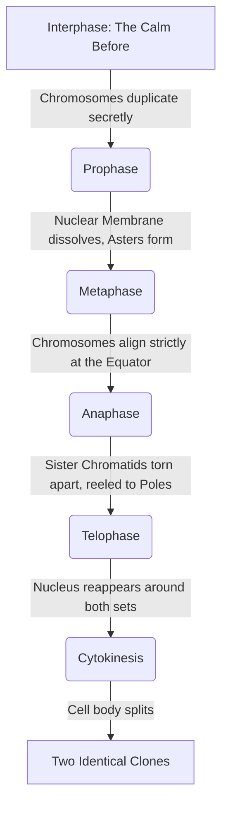

# Section 2.6: Types of Cell Division & Mitosis

> *"We now arrive at the greatest magic trick in the biological universe: the ability to turn one perfect machine into two perfect machines, without losing a single drop of microscopic information. It is a flawlessly choreographed dance, orchestrated by invisible threads, and written in Ancient Greek..."*

There are exactly two grand architectures of cell division:
1. **Mitosis:** The division of cloning. The engine of everyday growth, healing, and somatic (body) development.
2. **Meiosis:** The division of reduction. The engine of evolution, leading to the creation of reproductive gametes (sex cells).

## 2.6.1 MITOSIS (Mitos: thread)
Mitosis splits one majestic parent cell into **two perfectly identical daughter cells**. 
The golden, unbreakable rule of Mitosis is preservation: **The exact same normal chromosome number is maintained at each division.** If a skin cell with 46 chromosomes divides, both resulting daughter skin cells must possess 46 chromosomes.

This extraordinary event is split into two major theatrical acts: 
1. **Karyokinesis** (The splitting of the Nucleus).
2. **Cytokinesis** (The splitting of the Cytoplasm / Cell Body itself).

---

### 🎭 Phases of Mitosis — Karyokinesis (The Four Acts)
It occurs in 4 continuous, flowing phases. There is no hard stop between them; it is a fluid dance.
🔥 **Memory Trick:** **P**lease **M**ake **A**nother **T**aco!

**1. Prophase (pro = first)**
- The extremely long, messy chromatin fibers finally emerge from the dark, coiling up to become short, thick, and brutally visible **Chromosomes**. 
- They have already duplicated into sister chromatids, fiercely attached at the centromere.
- *The Logistics:* In animal cells, the centrosome splits. The **centrioles** migrate to opposite 'poles' of the cell. They begin glowing with radiating protein rays, creating a structure called an **aster** (star).
- *The Deconstruction:* Spindle fibres stretch out across the cellular void between the two asters. The **nuclear membrane and nucleolus completely disappear**. Why? Because the spindle fibers exist in the cytoplasm, and they need direct access to the chromosomes hidden inside the nucleus!

**2. Metaphase (meta = after)**
- The duplicated chromosomes are corralled by the spindle fibers and forced onto the **equatorial plane** (the exact, geometric middle of the cell).
- Every single chromosome is snared by a spindle fibre attaching exactly to its centromere. They are lined up for the firing squad.

**3. Anaphase (ana = up, back)**
- The tension peaks. The centromere shatters. The two sister chromatids simultaneously snap apart!
- They are violently reeled toward opposite poles by the physical contraction (shortening) of the spindle fibres. The V-shape of the chromatids being dragged through the cytoplasm is unmistakable under a microscope.

**4. Telophase (telo = end)**
- The exhausted daughter chromosomes reach the extreme poles and immediately thin out, reverting back into a messy, readable network of chromatin threads.
- Their job done, the spindle fibres vanish. 
- **The nuclear membrane and nucleolus miraculously reappear** around the two new chromatin clusters. The single cell now possesses two perfect, identical nuclei.

---

### ✂️ Cytokinesis (The Division of Cytoplasm)
Once the twin nuclei are formed, the cell body itself must be cleanly bisected. The physics of this event differs wildly between animals and plants.

- **In Animal cells (Squishy):** Animal cells lack a rigid cell wall. A squishy **cleavage furrow** appears in the middle of the membrane and pinches inward, much like tightening a belt around a balloon, until it pops the cell cleanly into two.
- **In Plant cells (Rigid):** Plant cells are encased in a brutal, stiff armor called a Cell Wall. They cannot pinch or bend. Instead, a rigid **cell plate** is laid down squarely down the middle, growing outward from the center to the periphery, constructing a brand new brick wall to separate the two halves.

## 2.6.2 The Deep Differences: Animal vs. Plant Mitosis

| Trait | 🐶 Animal Mitosis | 🌳 Plant Mitosis |
| :--- | :--- | :--- |
| **Asters?** | **Asters are formed** (They act as star-like rigid anchors at the poles because the animal cell is squishy). | **Asters are not formed** (The rigid plant cell wall provides all the structural anchoring needed). |
| **Cytokinesis Physics?** | By inward **furrowing of cytoplasm** (Pinching a balloon). | By outward **cell plate formation** (Building a wall from the inside out). |
| **Location in the body?** | Occurs heavily in most tissues throughout the entire body. | Occurs strictly at the **growing tips** (Meristems - for lengthening) and sides (for girth). |

## 2.6.3 The Monumental Significance of Mitosis
1. **Growth:** Increase in physical body size through millions of mitotic divisions.
2. **Repair:** Healing wounded, slashed, or fractured tissues.
3. **Replacement:** Replacing old, sloughed-off dead epidemal and violently destroyed blood cells.
4. **Asexual Reproduction:** Amoebas and yeast achieving biological immortality by continuously splitting in half.
5. **Genetic Preservation:** Maintaining the exact, unbreakable standard chromosome number in every newly minted daughter cell!

---
### 🏆 Active Recall & IIT Foundation Check

1. **Why does the nuclear membrane absolutely have to disappear during Prophase?** 
   *(Answer: The spindle fibers are built in the cytoplasm. To attach to the centromeres of the chromosomes, the protective wall of the nucleus must be dissolved to grant them access!)*
2. **Explain the physical reason why Animal cells form a cleavage furrow, but Plant cells must form a cell plate.** 
   *(Answer: Animal cells only have a flexible membrane, so they can be squeezed/pinched in half like a balloon. Plant cells have a thick, rigid Cellulose wall. You cannot squeeze a stiff box; instead, you must build a new dividing wall from the inside out).*
3. **What is the Greek translation of the prefixes for the 4 phases: Pro, Meta, Ana, Telo?** 
   *(Answer: Pro = First, Meta = After, Ana = Up/Back, Telo = End).*
