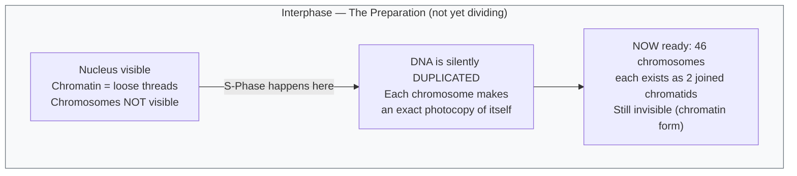
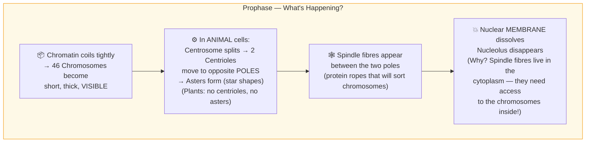
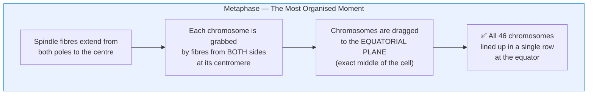
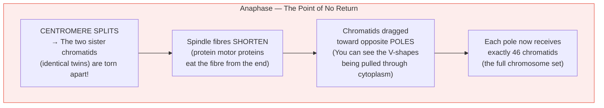
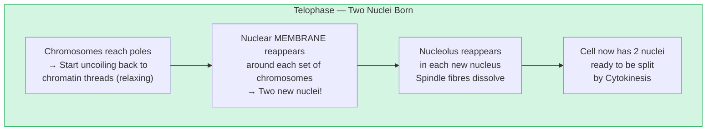

# Section 2.6: Mitosis — The Cell Division Movie

📍 **Where you are:** Body → Cell → **Division → Mitosis** (how does a cell copy itself perfectly?)

> *"Mitosis is not four separate stages. It is one continuous event, like a film playing at normal speed. We only give it four names because we needed a way to pause and describe what we see."*

---

## 🎯 What Mitosis Must Accomplish

Before showing the stages, understand the **goal**:

One parent cell (with 46 chromosomes, all duplicated) must split into **two daughter cells** — each with exactly **46 chromosomes**, identical to the parent.

The challenge: 46 duplicated chromosomes (92 chromatids) must be sorted perfectly into two equal groups, every single time, without losing or mixing a single one.

**Mitosis is the sorting machine.**

---

## 🎬 The Mitosis Movie — One Stage at a Time

> 🔑 **Memory trick for the 4 stages:** **P**lease **M**ake **A**nother **T**aco → **P**rophase, **M**etaphase, **A**naphase, **T**elophase

---

### 🎬 Stage 0: INTERPHASE (Before the movie starts)

This is not officially a stage of Mitosis, but nothing makes sense without it.

**The critical fact:** By the time Mitosis officially begins, all DNA has already been duplicated. The cell enters Mitosis with 46 chromosomes but each chromosome now has 2 attached copies (sister chromatids). So effectively 92 chromatids are present.

---

### 🎬 Stage 1: PROPHASE — *"The Packaging Phase"*

**Main event: Chromosomes become visible. The nucleus disappears.**

> 🔴 **Exam insight:** *"Why does the nuclear membrane disappear in Prophase?"*
> The spindle fibres are built in the cytoplasm. They need to reach and attach to the chromosomes. The nuclear membrane is the wall blocking them. It must dissolve for the spindle to access the chromosomes.

---

### 🎬 Stage 2: METAPHASE — *"The Lineup Phase"*

**Main event: All chromosomes line up perfectly at the cell's equator.**

> 🔴 **Exam insight:** *"This is the best stage to count chromosomes.* During Metaphase, chromosomes are maximally condensed AND lined up flat — making them easy to count and photograph. The chromosome images you see in textbooks are almost always Metaphase photographs.

---

### 🎬 Stage 3: ANAPHASE — *"The Tearing Phase"*

> 🧠 **Stop & Think — Before reading Anaphase:**
> *The chromosomes are lined up at the centre. The two identical sister chromatids are still stuck together. If you were the cell, what would your next step be?*
> *What EXACTLY needs to happen for each daughter cell to get a full set?*

**Main event: Sister chromatids are violently separated and pulled to opposite poles.**

> ⭐ **IIT insight:** The spindle fibres don't pull like a rope. They shorten by *depolymerizing* (disassembling) from the ends attached to the poles — essentially "eating themselves" to get shorter, which drags the chromosome like a winch reeling in a rope.

---

### 🎬 Stage 4: TELOPHASE — *"The Rebuilding Phase"*

**Main event: Two new nuclei form. The chromosomes relax.**

---

### ✂️ CYTOKINESIS — *"The Physical Split"*

**This happens AFTER Telophase and is NOT one of the 4 Karyokinesis stages.**

Karyokinesis = nucleus split. Cytokinesis = cytoplasm split. Very different.

| | Animal Cell | Plant Cell |
|:---|:---|:---|
| **How does it split?** | **Cleavage furrow** — the membrane pinches inward from outside, like squeezing a balloon in the middle | **Cell plate** — a new wall is built from the inside outward, from centre to edge |
| **Why different?** | Animal cells are soft and flexible — they can be pinched | Plant cells have a rigid wall — you can't pinch a wooden box, you must build a new dividing wall instead |

> 🔵 **5-mark exam question:** *"Describe the differences between Mitosis in animal and plant cells."*
> Key differences: (1) Asters form in animal cells, not plant cells. (2) Animal cells divide cytoplasm by cleavage furrow. Plant cells form a cell plate.

---

## 📊 The Mitosis Snapshot Table

| Stage | Main Event (One Line) | What Disappears | What Appears |
|:---|:---|:---|:---|
| **Prophase** | Chromosomes condense + become visible | Nuclear membrane, Nucleolus | Spindle fibres, Asters (animals) |
| **Metaphase** | All chromosomes line up at equator | — | — |
| **Anaphase** | Sister chromatids snap apart + move to poles | Centromere bond | — |
| **Telophase** | Two new nuclei form | Spindle fibres | Nuclear membranes ×2, Nucleoli ×2 |

---

---

> 📝 **3-Line Compression — PMAT in 3 lines:**
> 1. P: _____ appears / disappears. M: Chromosomes _____ at the _____.
> 2. A: _____ splits; chromatids move to _____. T: _____ reappears.
> 3. Animal cytokinesis = ___. Plant cytokinesis = ___.

> 🎤 **Feynman Challenge:**
> *"Describe Mitosis as a movie to a friend in 4 sentences — one per stage. Make it sound exciting."*

---

## 🎯 Significance of Mitosis (For Exam)

🔴 **2-mark: List 3 significances of Mitosis:**
1. Growth (increases cell number for body size increase)
2. Repair (replaces damaged/dead cells in wounded tissue)
3. Replacement (replaces naturally dying cells like skin, RBCs)
4. Asexual reproduction (single-celled organisms like Amoeba, bacteria)
5. **Maintains chromosome number** (each daughter gets identical 46 chromosomes)

---

### ✅ Before Moving On — Can You Answer These?

1. In which stage of Mitosis would you count chromosomes most easily, and why? *(Metaphase — chromosomes are maximally condensed AND lined up flat at the equator)*
2. What is the main event of Anaphase in ONE sentence? *(The centromere splits and sister chromatids are pulled to opposite poles by shortened spindle fibres)*
3. Why do plant cells form a cell plate while animal cells form a cleavage furrow? *(Plants have a rigid cell wall — can't be pinched. Animals have a flexible membrane — can be squeezed)*

---

## 📝 ICSE Practice Questions — Section 2.6 (Mitosis)

---

### 🔘 A. Multiple Choice (1 mark each)

**1.** During which stage of Mitosis do chromosomes line up at the equatorial plane?
- (a) Prophase
- (b) Metaphase
- (c) Anaphase
- (d) Telophase

> **Answer: (b) Metaphase** — all chromosomes align at the equatorial (middle) plane.

---

**2.** The nuclear membrane disappears during:
- (a) Anaphase
- (b) Telophase
- (c) Prophase
- (d) Metaphase

> **Answer: (c) Prophase.**

---

**3.** During Anaphase, the sister chromatids are separated because:
- (a) The nuclear membrane dissolves
- (b) The centromere divides and spindle fibres contract
- (c) DNA replicates
- (d) Asters form at the poles

> **Answer: (b)** The centromere splits and spindle fibres shorten (contract), pulling chromatids to opposite poles.

---

**4.** At the END of Telophase, the cell has:
- (a) 1 nucleus with 46 chromosomes
- (b) 2 nuclei each with 46 chromosomes
- (c) 1 nucleus with 92 chromosomes
- (d) 2 nuclei each with 23 chromosomes

> **Answer: (b) 2 nuclei, each with 46 chromosomes** — one for each future daughter cell.

---

**5.** Asters are NOT formed during Mitosis in:
- (a) Animal cells
- (b) Plant cells
- (c) Amoeba
- (d) Human liver cells

> **Answer: (b) Plant cells.** Plant cells lack centrioles and do not form asters.

---

**6.** Cytokinesis in plant cells differs from animal cells because plant cells form a:
- (a) Cleavage furrow
- (b) Cell wall furrow
- (c) Cell plate
- (d) Division membrane

> **Answer: (c) Cell plate** — formed from the inside out, from centre to periphery.

---

### 📝 B. Very Short Answer (1–2 marks each)

**1.** Name the 4 stages of Karyokinesis in correct sequence.

> **Answer:** Prophase → Metaphase → Anaphase → Telophase *(mnemonic: PMAT)*

---

**2.** Distinguish between Karyokinesis and Cytokinesis.

> **Answer:**
> - **Karyokinesis:** The division of the **nucleus** — includes all 4 stages of Mitosis (Prophase, Metaphase, Anaphase, Telophase).
> - **Cytokinesis:** The division of the **cytoplasm** — occurs after Telophase to split the cell into two physically separate daughter cells.

---

**3.** What is an "aster" and in which type of cells is it found?

> **Answer:** An aster is the star-shaped arrangement of protein fibres (rays) surrounding each centriole during Mitosis. It is formed from the **centrosome** and is found only in **animal cells** (not in plant cells, which lack centrioles).

---

**4.** Fill in the blanks:
> (a) In Prophase, the _____ disappears.
> (b) In Metaphase, chromosomes align at the _____.
> (c) In Anaphase, the _____ splits and chromatids move to _____ poles.
> (d) In Telophase, the _____ reappears.

> **Answers:** (a) nuclear membrane (and nucleolus); (b) equatorial plane; (c) centromere, opposite; (d) nuclear membrane (and nucleolus).

---

**5.** State two structural differences between Mitosis in animal and plant cells.

> **Answer:**
> 1. **Asters:** Formed in animal cells (from centrioles); NOT formed in plant cells (no centrioles).
> 2. **Cytokinesis:** Animal cells — cleavage furrow (cell membrane pinches inward). Plant cells — cell plate forms from inside out.

---

### 📄 C. Short Answer (2–3 marks each)

**1.** Describe the events of Prophase in an animal cell.

> **Answer:** During Prophase:
> 1. Chromatin fibres coil and condense → chromosomes become short, thick, and visible.
> 2. Each chromosome is already duplicated (two sister chromatids joined at the centromere).
> 3. The centrosome splits → two centrioles move to opposite poles.
> 4. Asters form around each centriole.
> 5. Spindle fibres appear between the two poles.
> 6. Nuclear membrane and nucleolus disappear.
> 7. Chromosomes begin moving toward the equatorial plane.

---

**2.** Draw a labelled diagram of a cell in Anaphase of Mitosis (animal cell with 4 chromosomes).

> **Answer (description):** Draw an oval cell. Show:
> - Asters at both poles (top and bottom)
> - 8 V-shaped chromatids (4 on each side) being pulled toward each pole
> - Spindle fibres connecting each chromatid to the pole's aster
> - No nuclear membrane
> - Label: Aster, Centriole, Spindle Fibre, Chromatid (chromosome), Poles

---

**3.** A student looking at cells under a microscope identifies a cell where chromosomes are arranged in a single plane at the centre of the cell.
- (a) Name this stage.
- (b) Why is this the best stage to count chromosomes?
- (c) Name the stage that comes immediately before and after this stage.

> **Answers:**
> (a) **Metaphase**
> (b) Because chromosomes are maximally condensed AND aligned flat at the equatorial plane — making them easiest to count, photograph, and study without overlap.
> (c) Before: **Prophase.** After: **Anaphase.**

---

### 🔬 D. Structured / Application Type (5 marks)

**1.** Refer to the following diagram description of a mitotic stage and answer the questions:
*(A cell showing chromosomes moving toward two poles with V-shapes, no nuclear membrane visible, asters present at poles)*

- (a) Name the stage shown.
- (b) Give one reason for your identification.
- (c) Name the organelle that forms the asters.
- (d) Why is this stage called the "point of no return"?
- (e) What happens immediately after this stage?

> **Answers:**
> (a) **Anaphase**
> (b) Sister chromatids are being pulled apart toward opposite poles — the centromere has split and chromatids are moving. OR: V-shaped chromosomes moving to poles.
> (c) **Centrosome** (containing centrioles)
> (d) Because the centromere has already split — the two sister chromatids are now permanently separated. They can never re-join. The cell is committed to producing two daughter cells.
> (e) **Telophase** — chromosomes reach the poles, nuclear membranes reform, nucleoli reappear, and chromosomes begin to de-condense back to chromatin. Cytokinesis then begins.

---

### ⭐ E. IIT / Significance Grade

**1.** What would happen if the spindle fibres failed to form during Mitosis? Explain the consequence at the cell and organism level.

> **Model Answer:**
> If spindle fibres failed to form, chromosomes could not move to opposite poles during Anaphase. All 92 chromatids would remain in the centre of the cell. When Cytokinesis occurs:
> - **Cell level:** The daughter cells would each receive incorrect chromosome numbers (some getting more, some getting none) — a condition called **nondisjunction**. Cells with abnormal chromosome numbers cannot function normally and typically die or malfunction.
> - **Organism level:** If this happened in early embryo development, the entire organism would be non-viable. In a mature body, it could lead to a tumour if cancer-checkpoint genes were also compromised. This is actually the mechanism exploited by **Taxol** (a cancer drug) — it prevents spindle fibre disassembly, causing cancer cells to get stuck in Mitosis and die.

