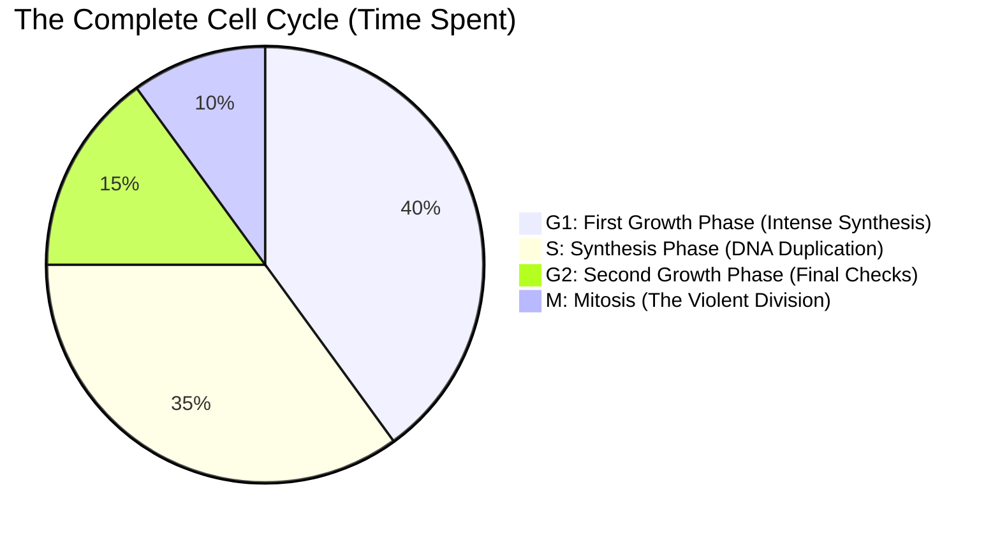

# Section 2.7: Cell Cycle ("Divide, grow and redivide")

> *"For decades, early pioneers of microscopy watched cells divide, only to see them enter a long, seemingly dormant state where absolutely nothing visible happened. They foolishly called it the 'resting phase'. But below the surface, nothing could be further from the truth. The cell is not resting. It is frantically, aggressively preparing for the most mathematically precise event in the universe..."*

At the exact moment Mitosis ends, the newborn daughter cells are remarkably small. They possess a full-sized, mature nucleus, but very little surrounding cytoplasm. They do not merely sit there; they plunge immediately into **Interphase**—the longest, most active, and most highly regulated period of the cell's entire existence.

During Interphase, the cell secretly prepares for the *next* massive division. If Mitosis is the visible explosion, Interphase is the long, invisible building of the bomb.

The cell cycle is beautifully broken into three distinct eras, culminating in the final division (M-Phase).

## 🧭 The 3 Deep Phases of Interphase

**1. First Growth Phase ($G_1$) — Building the Factory**
- In this era, the cell aggressively synthesizes RNA and a massive volume of proteins. The surrounding volume of the cytoplasm drastically swells as the cell matures to full size.
- **An Evolutionary Secret:** A fascinating sub-event occurs here. Mitochondria (and chloroplasts in plants) divide quietly on their own via simple fission. Why? Because these two unique organelles possess their own ancestral, circular DNA! They are not controlled by the nucleus.
- **The Great Crossroads (The Checkpoint!):** In late $G_1$, a cell must make a monumental choice. It will either fully prepare to cycle again, or it will **withdraw permanently** into a resting phase ($R$ or $G_0$).

**2. Synthesis Phase ($S$) — Photocopying the Library**
- Here lies the most critical, yet completely invisible, event of the entire cycle. **More DNA is synthesized and the 46 chromosomes are flawlessly duplicated!** 
- Every single strand of DNA is chemically photocopied. If a single base pair is mismatched, it could lead to catastrophic mutations (like cancer). The S-Phase ensures that when the cell finally splits, both daughters will receive the complete, uncut encyclopedia of life.

**3. Second Growth Phase ($G_2$) — The Final Countdown**
- This is a shorter, breathless push. More RNA and vital proteins specifically necessary for the physical act of division (like the proteins that make up the spindle fibers) are pumped out in massive quantities. 
- With its final microscopic checks complete, the cell boldly steps into Mitosis to face its destiny.

*(Note: Uncontrolled, non-stop cell cycles that bypass these checkpoints lead directly to tumors, which can be cancerous. Understanding the cell cycle is the key to curing cancer!).*

---
## ⏳ Immortality vs. Mortality (How long does a cell live?)
Can a cell simply cycle and divide endlessly, cheating death forever? 

**No.** Nature demands perfect, highly regulated balance. The cycle is brutally controlled. At some places in the body, it stops permanently; at others, it waits in dormant silence until injured. 

| Organ / Tissue | The Rate of Division (Life Span) | The "Why" behind the math |
| :--- | :--- | :--- |
| **Brain & Nerve Cells** | **Never!** Once formed in the embryo, they do not divide further. | Your memories and skills are stored in the physical wiring of neurons. If they divided, the wiring would shatter, and you would forget everything! |
| **Surface Skin Cells** | Continuously lost and replaced every **14 days**. | Skin faces constant friction from clothes, wind, and scratching. A large portion of household dust is dead skin! |
| **Red Blood Cells** | Replaced roughly every **120 days**. | Squeezing through tiny capillaries damages their membranes. Lacking a nucleus, they simply shatter after 4 months. |
| **Liver Cells** | Replaced slowly, every **300 to 500 days**. | The liver is highly regenerative but generally only divides to replace toxic damage from alcohol or disease. |
| **Bone Cells** | Replaced every **10 years** in adults. | Your skeleton is slowly remodeled to adapt to the gravitational stress of your weight. |

*(Note: Plant cells divide incredibly rapidly, but almost exclusively at specific vanguard locations called **meristems** at the tips of roots and shoots).*

---
### 🏆 Active Recall & IIT Foundation Check

1. **Why is the term "Resting Phase" scientifically incorrect for Interphase?** 
   *(Answer: Interphase is the most physiologically active phase of a cell's life! It is heavily synthesizing RNA, doubling its cytoplasm, and flawlessly duplicating its entire genetic code. It is only "resting" visually).*
2. **What catastrophic disease is the direct result of a "broken" Cell Cycle where a cell divides nonstop?** 
   *(Answer: Cancer / Tumors. Cancer is simply a cell cycle that refuses to stop at the natural checkpoints).*
3. **During $G_1$, which two organelles quietly divide on their own entirely independent of the nucleus, and what profound secret allows them to do this?** 
   *(Answer: Mitochondria and Chloroplasts. They can divide independently because they contain their own unique, ancient DNA and ribosomes!)*
