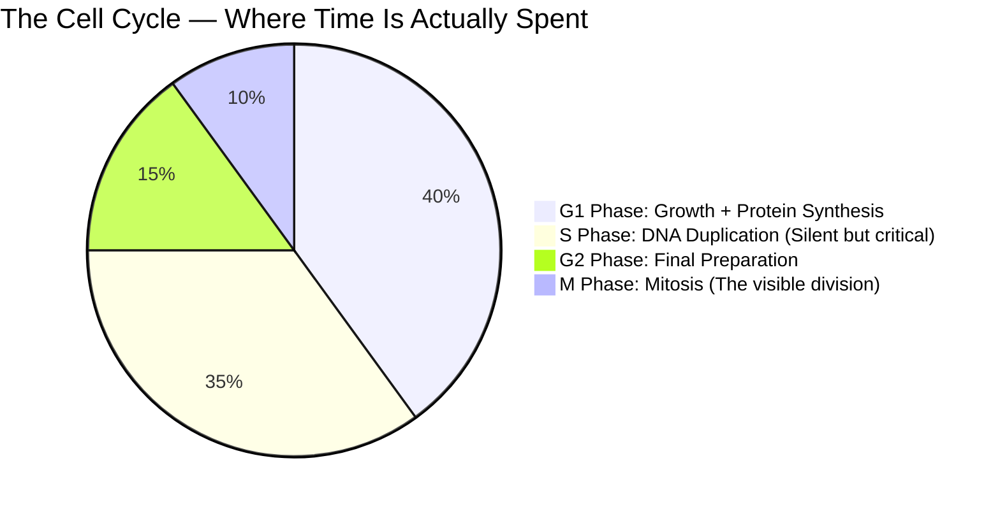

# Section 2.7: The Cell Cycle

📍 **Where you are:** Body → Cell → Division → **Cell Cycle** (the full life-loop of one cell)

> *"Scientists used to call Interphase the 'resting phase'. This is one of the most embarrassing mistakes in the history of biology. There is nothing restful about it."*

---

## 🎯 The Core Idea in One Sentence

**The Cell Cycle is the complete loop of a cell's life — from the moment it is born to the moment it divides into two.**

> 🧠 **Stop & Think — Before reading the phases:**
> *If Division (Mitosis) takes only 10% of a cell's life, what do you think the cell is doing the other 90% of the time? Why can't it just divide straight away?*

Most of this cycle is NOT division. Division (Mitosis) takes only about 10% of the total time. The other 90% is Interphase — the cell growing, preparing, and duplicating its DNA.

---

## 🏃 The Three Phases of Interphase

### Phase 1: G₁ — First Growth Phase ("Get Big")

The newly born daughter cell is small. Its nucleus is full-sized, but the cytoplasm is tiny. In G₁, the cell does two things:
1. **Makes proteins and RNA** — restocking its internal machinery
2. **Grows** — cytoplasm volume swells to match a full-sized cell

> ⭐ **IIT insight — The G₁ Checkpoint (The Cancer Trap):**
> Late in G₁, the cell faces a critical decision point monitored by security proteins:
> - DNA undamaged? → Proceed to S-Phase ✅
> - DNA damaged or conditions unfavourable? → Withdraw to resting phase (G₀) ❌
>
> **Cancer is what happens when this checkpoint is broken.** A cell with damaged DNA slips through the checkpoint and keeps dividing — uncontrolled. This is a tumour.

Also in G₁: Mitochondria (and chloroplasts in plant cells) quietly divide on their own — they have their own ancient circular DNA and don't need the nucleus to tell them when to divide.

### Phase 2: S — Synthesis Phase ("Copy Everything")

**The most critical phase you can't see.**

The entire DNA — all 46 chromosomes, all 3 billion base pairs — is duplicated. Every chromosome makes an identical copy of itself. These copies stay joined together at the centromere as sister chromatids.

After S-Phase: 46 chromosomes, each consisting of 2 joined sister chromatids. The cell is "loaded" and ready.

> 🔴 **Exam fact:** In which phase of the cell cycle is DNA synthesized? **S-Phase (Synthesis Phase)**.

### Phase 3: G₂ — Second Growth Phase ("Final Check")

The cell produces the proteins specifically needed for mitosis (the spindle fibre proteins, etc.) and does a final structural check. Then it commits to division.

---

## 🛑 Does the Cell Cycle Run Forever?

No. There are precise biological brakes. The cycle is tightly regulated:

| Cell Type | Division Status | Reason |
|:---|:---|:---|
| Nerve cells | **Never divide** after birth | Dividing would destroy memory-encoding neural connections |
| Skin cells | Continuously replacing | Surface cells are constantly lost to friction |
| RBCs | Never (no nucleus) | Replaced by bone marrow stem cells instead |
| Liver cells | Every 1–2 years | Only when damaged — highly regenerative |
| Cancer cells | **Never stop** | Checkpoint(s) broken — uncontrolled cycle |

> 🔴 **2-mark exam question:** *"What happens if cell cycles run without stopping?"*
> **Answer:** Uncontrolled, non-stop cell cycles lead to tumours that may or may not be cancerous.

---

> 📝 **3-Line Compression (2.7):**
> G1 = _____. S = _____. G2 = _____.
> The G1 checkpoint prevents _____.
> Cancer = cell cycle that _____.

> 🎤 **Feynman Challenge (2.7):**
> *"Why is calling Interphase a 'resting phase' one of biology's most embarrassing mistakes? Explain to a friend in 3 sentences."*

---

### ✅ Before Moving On — Can You Answer These?

1. Why is "resting phase" a wrong name for Interphase? *(The cell is doing its most intense molecular work — synthesising DNA, proteins, and growing. It only 'looks' quiet.)*
2. What does the G₁ checkpoint prevent? *(It prevents cells with damaged DNA from dividing and passing on mutations — if broken, it leads to cancer)*
