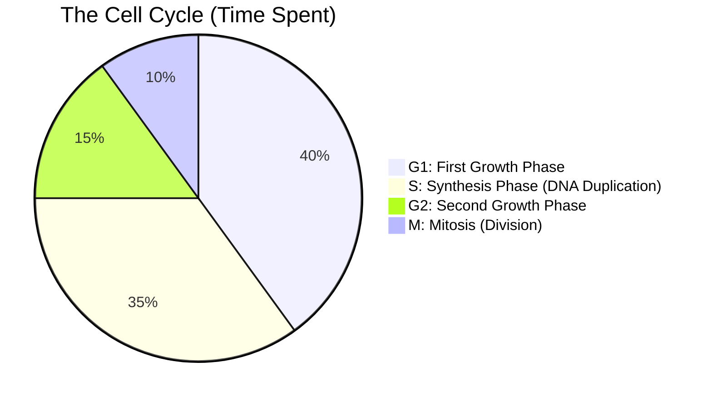
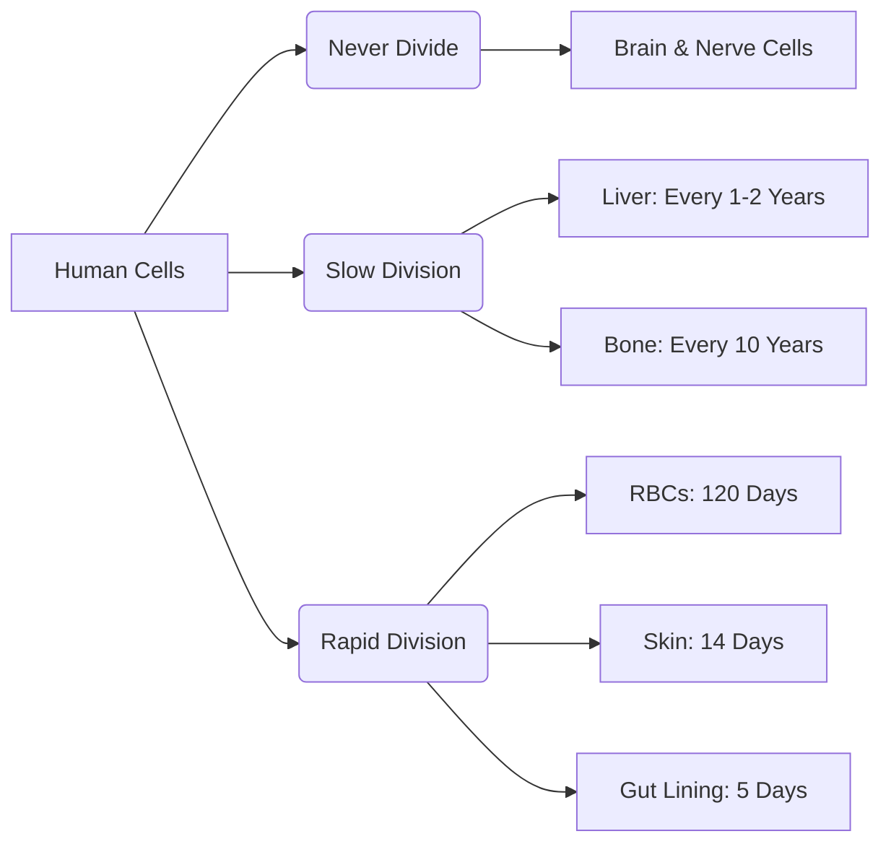

# Section 2.7: Cell Cycle ("Divide, grow and redivide")

> *"For decades, early pioneers of microscopy watched cells divide, only to see them enter a long, seemingly dormant state. They called it the 'resting phase'. But below the surface, nothing could be further from the truth. The cell is not resting. It is frantically preparing for the profound undertaking of bringing forth new life..."*

At the end of Mitosis, the newborn cells are remarkably small. They possess a full-sized nucleus but very little surrounding cytoplasm. They do not merely sit there; they plunge immediately into **Interphase**—the longest, most active period of the cell's entire existence.

During Interphase, the cell secretly prepares for the *next* division. This magnificent cycle is broken into three distinct eras:

## 🧭 The 3 Phases of Interphase

**1. First Growth Phase ($G_1$)**
- In this era, the cell aggressively synthesizes RNA and proteins. The volume of the cytoplasm swells.
- An extraordinary sub-event occurs: Mitochondria (and chloroplasts in plants) divide quietly on their own. Why? Because these two unique organelles possess their own ancestral DNA!
- *The Great Crossroads:* In late $G_1$, a cell must make a monumental choice. It will either prepare to cycle again, or it will **withdraw permanently** into a resting phase ($R$).

**2. Synthesis Phase ($S$)**
- Here lies the most critical, yet invisible, event of the entire cycle. **More DNA is synthesized and chromosomes are flawlessly duplicated!** 
- Every single strand of DNA is photocopied so that when the cell finally splits, both daughters receive the complete, uncut encyclopedia of life.

**3. Second Growth Phase ($G_2$)**
- This is the final, breathless push. More RNA and vital proteins necessary for the physical act of division are pumped out. With its preparations complete, the cell boldly steps into Mitosis.

---
## ⏳ Immortality vs. Mortality (How long does the cycle last?)
Can a cell simply divide endlessly, cheating death forever? 

**No.** Nature demands balance. At some places, the cycle stops permanently; at others, it waits in dormant silence.

*(Note: Plant cells divide incredibly rapidly, but almost exclusively at specific vanguard locations called **meristems**).*

---
### 🏆 Active Recall Check
1. **Which invisible phase of the Cell Cycle photocopies the DNA?** 
   *(Answer: Synthesis Phase / S Phase)*
2. **What tragic cell in the human body never divides once it is formed in the embryo?** 
   *(Answer: Brain and other nerve cells!)*
3. **During $G_1$, which two organelles quietly divide on their own because they have their own DNA?** 
   *(Answer: Mitochondria and Chloroplasts)*
