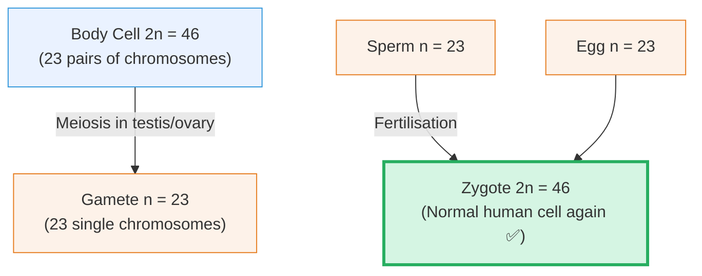
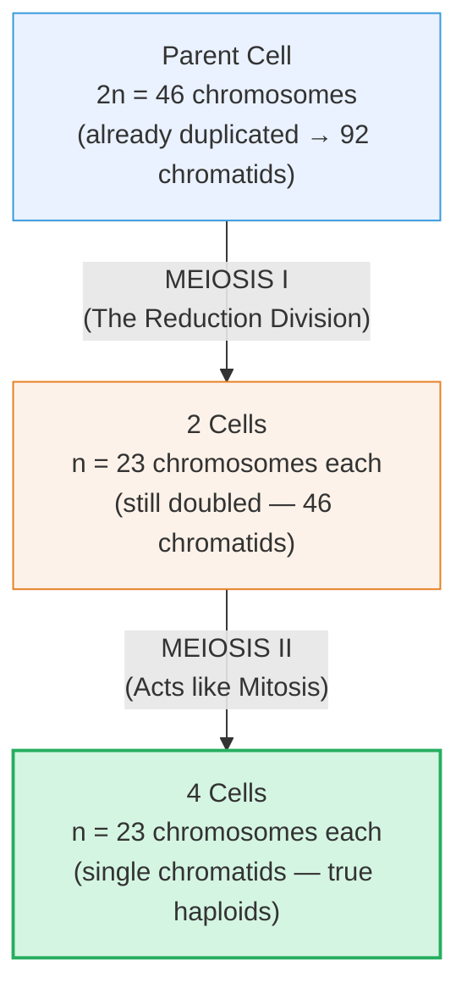
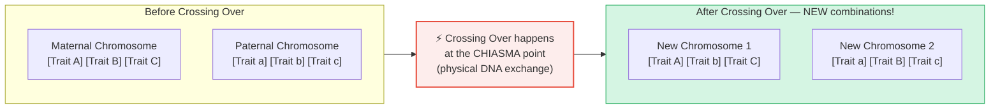

# Section 2.8: Meiosis — The Reduction Division

📍 **Where you are:** Body → Cell → Division → **Meiosis** (why sex cells play by different rules)

> *"Why don't you look like an exact clone of your mother? Or your father? You got DNA from both — but you're not just a 50/50 blend either. You are something new. Something that never existed before. Meiosis is the reason why."*

---

## 🎯 First — The Problem That Makes Meiosis Necessary

We established in Section 2.5 that if gametes (sperm and eggs) were made by Mitosis, the chromosome count would double every generation until the species collapsed.

But there's a second problem Meiosis solves — one that's even more fascinating:

**If every sperm were genetically identical and every egg were genetically identical, all children from the same parents would be clones.**

Meiosis solves *both* problems at once:
1. **Halves the chromosome number** (23 in gametes, restored to 46 at fertilization) ✅
2. **Shuffles the genetic deck** (creates unique gene combinations in every gamete) ✅

---

## 🧮 Diploid vs Haploid — The Core Vocabulary

Before the stages, you need these two terms:

| Term | Meaning | Example |
|:---|:---|:---|
| **Diploid (2n)** | Has full, paired chromosomes (one set from mum, one from dad) | All body cells: 2n = 46 |
| **Haploid (n)** | Has only one set — one member of each pair | Gametes: n = 23 |

---

## 🎬 Meiosis — The Two-Act Division

Meiosis is two divisions back to back. You don't need to memorise the phase names within each division (ICSE syllabus says stages not required), but you must understand what each division achieves.

- **Meiosis I** (Reduction): Homologous chromosome pairs (the matching mum/dad pairs) separate. This is where the chromosome count actually halves.
- **Meiosis II** (Mitotic-type): The chromatids within each half-set separate, just like in Mitosis.

**Result:** 1 parent cell → **4 haploid daughter cells** (gametes).

---

## 🂣 The Genetic Shuffle — Why You Are Unique

> 🧠 **Stop & Think — Before reading:**
> *You have 23 pairs of chromosomes. In each pair, one came from your mum and one from your dad. During Meiosis I, one from EACH pair goes to the gamete. Is the choice of which one goes random, or fixed?*
> *And if it’s random, how many possible combinations of 23 chromosomes could one person produce?*
> *(Hint: 2&sup2;³ — use a calculator!).*

### Shuffle #1: Random Separation

During Meiosis I, each pair of homologous chromosomes (one from mum, one from dad) separates randomly. The mum-chromosome from pair 1 might go left while the mum-chromosome from pair 2 goes right — completely at random.

With 23 pairs, the number of possible arrangements is 2²³ = **over 8 million different combinations** — from a single person's gametes alone.

### Shuffle #2: Crossing Over (The Gene Swap)

This is the most profound event. During Meiosis I, before homologous chromosomes separate, they physically embrace and exchange segments of DNA.

> 📌 **Exam Term — Chiasma (plural: Chiasmata):** The exact X-shaped physical point where two homologous chromosomes cross and exchange genetic material during Meiosis I.

> 🔴 **2-mark exam question:** *"What is crossing over and what is its significance?"*
> **Model answer:** Crossing over is the exchange of DNA segments between homologous chromosomes at a point called the chiasma during Meiosis I. It results in new combinations of genes, producing genetic variation in offspring.

---

## 🥊 Mitosis vs Meiosis — The Table You MUST Know

> 🔵 **5-mark exam question:** *"Distinguish between Mitosis and Meiosis."* This table is your complete answer.

| Feature | 🏭 Mitosis | 🎲 Meiosis |
|:---|:---|:---|
| **Where** | Somatic (body) cells | Reproductive cells (testis, ovary, anther) |
| **Purpose** | Growth, repair, replacement | Gamete formation |
| **When** | Throughout life | Only during reproductive age |
| **Daughter cells produced** | **2** | **4** |
| **Chromosome number** | **Diploid (2n)** — same as parent | **Haploid (n)** — half of parent |
| **Number of divisions** | **1** | **2** (Meiosis I + II) |
| **Genetic identity of daughters** | Identical clones | Genetically unique (variation!) |

---

## 🌍 Why Meiosis Matters for the Whole Planet

> ⭐ **IIT/HOT question:** *"How does Meiosis contribute to evolution?"*

If every organism produced identical offspring, evolution would stall. A single disease could wipe out an entire species. Meiosis, through crossing over and random assortment, ensures every individual is genetically unique. Some will be resistant to a new disease. Some will thrive in a new environment. This variation is the raw material that natural selection acts on — and it is the fundamental engine of evolution.

---

> 📝 **3-Line Compression (2.8):**
> 1. Meiosis produces ___ daughter cells, each with ___ chromosomes (_____).
> 2. In humans: sperm = ___ chromosomes, egg = ___, zygote = ___.
> 3. Chiasma = the point where _____; its significance = _____.

> 🎤 **Feynman Challenge (2.8):**
> *"Without using the word 'meiosis', explain to a friend in 2 sentences why you — a child of YOUR parents — are genetically unique and have never existed before."*

---

## 🏆 Chapter Complete — Final Self Test

1. **What are the 4 packing levels of DNA?** *(DNA → Nucleosome → Chromatin Fibre → Chromosome)*
2. **Name the 4 phases of Mitosis.** *(Prophase, Metaphase, Anaphase, Telophase — PMAT)*
3. **What is the main event of Anaphase?** *(Sister chromatids snap apart at the centromere and move to opposite poles)*
4. **Why does the nuclear membrane dissolve during Prophase?** *(Spindle fibres, built in the cytoplasm, need direct access to the chromosomes inside the nucleus)*
5. **Why does meiosis produce 4 cells, not 2?** *(Because it involves 2 successive divisions: Meiosis I (reduction) and Meiosis II (mitotic-type))*
6. **What is a chiasma?** *(The X-shaped point where homologous chromosomes physically cross and exchange genetic material during Meiosis I)*
7. **If mitosis preserves 46 chromosomes, why can't gametes be made by mitosis?** *(If gametes had 46 chromosomes, fertilisation would create 92 — doubling each generation, quickly collapsing the species)*
