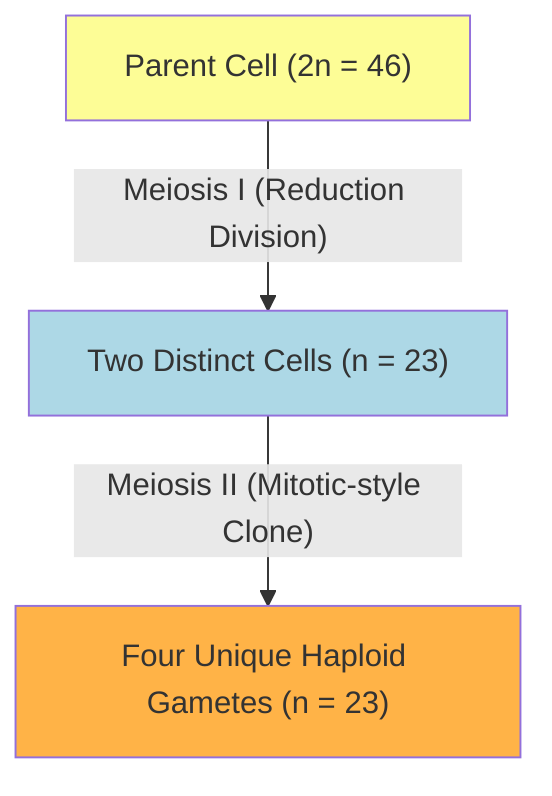

# Section 2.8: Meiosis (The Reduction Division)

> *"Why, one might ask, do we not look exactly like our siblings? If we are born of the exact same parents, and Mitosis builds perfect, identical clones, how is it that every human to ever walk the earth is utterly, profoundly unique? Why isn't a family just a collection of identical twins? The answer lies in the most exquisite biological shuffle known to science: Meiosis..."*

If sexual reproduction relied blindly on the cloning engine of Mitosis, a terrifying mathematical tragedy would unfold across generations. 
- A human sperm containing 46 chromosomes would fuse with a human egg containing 46 chromosomes. 
- The resulting child would possess 92 chromosomes. 
- In the next generation, that child's 92 would merge with another 92, creating an infant with 184 chromosomes!
- Within a few generations, chromosomes would explode into the thousands, causing immediate cellular failure and cellular death.

To circumvent this mathematical apocalypse, nature invented **Meiosis**. 

Meiosis is an extraordinary, two-act division that brutally, yet perfectly, **halves the chromosome number** (from 46 down to exactly 23).
- **In Humans:** It occurs strictly behind the hidden, highly protected walls of the reproductive organs (Testis in males, Ovary in females) to forge sperms and ova.
- **In Plants:** It occurs high up within the delicate anthers and deep within the ovary of a flower to produce pollen grains and ovules.

### 🧮 The Mathematics of Life (Diploid vs. Haploid)
When a mature, normal body cell possesses matching pairs of chromosomes (one full set inherited from the father, plus one identical-looking set from the mother), it is called **Diploid (2n)**.
When a sex cell (gamete) undergoes Meiosis, it receives only *one* solitary member of each pair. It is stripped down to become **Haploid (n)**. 

Only through Meiosis can the sacred equation of human life balance:
$n \text{ (Haploid Sperm)} + n \text{ (Haploid Egg)} = 2n \text{ (A beautifully fertilised Diploid Zygote)!}$

*(Note: As per the ICSE syllabus, you do not need to memorize the dizzying phases like Prophase I, Metaphase II, etc. Just know that it occurs in two major leaps: Meiosis I (the true reduction) followed by Meiosis II (which essentially acts exactly like Mitosis to split the chromatids).*

---
## 2.8.1 The Monumental Significance of Meiosis

Why is Meiosis considered the true engine of human evolution? It provides two profound, world-altering gifts:

**1. The Restoration of Balance**
As we have seen, the chromosome number is halved intentionally in the gametes so that upon the miracle of fertilization, the normal diploid number ($2n$) is perfectly restored. No exploding mathematics.

**2. The Great Genetic Shuffle (Crossing Over)**
This is the moment individuality is born. While the maternal and paternal matching chromosomes are separating during Meiosis I, they often intimately, physically embrace. 

In a spectacular display of genetic recombination, they simply cross their arms, snap off a piece of their chromatid material, and exchange physical tips with each other! 
👉 **Exam Term:** The exact X-shaped microscopic point where they visually cross and swap their genetic destinies is called the **Chiasma** (Plural: Chiasmata).

> 🧬 **The Trait Mix-Up:**
> Imagine a paternal chromosome carries the gene for [Brown Hair] and [Brown Eyes] right next to each other. The maternal chromosome carries [Blonde Hair] and [Blue Eyes]. Normally, they are packaged together. But during Crossing Over, they physically snap and swap! Suddenly, you create a brand new, never-before-seen chromosome containing [Brown Hair] and [Blue Eyes]. 

Because these swaps occur completely at random, **no two sperms and no two eggs forged by a human body will ever be the exact same**. This brilliant permutation provides the endless, breathtaking variation seen in every species on Earth. It is the reason a single virus cannot kill every single plant in a forest; varied genetics act as a shield for the species.

---
## 🥊 Table 2.2: The Ultimate Biological Showdown (Mitosis vs. Meiosis)

| Question | 🏭 Mitosis (The Clone Factory) | 🎲 Meiosis (The Shuffler) |
| :--- | :--- | :--- |
| **Where does it reign?** | Somatic (Standard body) cells (Skin, Bone, Leaf). | Specialized Reproductive cells (Testis, Anther). |
| **What is its ultimate purpose?** | Growth of the organism and repair of tissue. | Gamete formation exclusively for reproduction. |
| **When does it actively occur?** | Continuously, violently, throughout your entire life. | Only during a reproductively active age. |
| **How many daughter cells are born?** | Exactly 2. | Exactly 4. |
| **The Chromosome count?** | Diploid ($2n$) — an identical, full count is passed. | Haploid ($n$) — cut exactly, cleanly in half. |
| **How many Nuclear divisions occur?** | A single division. | Two successive divisions (I and II). |
| **What is the identity of the progeny?** | Perfect, identical genetic clones of the parent. | Beautifully, randomly unique (due to crossing over). |

---
### 🏆 Active Recall & IIT Foundation Check
*Do you truly understand the engine of evolution?*

1. **What mathematical catastrophe would occur if human reproduction utilized Mitosis instead of Meiosis?** 
   *(Answer: A sperm (46) and an egg (46) would fuse to create a baby with 92 chromosomes, leading to rapid cellular failure. Meiosis deliberately halves the count to 23 so the resulting baby remains at 46).*
2. **Define the Chiasma and explain its profound evolutionary consequence.** 
   *(Answer: The Chiasma is the specific physical point where two homologous (matching) chromosomes physically cross over and exchange their genetic material. This creates genetic recombination, ensuring that no two human beings are identical!)*
3. **If a specific skin cell dividing by Mitosis produces 2 daughter cells, how many total gametes are produced by a single parent cell undergoing Meiosis?** 
   *(Answer: Exactly 4 daughter cells).*
