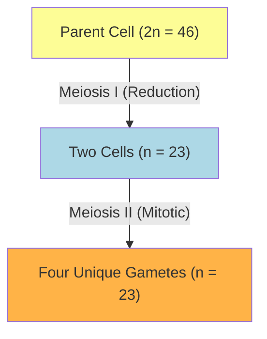

# Section 2.8: Meiosis (The Reduction Division)

> *"Why, one might ask, do we not look exactly like our siblings? If Mitosis produces perfect, identical clones, how is it that every human to ever walk the earth is utterly unique? The answer lies in the most exquisite biological shuffle known to science: Meiosis..."*

If sexual reproduction relied on Mitosis, a tragedy would unfold. A sperm containing 46 chromosomes would fuse with an egg containing 46 chromosomes. The resulting child would possess 92 chromosomes—a biological impossibility that would immediately self-destruct.
To circumvent this, nature invented **Meiosis**. 

Meiosis is an extraordinary division that brutally, yet perfectly, **halves the chromosome number** (from 46 down to 23).
- **In Humans:** It occurs strictly in the hidden sanctuaries of the reproductive organs (Testis and Ovary) to forge sperms and ova.
- **In Plants:** It occurs within the anthers and ovary to produce pollen grains and ovules.

### 🧮 The Mathematics of Life (Diploid vs. Haploid)
When a cell possesses normal, matching pairs of chromosomes (one set inherited from the father, one identical set from the mother), it is called **Diploid (2n)**.
When a gamete receives only *one* solitary member of each pair, it is stripped down to become **Haploid (n)**. 

$n \text{ (sperm)} + n \text{ (egg)} = 2n \text{ (a fertilised, beautifully diploid baby)!}$

---
## 2.8.1 The Monumental Significance of Meiosis

Why is Meiosis the true engine of evolution? It provides two profound gifts:

**1. The Restoration of Balance**
As we have seen, the chromosome number is halved in the gametes so that upon the miracle of fertilization, the normal diploid number ($2n$) is perfectly restored.

**2. The Great Genetic Shuffle (Crossing Over)**
This is the moment individuality is born. While the maternal and paternal chromosomes are separating, they often intimately embrace. In a spectacular display of genetic recombination, they simply snap off a piece of their arms and exchange physical material with each other! 
👉 **Exam Term:** The exact point where they visually cross and swap is called the **Chiasma**.

No two sperms and no two eggs forged by this process will ever be the same. This permutation provides the endless, breathtaking variation seen in every species on Earth.

---
## 🥊 Table 2.2: The Ultimate Showdown (Mitosis vs. Meiosis)

| Question | 🏭 Mitosis | 🎲 Meiosis |
| :--- | :--- | :--- |
| **Where does it reign?** | Somatic (body) cells. | Reproductive cells. |
| **What is its purpose?** | Growth and repair. | Gamete formation only. |
| **When does it act?** | Continuously throughout life. | Only in reproductively active age. |
| **Daughter cells born?** | Exactly 2. | Exactly 4. |
| **The Chromosome count?** | Diploid ($2n$) — identical count. | Haploid ($n$) — cut exactly in half. |
| **Nuclear divisions?** | A single division. | Two successive divisions. |
| **Identity of the progeny?** | Perfect, identical clones. | Beautifully, randomly unique. |

---
### 🏆 Active Recall Check
1. **What is the difference between Diploid and Haploid?** 
   *(Answer: Diploid means matching pairs, normally 46 chromosomes (2n). Haploid means halved, normally 23 chromosomes (n).)*
2. **What is the Chiasma?** 
   *(Answer: The point where two matching chromosomes exchange their chromatid material during Meiosis, resulting in crossing-over.)*
3. **How many daughter cells does Meiosis produce versus Mitosis?** 
   *(Answer: Meiosis produces 4, Mitosis produces 2.)*
