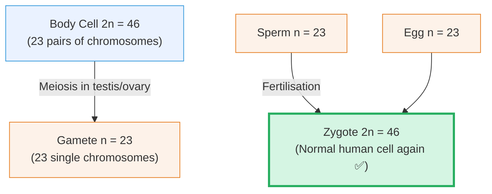
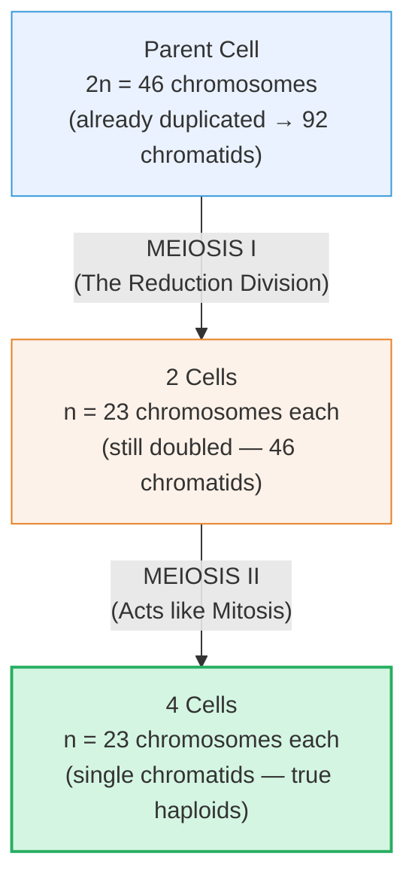
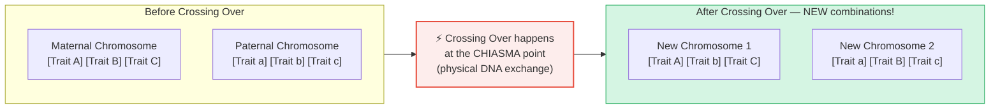

# Section 2.8: Meiosis — The Reduction Division

📍 **Where you are:** Body → Cell → Division → **Meiosis** (why sex cells play by different rules)

> *"Why don't you look like an exact clone of your mother? Or your father? You got DNA from both — but you're not just a 50/50 blend either. You are something new. Something that never existed before. Meiosis is the reason why."*

---

## 🎯 First — The Problem That Makes Meiosis Necessary

We established in Section 2.5 that if gametes (sperm and eggs) were made by Mitosis, the chromosome count would double every generation until the species collapsed.

But there's a second problem Meiosis solves — one that's even more fascinating:

**If every sperm were genetically identical and every egg were genetically identical, all children from the same parents would be clones.**

Meiosis solves *both* problems at once:
1. **Halves the chromosome number** (23 in gametes, restored to 46 at fertilization) ✅
2. **Shuffles the genetic deck** (creates unique gene combinations in every gamete) ✅

---

## 🧮 Diploid vs Haploid — The Core Vocabulary

Before the stages, you need these two terms:

| Term | Meaning | Example |
|:---|:---|:---|
| **Diploid (2n)** | Has full, paired chromosomes (one set from mum, one from dad) | All body cells: 2n = 46 |
| **Haploid (n)** | Has only one set — one member of each pair | Gametes: n = 23 |

---

## 🎬 Meiosis — The Two-Act Division

Meiosis is two divisions back to back. You don't need to memorise the phase names within each division (ICSE syllabus says stages not required), but you must understand what each division achieves.

- **Meiosis I** (Reduction): Homologous chromosome pairs (the matching mum/dad pairs) separate. This is where the chromosome count actually halves.
- **Meiosis II** (Mitotic-type): The chromatids within each half-set separate, just like in Mitosis.

**Result:** 1 parent cell → **4 haploid daughter cells** (gametes).

---

## 🂣 The Genetic Shuffle — Why You Are Unique

> 🧠 **Stop & Think — Before reading:**
> *You have 23 pairs of chromosomes. In each pair, one came from your mum and one from your dad. During Meiosis I, one from EACH pair goes to the gamete. Is the choice of which one goes random, or fixed?*
> *And if it’s random, how many possible combinations of 23 chromosomes could one person produce?*
> *(Hint: 2&sup2;³ — use a calculator!).*

### Shuffle #1: Random Separation

During Meiosis I, each pair of homologous chromosomes (one from mum, one from dad) separates randomly. The mum-chromosome from pair 1 might go left while the mum-chromosome from pair 2 goes right — completely at random.

With 23 pairs, the number of possible arrangements is 2²³ = **over 8 million different combinations** — from a single person's gametes alone.

### Shuffle #2: Crossing Over (The Gene Swap)

This is the most profound event. During Meiosis I, before homologous chromosomes separate, they physically embrace and exchange segments of DNA.

> 📌 **Exam Term — Chiasma (plural: Chiasmata):** The exact X-shaped physical point where two homologous chromosomes cross and exchange genetic material during Meiosis I.

> 🔴 **2-mark exam question:** *"What is crossing over and what is its significance?"*
> **Model answer:** Crossing over is the exchange of DNA segments between homologous chromosomes at a point called the chiasma during Meiosis I. It results in new combinations of genes, producing genetic variation in offspring.

---

## 🥊 Mitosis vs Meiosis — The Table You MUST Know

> 🔵 **5-mark exam question:** *"Distinguish between Mitosis and Meiosis."* This table is your complete answer.

| Feature | 🏭 Mitosis | 🎲 Meiosis |
|:---|:---|:---|
| **Where** | Somatic (body) cells | Reproductive cells (testis, ovary, anther) |
| **Purpose** | Growth, repair, replacement | Gamete formation |
| **When** | Throughout life | Only during reproductive age |
| **Daughter cells produced** | **2** | **4** |
| **Chromosome number** | **Diploid (2n)** — same as parent | **Haploid (n)** — half of parent |
| **Number of divisions** | **1** | **2** (Meiosis I + II) |
| **Genetic identity of daughters** | Identical clones | Genetically unique (variation!) |

---

## 🌍 Why Meiosis Matters for the Whole Planet

> ⭐ **IIT/HOT question:** *"How does Meiosis contribute to evolution?"*

If every organism produced identical offspring, evolution would stall. A single disease could wipe out an entire species. Meiosis, through crossing over and random assortment, ensures every individual is genetically unique. Some will be resistant to a new disease. Some will thrive in a new environment. This variation is the raw material that natural selection acts on — and it is the fundamental engine of evolution.

---

> 📝 **3-Line Compression (2.8):**
> 1. Meiosis produces ___ daughter cells, each with ___ chromosomes (_____).
> 2. In humans: sperm = ___ chromosomes, egg = ___, zygote = ___.
> 3. Chiasma = the point where _____; its significance = _____.

> 🎤 **Feynman Challenge (2.8):**
> *"Without using the word 'meiosis', explain to a friend in 2 sentences why you — a child of YOUR parents — are genetically unique and have never existed before."*

---

## 🏆 Chapter Complete — Final Self Test

1. **What are the 4 packing levels of DNA?** *(DNA → Nucleosome → Chromatin Fibre → Chromosome)*
2. **Name the 4 phases of Mitosis.** *(Prophase, Metaphase, Anaphase, Telophase — PMAT)*
3. **What is the main event of Anaphase?** *(Sister chromatids snap apart at the centromere and move to opposite poles)*
4. **Why does the nuclear membrane dissolve during Prophase?** *(Spindle fibres, built in the cytoplasm, need direct access to the chromosomes inside the nucleus)*
5. **Why does meiosis produce 4 cells, not 2?** *(Because it involves 2 successive divisions: Meiosis I (reduction) and Meiosis II (mitotic-type))*
6. **What is a chiasma?** *(The X-shaped point where homologous chromosomes physically cross and exchange genetic material during Meiosis I)*
7. **If mitosis preserves 46 chromosomes, why can't gametes be made by mitosis?** *(If gametes had 46 chromosomes, fertilisation would create 92 — doubling each generation, quickly collapsing the species)*

---

## 📝 ICSE Practice Questions — Section 2.8 (Meiosis)

---

### 🔘 A. Multiple Choice (1 mark each)

**1.** The number of chromosomes is halved during:
- (a) Mitosis
- (b) Meiosis I
- (c) Meiosis II
- (d) Interphase

> **Answer: (b) Meiosis I** — this is the "reduction division" where homologous pairs separate.

---

**2.** How many cells are produced at the end of one complete Meiosis?
- (a) 2
- (b) 4
- (c) 8
- (d) 1

> **Answer: (b) 4** — one parent cell → 4 haploid daughter cells (gametes).

---

**3.** If a body cell has 46 chromosomes, how many chromosomes will its egg cell have?
- (a) 46
- (b) 92
- (c) 23
- (d) 12

> **Answer: (c) 23.** Meiosis halves the chromosome number; n = 23 in human gametes.

---

**4.** Crossing over occurs between:
- (a) Sister chromatids of the same chromosome
- (b) Non-homologous chromosomes
- (c) Chromatids of homologous chromosome pairs
- (d) The centromere and the spindle fibre

> **Answer: (c)** Crossing over happens between chromatids of **homologous** chromosome pairs during Meiosis I.

---

**5.** Meiosis occurs in:
- (a) All body cells throughout life
- (b) Only in ovary and testis in humans
- (c) Heart muscle cells during repair
- (d) Nerve cells in the brain

> **Answer: (b)** Meiosis occurs only in **germinal cells of reproductive organs** (testis, ovary in animals; anthers, ovary in plants).

---

### 📝 B. Very Short Answer (1–2 marks each)

**1.** Why is meiosis called the "reduction division"?

> **Answer:** Meiosis is called the reduction division because the chromosome number is **reduced** from the diploid number (2n) to the haploid number (n) — i.e., from 46 to 23 in humans. This reduction in chromosome number is the key purpose of Meiosis I (the first division).

---

**2.** Define: (a) Haploid (b) Diploid (c) Chiasma

> **Answers:**
> (a) **Haploid (n):** A cell with only one set of chromosomes — one from each homologous pair (e.g. human gametes: n = 23).
> (b) **Diploid (2n):** A cell with a full set of paired chromosomes, one set from each parent (e.g. human body cells: 2n = 46).
> (c) **Chiasma:** The X-shaped point at which homologous chromosomes physically cross and exchange segments of DNA during Meiosis I (crossing over).

---

**3.** Compare the number of daughter cells and chromosome content produced by (a) Mitosis (b) Meiosis, from a cell with 2n = 46.

> **Answers:**
> (a) **Mitosis:** 2 daughter cells, each with **46 chromosomes** (2n).
> (b) **Meiosis:** 4 daughter cells, each with **23 chromosomes** (n).

---

**4.** State two ways in which Meiosis produces genetic variation.

> **Answer:**
> 1. **Random assortment:** During Meiosis I, homologous chromosome pairs separate randomly → 2²³ = over 8 million possible chromosome combinations per person.
> 2. **Crossing over:** Chromatids of homologous chromosomes physically exchange segments at chiasma points → new gene combinations that never existed before.

---

### 📄 C. Short Answer / Long Answer (3–5 marks)

**1.** Distinguish between Mitosis and Meiosis under at least five headings.

| Feature | Mitosis | Meiosis |
|:---|:---|:---|
| **Location** | Somatic (body) cells | Reproductive organs (testis, ovary) |
| **Purpose** | Growth, repair, replacement | Gamete (sex cell) formation |
| **No. of daughter cells** | 2 | 4 |
| **Chromosome number in daughters** | Diploid (2n) — same as parent | Haploid (n) — half of parent |
| **No. of divisions** | 1 | 2 (Meiosis I + II) |
| **Genetic identity** | Daughters are identical clones | Daughters are genetically unique |
| **Crossing over** | Does NOT occur | Occurs during Meiosis I |

---

**2.** "Gametes must be produced by meiosis for sexual reproduction." Explain why.

> **Answer:** Sexual reproduction involves the fusion of two gametes (sperm + egg) during fertilization to form a zygote. If gametes were produced by Mitosis, they would each contain the full diploid chromosome number (2n = 46 in humans). Fertilization would then produce offspring with 92 chromosomes (4n). This would double every generation, quickly becoming biologically impossible — the organism's cells could not function. Meiosis solves this by producing gametes with the haploid number (n = 23). When two haploid gametes fuse, the normal diploid number (2n = 46) is restored in the zygote — maintaining species stability across generations.

---

**3.** What is crossing over? Explain its significance.

> **Answer:** **Crossing over** is the exchange of segments of DNA between chromatids of **homologous chromosome pairs** at specific points called **chiasmata (singular: chiasma)** during Meiosis I (prophase I).
>
> **Significance:**
> 1. Creates new combinations of genes (alleles) that did not exist in either parent chromosome.
> 2. Increases genetic variation in offspring — contributing to the immense diversity seen within species.
> 3. Provides a source of variation for **natural selection** and **evolution** — populations with variation are more adaptable to changing environments.

---

### 🔬 D. Structured / Application Type

**1.** A cell with 6 chromosomes (2n = 6) undergoes Meiosis. Answer:
- (a) How many chromosomes will each gamete contain?
- (b) How many cells will be produced in total?
- (c) If one of these gametes fuses with another gamete of the same species, what is the chromosome number of the zygote?
- (d) Name the phase of Meiosis in which crossing-over occurs.

> **Answers:**
> (a) **3 chromosomes** (n = 3)
> (b) **4 cells** (Meiosis always produces 4 daughter cells)
> (c) **6 chromosomes** (3 + 3 = 2n = 6, restoring the diploid number)
> (d) **Prophase I** of Meiosis I

---

### ⭐ E. IIT / Evolution Grade

**1.** "Without Meiosis, complex multicellular life as we know it could not exist, AND all offspring would be genetically identical to their parents." Explain both parts of this statement.

> **Model Answer:**
> **Part 1 — Without Meiosis, complex life could not exist:**
> Sexual reproduction requires gametes. If gametes were produced by Mitosis (2n), fertilization would create 4n offspring, then 8n, then 16n — chromosome numbers would double each generation rapidly making cell division impossible. Meiosis is the ONLY mechanism that allows sexual reproduction to be genetically sustainable across infinite generations.
>
> **Part 2 — Without Meiosis, offspring would be clones:**
> If cells simply divided by Mitosis and somehow contributed to reproduction (like in asexual reproduction), the offspring would be genetically identical to the parent. Meiosis introduces two shuffling mechanisms — random assortment (2²³ combinations) and crossing over (new allele combinations) — ensuring every gamete is unique, and therefore every sexually-produced offspring is genetically novel. This variation is the engine of evolution itself.

