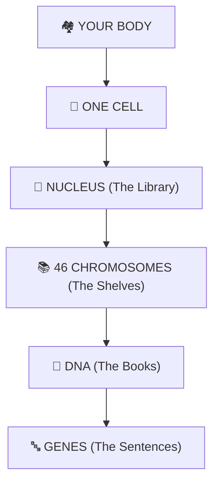

# Chapter 2: Structure of Chromosomes, Cell Cycle, and Cell Division 🧬

Welcome to the core chapter of ICSE 10th Biology Unit 1. This chapter is the "foundation" for everything that follows in Genetics and Evolution.

---

## 🗺️ The Hierarchy of Life (Keep This in Mind)

---

## 🚀 Tutorial Sections (Read in Order)

| Section | Title | Focus |
|:---|:---|:---|
| [📍 00_Intro](./00_Chapter_Introduction.md) | **START HERE** | The Story, Hierarchy, and Master Mnemonics. |
| [Section 2.1](./2.1_What_Are_Chromosomes.md) | What Are Chromosomes? | The "Moving Day" packing logic. |
| [Section 2.2](./2.2_Discovery_of_Chromosomes.md) | Discovery | The history from Flemming to modern theory. |
| [Section 2.3](./2.3_Structure_of_Chromosomes.md) | **Deep Structure** | DNA double helix, Nucleosomes, and Histones. |
| [Section 2.4](./2.4_What_Are_Genes.md) | What Are Genes? | The functional code inside the DNA books. |
| [Section 2.5](./2.5_New_Cells_Need_To_Be_Produced.md) | Why Divide? | Kitchen Math (Surface Area to Volume ratio). |
| [Section 2.6](./2.6_Types_of_Cell_Division_and_Mitosis.md) | **Mitosis** | The "PMAT" movie of cell division. |
| [Section 2.7](./2.7_Cell_Cycle.md) | Cell Cycle | The G1, S, and G2 prep laps + Cancer logic. |
| [Section 2.8](./2.8_Meiosis.md) | Meiosis | The "Deck of Cards" shuffle for variation. |
| [🏆 2.09_Summary](./2.09_Chapter_Summary.md) | **Revision Card** | Night-Before-Exam condensed facts. |
| [🧠 2.10_Practice_Questions](./2.10_Practice_Questions_Deep_Conceptual.md) | **57 Deep Practice Questions** | Organised by chapter section (2.1–2.8 + cross-chapter). |
| [✅ 2.11_Answers](./2.11_Practice_Questions_Answers.md) | **Answers to All 57 Questions** | Click-to-reveal answers written intuitively with real-world hooks. |

---

## 🧠 Practice Questions
Test your deep understanding with **52 conceptual questions** spanning core clarity, mechanisms, what-if scenarios, error detection, and multi-step reasoning.
→ [Open Practice Questions](./2.10_Practice_Questions_Deep_Conceptual.md) — 57 questions organised by section (2.1–2.8)  
→ [Open Answers](./2.11_Practice_Questions_Answers.md) — click-to-reveal for all 57

---

## 🎯 Exam Strategy for Chapter 2
- **Diagrams:** Practice drawing the DNA Nucleotide and the stages of Mitosis (especially Metaphase and Anaphase).
- **Definitions:** Be precise with *Nucleosome*, *Centromere*, and *Crossing Over*.
- **Differences:** Be ready for *Mitosis vs Meiosis* and *Animal vs Plant Cytokinesis* tables.

---
*← [Back to Main Repository](../README.md)*
